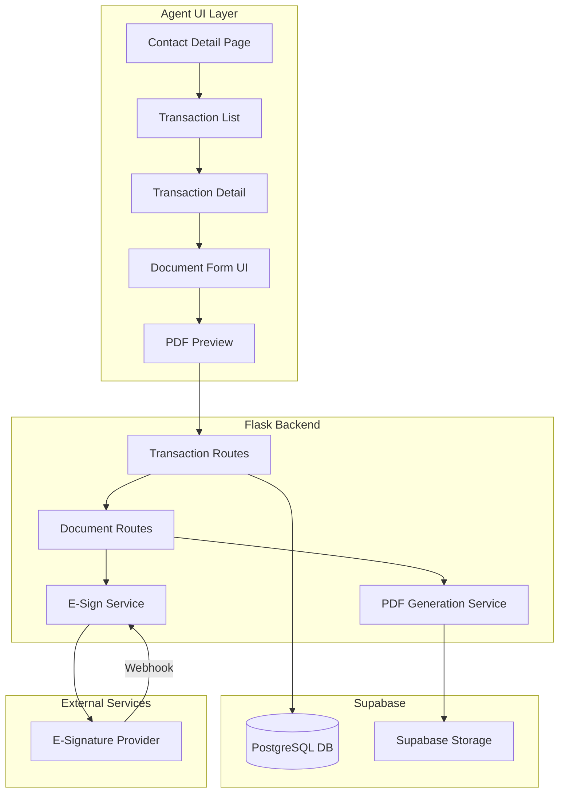
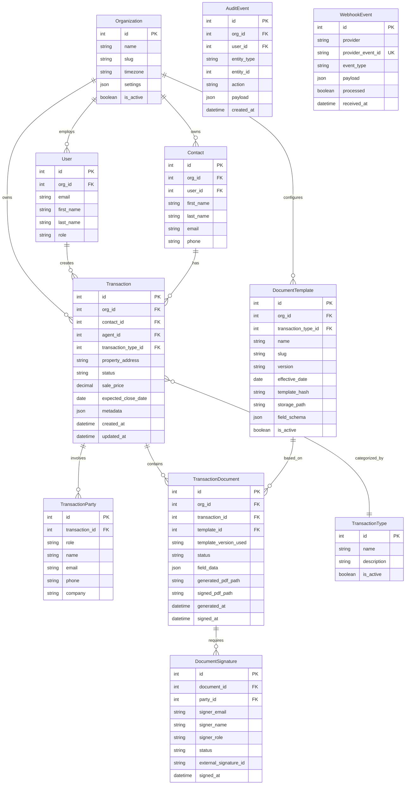
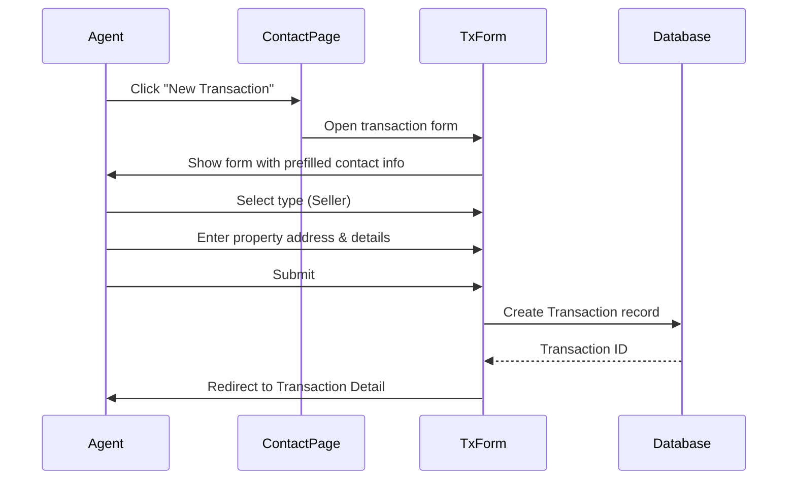
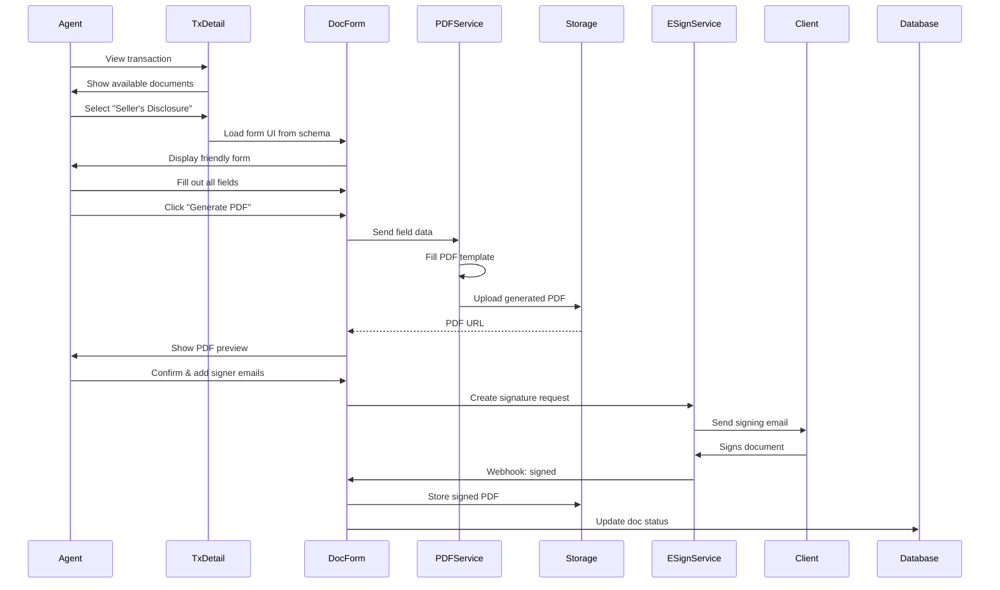

# Transaction Management & Document Generation Feature

## Executive Summary

**Goal**: Transform the CRM into a complete agent workflow hub by adding:

1. **Transaction Management** - Track real estate deals from start to close
2. **Document Generation** - Create and fill legal documents via friendly UI
3. **E-Signature Integration** - Send docs for signing without leaving the app
4. **Document Storage** - Store all generated and signed docs per transaction

**MVP Scope**: Seller transactions only, with 6-8 seller-specific documents (to be defined).**Eliminates need for**: Zipforms (document generation) + Backagent (transaction management)**Future Vision**: Multi-tenant SaaS serving multiple brokerages (architecture designed for this from day one)---

## Key Architectural Decisions (SaaS-Ready)

These decisions are made NOW to avoid painful retrofits later:| Decision | Rationale ||----------|-----------|| **Multi-tenant `org_id` everywhere** | Every major entity gets `org_id`. Makes RLS, permissions, reporting, and scaling to 50+ brokerages trivial. || **Template versioning discipline** | TXR/TREC forms change. We track which version was used for every generated document. || **Audit logging from day one** | Real estate needs "who did what when." Lightweight `audit_events` table. || **Webhook idempotency** | E-sign providers resend webhooks. We dedupe with `webhook_events` table. || **Separate storage buckets** | Templates vs transaction docs have different permissions. Cleaner security. || **Transaction parties abstraction** | Sellers, buyers, agents, title companies are all "parties" with roles. Makes signers and prefills cleaner. |---

## 1. High-Level Architecture



---

## 2. Database Schema Design

### 2.1 Entity Relationship Diagram




### 2.2 Detailed Model Definitions

#### Organization Model (Multi-Tenant Foundation)

```python
class Organization(db.Model):
    """Represents a brokerage/tenant in the multi-tenant system."""
    __tablename__ = 'organizations'
    
    id = db.Column(db.Integer, primary_key=True)
    name = db.Column(db.String(200), nullable=False)  # "Origen Realty"
    slug = db.Column(db.String(100), unique=True, nullable=False)  # "origen-realty"
    
    # Brokerage details
    license_number = db.Column(db.String(50))
    phone = db.Column(db.String(20))
    email = db.Column(db.String(200))
    address = db.Column(db.String(500))
    
    # Settings
    timezone = db.Column(db.String(50), default='America/Chicago')
    settings = db.Column(db.JSON, default={})  # Org-specific config
    
    # Status
    is_active = db.Column(db.Boolean, default=True)
    subscription_tier = db.Column(db.String(50), default='standard')  # For future billing
    
    # Timestamps
    created_at = db.Column(db.DateTime, default=datetime.utcnow)
    updated_at = db.Column(db.DateTime, default=datetime.utcnow, onupdate=datetime.utcnow)
    
    # Relationships
    users = db.relationship('User', backref='organization')
    contacts = db.relationship('Contact', backref='organization')
    transactions = db.relationship('Transaction', backref='organization')
```


#### Transaction Model

```python
class Transaction(db.Model):
    __tablename__ = 'transactions'
    
    id = db.Column(db.Integer, primary_key=True)
    org_id = db.Column(db.Integer, db.ForeignKey('organizations.id'), nullable=False)  # MULTI-TENANT
    contact_id = db.Column(db.Integer, db.ForeignKey('contact.id'), nullable=False)
    agent_id = db.Column(db.Integer, db.ForeignKey('user.id'), nullable=False)
    transaction_type_id = db.Column(db.Integer, db.ForeignKey('transaction_types.id'), nullable=False)
    
    # Property Details
    property_address = db.Column(db.String(500), nullable=False)
    property_city = db.Column(db.String(100))
    property_state = db.Column(db.String(50), default='TX')
    property_zip = db.Column(db.String(20))
    property_county = db.Column(db.String(100))
    legal_description = db.Column(db.Text)  # Metes and bounds, lot/block
    
    # Transaction Details
    sale_price = db.Column(db.Numeric(12, 2))
    earnest_money = db.Column(db.Numeric(10, 2))
    option_fee = db.Column(db.Numeric(10, 2))
    option_period_days = db.Column(db.Integer)
    
    # Key Dates
    contract_date = db.Column(db.Date)
    option_period_end = db.Column(db.Date)
    financing_deadline = db.Column(db.Date)
    expected_close_date = db.Column(db.Date)
    actual_close_date = db.Column(db.Date)
    
    # Status Tracking
    status = db.Column(db.String(50), default='draft')
    # Statuses: draft, active, pending, under_contract, awaiting_broker_review, closed, cancelled, expired
    
    # Flexible extra data for additional fields (avoid "metadata" - SQLAlchemy reserved word)
    extra_data = db.Column(db.JSON, default={})
    
    # Timestamps
    created_at = db.Column(db.DateTime, default=datetime.utcnow)
    updated_at = db.Column(db.DateTime, default=datetime.utcnow, onupdate=datetime.utcnow)
    
    # Relationships
    contact = db.relationship('Contact', backref='transactions')
    agent = db.relationship('User', backref='transactions')
    transaction_type = db.relationship('TransactionType')
    documents = db.relationship('TransactionDocument', backref='transaction', cascade='all, delete-orphan')
    parties = db.relationship('TransactionParty', backref='transaction', cascade='all, delete-orphan')
```


#### TransactionParty Model (with org_id for RLS safety)

```python
class TransactionParty(db.Model):
    """
    Represents any party involved in a transaction.
    This abstraction makes signers, prefills, and notifications much cleaner.
    
    NOTE: org_id is denormalized from transaction for RLS safety and cheaper queries.
    """
    __tablename__ = 'transaction_parties'
    
    id = db.Column(db.Integer, primary_key=True)
    org_id = db.Column(db.Integer, db.ForeignKey('organizations.id'), nullable=False)  # Denormalized for RLS
    transaction_id = db.Column(db.Integer, db.ForeignKey('transactions.id'), nullable=False)
    
    # Role in transaction
    role = db.Column(db.String(50), nullable=False)
    # Roles: seller, co_seller, buyer, co_buyer, listing_agent, buyer_agent, 
    #        title_company, lender, escrow_officer, transaction_coordinator
    
    # Party details (can be individual or company)
    is_company = db.Column(db.Boolean, default=False)
    name = db.Column(db.String(200), nullable=False)  # Person name or company name
    company = db.Column(db.String(200))  # Company if is_company=False but they work for one
    email = db.Column(db.String(200))
    phone = db.Column(db.String(20))
    address = db.Column(db.String(500))
    
    # For agents specifically
    license_number = db.Column(db.String(50))
    
    # Linking to existing contacts/users (optional)
    contact_id = db.Column(db.Integer, db.ForeignKey('contact.id'), nullable=True)
    user_id = db.Column(db.Integer, db.ForeignKey('user.id'), nullable=True)
    
    # Signing order preference
    default_sign_order = db.Column(db.Integer, default=1)
    
    created_at = db.Column(db.DateTime, default=datetime.utcnow)
    
    # Relationships
    contact = db.relationship('Contact')
    user = db.relationship('User')
    organization = db.relationship('Organization')
```


#### TransactionType Model

```python
class TransactionType(db.Model):
    __tablename__ = 'transaction_types'
    
    id = db.Column(db.Integer, primary_key=True)
    name = db.Column(db.String(50), unique=True, nullable=False)  # 'seller', 'buyer', 'dual', 'lease'
    display_name = db.Column(db.String(100), nullable=False)  # 'Seller Representation'
    description = db.Column(db.Text)
    is_active = db.Column(db.Boolean, default=True)
    sort_order = db.Column(db.Integer, default=0)
    
    # Relationships
    templates = db.relationship('DocumentTemplate', backref='transaction_type')
```


#### DocumentTemplate Model (Enhanced Versioning)

```python
class DocumentTemplate(db.Model):
    """
    Represents a fillable document template (e.g., Seller's Disclosure).
    
    VERSIONING STRATEGY:
    - TXR/TREC forms get updated (often Jan 1). We preserve history.
    - Each version is a separate row with same slug but different version.
    - Only one version per slug can be is_current=True.
    - When generating a document, we record template_version_used.
    """
    __tablename__ = 'document_templates'
    
    id = db.Column(db.Integer, primary_key=True)
    org_id = db.Column(db.Integer, db.ForeignKey('organizations.id'), nullable=True)  # NULL = global template
    transaction_type_id = db.Column(db.Integer, db.ForeignKey('transaction_types.id'), nullable=False)
    
    # Template Identity
    name = db.Column(db.String(200), nullable=False)  # "Seller's Disclosure Notice"
    slug = db.Column(db.String(100), nullable=False)  # "sellers-disclosure" (not unique - versions share slug)
    description = db.Column(db.Text)
    
    # VERSIONING FIELDS
    version = db.Column(db.String(20), nullable=False, default='1.0')  # Our version string
    form_version = db.Column(db.String(50))  # Official form version (e.g., "TXR-1406 Rev. 01-01-2026")
    effective_date = db.Column(db.Date)  # When this version becomes valid
    superseded_date = db.Column(db.Date)  # When a newer version replaced this
    is_current = db.Column(db.Boolean, default=True)  # Is this the active version?
    
    # Storage & Integrity
    template_storage_path = db.Column(db.String(500), nullable=False)  # Path in Supabase Storage
    template_hash = db.Column(db.String(64))  # SHA256 of PDF file for integrity verification
    
    # Field Schema - JSON defining all fillable fields (see Section 3)
    field_schema = db.Column(db.JSON, nullable=False)
    
    # Fields to persist to transaction (subset of field_schema)
    persistent_fields = db.Column(db.JSON, default=[])
    
    # UI Configuration
    form_sections = db.Column(db.JSON)  # How to group fields in the UI
    
    # Document behavior
    is_active = db.Column(db.Boolean, default=True)
    is_required = db.Column(db.Boolean, default=False)  # Required for this transaction type?
    requires_signature = db.Column(db.Boolean, default=True)
    default_signers = db.Column(db.JSON, default=[])  # e.g., ["seller", "listing_agent"]
    sort_order = db.Column(db.Integer, default=0)
    
    # Timestamps
    created_at = db.Column(db.DateTime, default=datetime.utcnow)
    updated_at = db.Column(db.DateTime, default=datetime.utcnow, onupdate=datetime.utcnow)
    
    # Unique constraint: one version per slug per org
    __table_args__ = (
        db.UniqueConstraint('org_id', 'slug', 'version', name='unique_template_version'),
    )
    
    @classmethod
    def get_current(cls, slug, org_id):
        """
        Get the current active version of a template.
        
        RESOLUTION ORDER:
                1. If org-specific template exists and is_current=True → use it
                2. Else fall back to global (org_id=NULL) current template
        
        NOTE: Application layer must enforce only ONE is_current=True per (org_id, slug).
        Consider adding a partial unique index if your DB supports it:
        CREATE UNIQUE INDEX unique_current_template ON document_templates (org_id, slug) WHERE is_current = true;
        """
        # First try org-specific
        template = cls.query.filter_by(
            slug=slug, org_id=org_id, is_current=True, is_active=True
        ).first()
        
        if template:
            return template
        
        # Fall back to global template
        return cls.query.filter_by(
            slug=slug, org_id=None, is_current=True, is_active=True
        ).first()
    
    @classmethod
    def set_current(cls, template_id):
        """
        Mark a template as current, unsetting any other current versions for same org/slug.
        Must be called within a transaction.
        """
        template = cls.query.get(template_id)
        if not template:
            raise ValueError("Template not found")
        
        # Unset other current versions for this org/slug
        cls.query.filter_by(
            org_id=template.org_id, 
            slug=template.slug, 
            is_current=True
        ).update({'is_current': False, 'superseded_date': datetime.utcnow().date()})
        
        # Set this one as current
        template.is_current = True
        template.superseded_date = None
        db.session.add(template)
```


#### TransactionDocument Model (Immutable Artifacts + E-Sign Audit)

```python
class TransactionDocument(db.Model):
    """
    A specific document instance within a transaction.
    Tracks which template version was used and stores the filled/signed PDFs.
    
    IMMUTABILITY: Once sent for signature, field_data is locked and cannot change.
    This ensures the signed PDF matches what was sent.
    """
    __tablename__ = 'transaction_documents'
    
    id = db.Column(db.Integer, primary_key=True)
    org_id = db.Column(db.Integer, db.ForeignKey('organizations.id'), nullable=False)  # Denormalized for RLS
    transaction_id = db.Column(db.Integer, db.ForeignKey('transactions.id'), nullable=False)
    template_id = db.Column(db.Integer, db.ForeignKey('document_templates.id'), nullable=False)
    
    # VERSION TRACKING - captures exactly what template was used
    template_version_used = db.Column(db.String(20), nullable=False)  # Copy of template.version at generation
    template_hash_used = db.Column(db.String(64))  # Copy of template.template_hash for verification
    
    # Status workflow
    # draft -> filled -> generated -> awaiting_review -> sent_for_signature -> 
    # partially_signed -> signed -> voided
    status = db.Column(db.String(50), default='draft')
    
    # The actual data filled in by the agent
    field_data = db.Column(db.JSON, nullable=False, default={})
    
    # IMMUTABLE ARTIFACT - once locked, field_data cannot change
    locked_at = db.Column(db.DateTime)  # When the document became immutable
    locked_by_id = db.Column(db.Integer, db.ForeignKey('user.id'), nullable=True)
    lock_reason = db.Column(db.String(50))  # 'sent_for_signature', 'signed', 'manually_locked'
    
    # Storage paths in Supabase (three distinct artifacts)
    generated_pdf_path = db.Column(db.String(500))  # The filled PDF (pre-signature)
    signed_pdf_path = db.Column(db.String(500))  # The signed PDF (from e-sign provider)
    signed_certificate_path = db.Column(db.String(500))  # Certificate of completion (if provider offers)
    
    # E-Signature tracking
    external_envelope_id = db.Column(db.String(200))  # Provider's envelope/request ID
    esign_provider = db.Column(db.String(50))  # 'signwell', 'dropbox_sign', etc.
    provider_audit_log = db.Column(db.JSON)  # Raw audit trail from provider (valuable for disputes)
    
    # Broker review (if brokerage requires it)
    requires_broker_review = db.Column(db.Boolean, default=False)
    reviewed_by_id = db.Column(db.Integer, db.ForeignKey('user.id'), nullable=True)
    reviewed_at = db.Column(db.DateTime)
    review_notes = db.Column(db.Text)
    
    # Timestamps
    created_at = db.Column(db.DateTime, default=datetime.utcnow)
    updated_at = db.Column(db.DateTime, default=datetime.utcnow, onupdate=datetime.utcnow)
    generated_at = db.Column(db.DateTime)
    sent_for_signature_at = db.Column(db.DateTime)
    signed_at = db.Column(db.DateTime)  # When ALL signers have signed
    
    # Relationships
    template = db.relationship('DocumentTemplate')
    signatures = db.relationship('DocumentSignature', backref='document', cascade='all, delete-orphan')
    reviewed_by = db.relationship('User', foreign_keys=[reviewed_by_id])
    locked_by = db.relationship('User', foreign_keys=[locked_by_id])
    
    def lock(self, user_id, reason='sent_for_signature'):
        """Lock the document, making field_data immutable."""
        if self.locked_at:
            raise ValueError("Document is already locked")
        self.locked_at = datetime.utcnow()
        self.locked_by_id = user_id
        self.lock_reason = reason
    
    @property
    def is_locked(self):
        return self.locked_at is not None
    
    def update_field_data(self, new_data, user_id):
        """Update field_data only if document is not locked."""
        if self.is_locked:
            raise ValueError(f"Document is locked ({self.lock_reason}). Cannot modify field_data.")
        self.field_data = new_data
```


#### DocumentSignature Model

```python
class DocumentSignature(db.Model):
    """
    Tracks each signer on a document.
    Can link to a TransactionParty for pre-fill and consistency.
    """
    __tablename__ = 'document_signatures'
    
    id = db.Column(db.Integer, primary_key=True)
    document_id = db.Column(db.Integer, db.ForeignKey('transaction_documents.id'), nullable=False)
    party_id = db.Column(db.Integer, db.ForeignKey('transaction_parties.id'), nullable=True)  # Link to party
    
    # Signer Info (can be populated from party or entered manually)
    signer_email = db.Column(db.String(200), nullable=False)
    signer_name = db.Column(db.String(200), nullable=False)
    signer_role = db.Column(db.String(50), nullable=False)  # 'seller', 'buyer', 'listing_agent', etc.
    
    # Status: pending, sent, delivered, viewed, signed, declined, voided
    status = db.Column(db.String(50), default='pending')
    decline_reason = db.Column(db.Text)  # If they declined
    
    # External tracking
    external_signature_id = db.Column(db.String(200))  # Provider's signer ID
    
    # Timestamps
    sent_at = db.Column(db.DateTime)
    delivered_at = db.Column(db.DateTime)  # Email delivered
    viewed_at = db.Column(db.DateTime)
    signed_at = db.Column(db.DateTime)
    
    sign_order = db.Column(db.Integer, default=1)  # For sequential signing
    
    # Relationships
    party = db.relationship('TransactionParty')
```


#### AuditEvent Model (Compliance & Debugging)

```python
class AuditEvent(db.Model):
    """
    Lightweight audit trail for all significant actions.
    Invaluable for debugging, compliance, and "what happened?" questions.
    """
    __tablename__ = 'audit_events'
    
    id = db.Column(db.Integer, primary_key=True)
    org_id = db.Column(db.Integer, db.ForeignKey('organizations.id'), nullable=False)
    user_id = db.Column(db.Integer, db.ForeignKey('user.id'), nullable=True)  # NULL for system actions
    
    # What happened
    entity_type = db.Column(db.String(50), nullable=False)  # 'transaction', 'document', 'signature'
    entity_id = db.Column(db.Integer, nullable=False)
    action = db.Column(db.String(50), nullable=False)
    # Actions: created, updated, deleted, generated, sent_for_signature, signed, voided, 
    #          viewed, downloaded, broker_approved, broker_rejected
    
    # Additional context
    payload = db.Column(db.JSON, default={})  # Action-specific data (e.g., field changes)
    ip_address = db.Column(db.String(45))  # For security auditing
    user_agent = db.Column(db.String(500))
    
    created_at = db.Column(db.DateTime, default=datetime.utcnow, index=True)
    
    # Relationships
    user = db.relationship('User')
    
    @classmethod
    def log(cls, org_id, user_id, entity_type, entity_id, action, payload=None, request=None):
        """Convenience method to create an audit event."""
        event = cls(
            org_id=org_id,
            user_id=user_id,
            entity_type=entity_type,
            entity_id=entity_id,
            action=action,
            payload=payload or {},
            ip_address=request.remote_addr if request else None,
            user_agent=request.user_agent.string if request else None
        )
        db.session.add(event)
        return event
```


#### WebhookEvent Model (Idempotency)

```python
class WebhookEvent(db.Model):
    """
    Tracks webhooks received from e-signature providers.
    Ensures idempotency - if we've seen an event, we don't process it twice.
    """
    __tablename__ = 'webhook_events'
    
    id = db.Column(db.Integer, primary_key=True)
    
    # Provider identification
    provider = db.Column(db.String(50), nullable=False)  # 'signwell', 'dropbox_sign'
    provider_event_id = db.Column(db.String(200), nullable=False)  # Their unique event ID
    
    # Event details
    event_type = db.Column(db.String(100), nullable=False)  # 'signature_request_signed', etc.
    payload = db.Column(db.JSON, nullable=False)  # Full webhook payload
    
    # Processing status
    processed = db.Column(db.Boolean, default=False)
    processed_at = db.Column(db.DateTime)
    error_message = db.Column(db.Text)  # If processing failed
    retry_count = db.Column(db.Integer, default=0)
    
    received_at = db.Column(db.DateTime, default=datetime.utcnow)
    
    # Unique constraint prevents duplicate processing
    __table_args__ = (
        db.UniqueConstraint('provider', 'provider_event_id', name='unique_webhook_event'),
    )
    
    @classmethod
    def already_processed(cls, provider, event_id):
        """Check if we've already seen this webhook."""
        return cls.query.filter_by(
            provider=provider, 
            provider_event_id=event_id,
            processed=True
        ).first() is not None
```


#### DocumentJob Model (Async-Ready Processing)

```python
class DocumentJob(db.Model):
    """
    Tracks document generation jobs.
    
    WHY: PDF generation is "fine" until it isn't. Having this table means:
        - We can run sync today (generate inline, mark succeeded/failed immediately)
        - We can move to async later (background worker) without rewriting flows
        - We have visibility into generation failures and can retry
    """
    __tablename__ = 'document_jobs'
    
    id = db.Column(db.Integer, primary_key=True)
    org_id = db.Column(db.Integer, db.ForeignKey('organizations.id'), nullable=False)
    document_id = db.Column(db.Integer, db.ForeignKey('transaction_documents.id'), nullable=False)
    created_by_id = db.Column(db.Integer, db.ForeignKey('user.id'), nullable=False)
    
    # Job type
    job_type = db.Column(db.String(50), nullable=False)  # 'generate_pdf', 'send_for_signature', 'download_signed'
    
    # Status: pending, running, succeeded, failed
    status = db.Column(db.String(20), default='pending')
    
    # Execution details
    started_at = db.Column(db.DateTime)
    completed_at = db.Column(db.DateTime)
    error_message = db.Column(db.Text)
    attempts = db.Column(db.Integer, default=0)
    max_attempts = db.Column(db.Integer, default=3)
    
    # Input/output
    input_data = db.Column(db.JSON)  # Job-specific input
    output_data = db.Column(db.JSON)  # Job result (e.g., generated file path)
    
    created_at = db.Column(db.DateTime, default=datetime.utcnow)
    
    # Relationships
    document = db.relationship('TransactionDocument')
    created_by = db.relationship('User')
    
    def run_sync(self, executor_func):
        """
        Run the job synchronously. Wraps execution with status updates.
        executor_func should be a callable that takes (job) and returns result dict.
        """
        self.status = 'running'
        self.started_at = datetime.utcnow()
        self.attempts += 1
        db.session.commit()
        
        try:
            result = executor_func(self)
            self.status = 'succeeded'
            self.output_data = result
            self.completed_at = datetime.utcnow()
        except Exception as e:
            self.status = 'failed'
            self.error_message = str(e)
            self.completed_at = datetime.utcnow()
        
        db.session.commit()
        return self.status == 'succeeded'
    
    @property
    def can_retry(self):
        return self.status == 'failed' and self.attempts < self.max_attempts
```

---

## 3. Document Template System

### 3.1 Field Schema Structure (Enhanced)

Each document template has a `field_schema` that defines all fillable fields. This is what powers the dynamic form UI and PDF filling.**Key enhancements from feedback:**

- `pdf_type` - How PDF libraries should treat the field (text, checkbox, radio differ)
- `pdf_value_map` - Exact values to write to PDF (e.g., checkboxes often need "X" not "true")
- `transform` - How to format values for display/PDF (currency, date formats, etc.)
```json
{
  "schema_version": "2.0",
  "fields": [
    {
      "id": "property_address",
      "label": "Property Address",
      "type": "text",
      "pdf_type": "text",
      "required": true,
      "pdf_field_name": "PropertyAddress",
      "prefill_from": "transaction.property_address",
      "section": "property_info",
      "validation": {
        "max_length": 200
      }
    },
    {
      "id": "sale_price",
      "label": "Sale Price",
      "type": "currency",
      "pdf_type": "text",
      "required": true,
      "pdf_field_name": "SalesPrice",
      "prefill_from": "transaction.sale_price",
      "transform": "currency",
      "section": "financial",
      "persist_to_transaction": true
    },
    {
      "id": "contract_date",
      "label": "Contract Date",
      "type": "date",
      "pdf_type": "text",
      "required": true,
      "pdf_field_name": "ContractDate",
      "prefill_from": "transaction.contract_date",
      "transform": "date_mdy",
      "section": "dates"
    },
    {
      "id": "has_foundation_issues",
      "label": "Are you aware of any foundation problems?",
      "type": "radio",
      "pdf_type": "checkbox",
      "required": true,
      "section": "structural",
      "options": [
        {
          "value": "yes", 
          "label": "Yes",
          "pdf_field_name": "FoundationYes",
          "pdf_value": "X"
        },
        {
          "value": "no", 
          "label": "No",
          "pdf_field_name": "FoundationNo",
          "pdf_value": "X"
        },
        {
          "value": "unknown", 
          "label": "Unknown",
          "pdf_field_name": "FoundationUnknown",
          "pdf_value": "X"
        }
      ],
      "conditional_fields": ["foundation_issue_details"]
    },
    {
      "id": "foundation_issue_details",
      "label": "Describe the foundation issues",
      "type": "textarea",
      "pdf_type": "multiline",
      "required": false,
      "pdf_field_name": "FoundationDetails",
      "section": "structural",
      "show_when": {
        "field": "has_foundation_issues",
        "equals": "yes"
      },
      "validation": {
        "max_length": 500
      }
    },
    {
      "id": "has_hoa",
      "label": "Is there an HOA?",
      "type": "checkbox",
      "pdf_type": "checkbox",
      "required": false,
      "pdf_field_name": "HOACheckbox",
      "pdf_value_map": {
        "true": "X",
        "false": ""
      },
      "section": "hoa_info",
      "conditional_fields": ["hoa_monthly_fee", "hoa_name"]
    },
    {
      "id": "hoa_monthly_fee",
      "label": "Monthly HOA Fee",
      "type": "currency",
      "pdf_type": "text",
      "required": false,
      "pdf_field_name": "HOAFee",
      "transform": "currency",
      "section": "hoa_info",
      "show_when": {
        "field": "has_hoa",
        "equals": true
      },
      "persist_to_transaction": true
    }
  ],
  "sections": [
    {"id": "property_info", "title": "Property Information", "order": 1},
    {"id": "financial", "title": "Financial Details", "order": 2},
    {"id": "dates", "title": "Important Dates", "order": 3},
    {"id": "structural", "title": "Structural Conditions", "order": 4},
    {"id": "hoa_info", "title": "HOA Information", "order": 5}
  ]
}
```


### 3.2 Transform Functions

The `transform` field specifies how to format values when writing to PDF:| Transform | Input | Output | Use Case ||-----------|-------|--------|----------|| `currency` | `250000` | `$250,000.00` | Sale price, fees || `currency_no_cents` | `250000` | `$250,000` | Round dollar amounts || `date_mdy` | `2026-01-15` | `01/15/2026` | Standard US date || `date_long` | `2026-01-15` | `January 15, 2026` | Formal documents || `phone` | `5125551234` | `(512) 555-1234` | Phone numbers || `uppercase` | `john doe` | `JOHN DOE` | Legal names || `percentage` | `0.03` | `3%` | Commission rates |

### 3.3 Supported Field Types

| Type | Description | PDF Mapping |

|------|-------------|-------------|

| `text` | Single line text input | Text field |

| `textarea` | Multi-line text | Text area or multiple lines |

| `number` | Numeric input | Text field |

| `currency` | Money input (formats as $X,XXX.XX) | Text field |

| `date` | Date picker | Text field (formatted) |

| `radio` | Single select from options | Radio buttons or checkboxes |

| `checkbox` | Yes/No toggle | Checkbox |

| `checkbox_group` | Multiple checkboxes | Multiple checkboxes |

| `select` | Dropdown | Text field |

### 3.3 Pre-fill Logic

Fields can be pre-filled from:

- **Transaction data**: `prefill_from: "transaction.property_address"`
- **Contact data**: `prefill_from: "contact.email"`
- **Agent data**: `prefill_from: "agent.license_number"`
- **Previous document in same transaction**: `prefill_from: "document.sellers-disclosure.field_id"`

---

## 4. Technology Decisions

### 4.1 PDF Processing Library

**Recommendation: `pypdf` (formerly PyPDF2) + `reportlab` for complex cases**| Library | Pros | Cons | Use Case ||---------|------|------|----------|| `pypdf` | Pure Python, fills AcroForms, well-maintained | Limited for complex layouts | Primary - form filling || `reportlab` | Full PDF generation, precise control | Steeper learning curve | Fallback for custom layouts || `pdfrw` | Can combine PDFs | Less active development | PDF merging if needed || `PyMuPDF` | Fast, handles complex PDFs | C library dependency | If pypdf fails on specific forms |**Approach**:

1. Use `pypdf` for standard AcroForm PDF filling (most real estate forms are AcroForms)
2. Fall back to `reportlab` overlay approach if a form isn't AcroForm-based
3. **Always flatten after filling** - This bakes the text into the PDF and avoids "looks blank in Preview but fine in Acrobat" bugs

**Common PDF Gotchas to Handle**:| Issue | Solution ||-------|----------|| Flattened PDFs (no fillable fields) | Use reportlab overlay approach || Weird field naming | Inspect with `pypdf` and map in schema || Fields don't appear until opened | Set `NeedAppearances` flag || Multi-line fields don't wrap | Pre-wrap text in service layer || Checkbox needs exact value | Use `pdf_value_map` in schema |**PDF Service Workflow**:

```python
def generate_filled_pdf(template_path, field_data, schema):
    # 1. Download template from Supabase
    # 2. Validate field_data against schema
    # 3. Transform values (currency, dates, etc.)
    # 4. Fill PDF form fields using pypdf
    # 5. Flatten the PDF (bake in values)
    # 6. Upload to Supabase and return path
```


### 4.2 E-Signature Provider

**Recommendation: SignWell or Dropbox Sign (HelloSign)**| Provider | Pricing | API Quality | Key Features |

|----------|---------|-------------|--------------|

| **SignWell** | $8/user/mo (unlimited) | Good REST API | White-label, templates, webhooks |

| **Dropbox Sign** | $15/user/mo | Excellent API | Embedded signing, mature platform |

| **DocuSign** | $25+/user/mo | Industry standard | Most features, most expensive |

| **PandaDoc** | $19/user/mo | Good | Document builder + signatures |**Recommendation**: Start with **SignWell** for cost-effectiveness, or **Dropbox Sign** for better API/docs.Both support:

- API-based document upload
- Embedded signing (in-app) or email-based signing
- Webhooks for status updates
- Multiple signers with order
- Template storage on their end (optional)

### 4.3 Supabase Storage Structure (Separate Buckets)

**Why two buckets?** Templates have different permissions than transaction documents. Mixing them makes security messy. Separating them is cleaner for RLS and access control.

```javascript
BUCKET: crm-templates (private, admin-only write)
├── global/
│   ├── sellers-disclosure/
│   │   ├── v1.0/
│   │   │   ├── template.pdf
│   │   │   └── schema.json (backup of field_schema)
│   │   └── v2.0/
│   │       ├── template.pdf
│   │       └── schema.json
│   ├── listing-agreement/
│   │   └── v1.0/
│   │       └── template.pdf
│   └── ...
└── org-{org_id}/  (org-specific template overrides if needed)
    └── ...

BUCKET: crm-documents (private, RLS by org_id)
├── org-{org_id}/
│   └── tx-{transaction_id}/
│       ├── generated/
│       │   ├── sellers-disclosure-{doc_id}-{timestamp}.pdf
│       │   └── ...
│       └── signed/
│           ├── sellers-disclosure-{doc_id}-signed-{timestamp}.pdf
│           └── ...
```


### 4.4 Storage Access Pattern (Flask Auth + Signed URLs)

**Your auth stack**: Flask-Login is your authentication layer. Supabase is just your database and storage backend - you're NOT using Supabase Auth.**Best approach**: Pattern A - Signed URLs via Flask backend

```javascript
┌─────────────────────────────────────────────────────────────────┐
│  HOW FILE ACCESS WORKS                                           │
├─────────────────────────────────────────────────────────────────┤
│                                                                  │
│  1. User requests document download                              │
│     └─> Flask route (e.g., /documents/<id>/download)            │
│                                                                  │
│  2. Flask checks permissions                                     │
│     └─> Is user logged in? (Flask-Login)                        │
│     └─> Does user's org_id match document's org_id?             │
│     └─> Is user authorized for this transaction?                │
│                                                                  │
│  3. Flask generates signed URL from Supabase Storage             │
│     └─> supabase.storage.from_('crm-documents')                 │
│         .create_signed_url(path, expires_in=300)                │
│                                                                  │
│  4. Return signed URL to client (or redirect)                    │
│     └─> URL expires in 5 minutes                                │
│     └─> One-time use is ideal                                   │
│                                                                  │
└─────────────────────────────────────────────────────────────────┘
```

**Bucket Configuration**:

```python
# Both buckets are PRIVATE - no direct public access
# All access goes through Flask → signed URLs

# crm-templates bucket:
#   - Flask admin routes can upload templates
#   - Flask generates signed URLs for template downloads (rarely needed)

# crm-documents bucket:
#   - Flask routes upload generated PDFs directly
#   - Flask routes download signed PDFs from e-sign provider and upload
#   - Flask generates signed URLs for agent downloads/previews
```

**supabase_storage.py service example**:

```python
from supabase import create_client
import os

class SupabaseStorage:
    def __init__(self):
        self.client = create_client(
            os.getenv('SUPABASE_URL'),
            os.getenv('SUPABASE_SERVICE_ROLE_KEY')  # Use service role for backend
        )
    
    def upload_document(self, bucket: str, path: str, file_bytes: bytes, content_type: str = 'application/pdf'):
        """Upload a file to Supabase Storage."""
        return self.client.storage.from_(bucket).upload(
            path, 
            file_bytes,
            file_options={"content-type": content_type}
        )
    
    def get_signed_url(self, bucket: str, path: str, expires_in: int = 300):
        """Generate a signed URL for download (expires in 5 min by default)."""
        result = self.client.storage.from_(bucket).create_signed_url(path, expires_in)
        return result.get('signedURL')
    
    def download_file(self, bucket: str, path: str) -> bytes:
        """Download a file from Supabase Storage."""
        return self.client.storage.from_(bucket).download(path)
    
    def delete_file(self, bucket: str, path: str):
        """Delete a file from Supabase Storage."""
        return self.client.storage.from_(bucket).remove([path])
```

**Security Rules** (simple, since Flask handles auth):| Bucket | Public | Policy |

|--------|--------|--------|

| `crm-templates` | No | Allow all via service role (Flask backend only) |

| `crm-documents` | No | Allow all via service role (Flask backend only) |All user-facing access is mediated by Flask, which checks `org_id` before generating signed URLs.---

## 5. Environment Variables (New)

These need to be added to `.env` (local) and PythonAnywhere's `~/mysite/.env`:

```bash
# Supabase Storage (you already have DATABASE_URL for PostgreSQL)
SUPABASE_URL=https://your-project.supabase.co
SUPABASE_SERVICE_ROLE_KEY=eyJhbGciOiJIUzI1NiIs...  # Service role for backend storage access

# E-Signature Provider (choose one)
# SignWell
SIGNWELL_API_KEY=your_signwell_api_key
SIGNWELL_WEBHOOK_SECRET=your_webhook_secret

# OR Dropbox Sign (HelloSign)
DROPBOX_SIGN_API_KEY=your_dropbox_sign_api_key
DROPBOX_SIGN_CLIENT_ID=your_client_id  # For embedded signing
DROPBOX_SIGN_WEBHOOK_SECRET=your_webhook_secret
```

**Finding Supabase credentials**:

1. Go to your Supabase project dashboard
2. Settings → API
3. Copy `Project URL` → SUPABASE_URL
4. Copy `service_role` key → SUPABASE_SERVICE_ROLE_KEY (keep this secret!)

---

## 6. File Structure (New Files)

```javascript
CRM/
├── models.py                    # Add new models (Organization, Transaction, etc.)
├── routes/
│   ├── transactions.py          # NEW: Transaction CRUD
│   ├── documents.py             # NEW: Document generation, preview
│   ├── esign.py                 # NEW: E-signature routes & webhooks
│   └── admin_templates.py       # NEW: Admin UI for template management
├── services/
│   ├── pdf_service.py           # NEW: PDF filling logic
│   ├── esign_service.py         # NEW: E-signature provider integration
│   ├── supabase_storage.py      # NEW: Supabase storage operations
│   ├── audit_service.py         # NEW: Audit logging helper
│   └── transform_service.py     # NEW: Value transformations (currency, dates)
├── templates/
│   └── transactions/
│       ├── list.html            # Transaction list (per contact or global)
│       ├── detail.html          # Single transaction view with doc checklist
│       ├── create.html          # Create/edit transaction form
│       ├── parties.html         # Manage transaction parties
│       ├── documents/
│       │   ├── select.html      # Select documents to fill
│       │   ├── form.html        # Dynamic form for document fields
│       │   ├── preview.html     # PDF preview before sending
│       │   └── sign_request.html # Add signers and send for signature
│       └── partials/
│           ├── document_card.html
│           ├── party_card.html
│           └── status_badge.html
├── static/
│   ├── js/
│   │   ├── transactions.js      # Transaction UI logic
│   │   ├── document_form.js     # Dynamic form rendering from schema
│   │   ├── pdf_preview.js       # PDF.js integration
│   │   └── party_manager.js     # Add/edit transaction parties
│   └── css/
│       └── transactions.css
├── document_schemas/            # NEW: JSON field schemas (version controlled)
│   ├── sellers-disclosure/
│   │   └── v1.0.json
│   ├── listing-agreement/
│   │   └── v1.0.json
│   └── ...
└── migrations/
    └── versions/
        ├── xxx_add_organization_table.py
        ├── xxx_add_transaction_tables.py
        ├── xxx_add_document_tables.py
        └── xxx_add_audit_tables.py
```

---

## 6. User Flow Diagrams

### 6.1 Transaction Creation Flow




### 6.2 Document Fill & Sign Flow



---

## 7. Phased Implementation Plan

### Phase 0: Multi-Tenant Foundation (Do First!)

**Goal**: Add Organization model and org_id to existing models before building new features

- [ ] Create `Organization` model
- [ ] Add `org_id` to existing `User` model (migration)
- [ ] Add `org_id` to existing `Contact` model (migration)
- [ ] Create initial Organization record for Origen Realty
- [ ] Update existing users/contacts to have org_id
- [ ] Create `services/audit_service.py` with simple logging helper
- [ ] Add AuditEvent and WebhookEvent models

**Deliverable**: Multi-tenant foundation in place, existing data migrated**Why first?** Adding org_id later is painful. Do it now while there's one brokerage.

### Phase 1: Database & Storage Setup

**Goal**: Set up transaction-related data layer

- [ ] Add Transaction, TransactionType, TransactionParty models (with org_id)
- [ ] Add DocumentTemplate, TransactionDocument, DocumentSignature models
- [ ] Add DocumentJob model (async-ready job tracking)
- [ ] Create database migrations (one per logical group)
- [ ] Set up two Supabase Storage buckets:
- `crm-templates` (private, backend-only via service role)
- `crm-documents` (private, backend-only via service role)
- [ ] Create `services/supabase_storage.py` with signed URL generation
- [ ] Seed `TransactionType` table (Seller, Buyer, Dual, Lease)
- [ ] Upload 1-2 test PDF templates to crm-templates bucket
- [ ] Verify pypdf works on PythonAnywhere (test early!)

**Deliverable**: Can programmatically upload/download PDFs via signed URLs, all schema in place

### Phase 2: Transaction Management

**Goal**: Full CRUD for transactions with parties

- [ ] Create `routes/transactions.py` blueprint
- [ ] Transaction list view (per contact and global "My Transactions")
- [ ] Transaction detail view with status timeline
- [ ] Create transaction form (type, property, key dates)
- [ ] Edit transaction form
- [ ] Add "Transactions" tab to contact detail page
- [ ] Transaction status workflow (draft -> active -> under_contract -> closed)
- [ ] TransactionParty management UI (add sellers, agents, title company, etc.)
- [ ] Dashboard widget showing active transactions count
- [ ] Audit logging on transaction create/update

**Deliverable**: Agents can create and manage transactions with parties

### Phase 3: Document Template System

**Goal**: Define documents and build dynamic form UI

- [ ] Create JSON schemas for MVP seller documents (you'll provide PDFs)
- [ ] Build schema validation utility
- [ ] Create `DocumentTemplate` records from schemas
- [ ] Build `services/transform_service.py` for value formatting
- [ ] Build dynamic form renderer in JS (`document_form.js`):
                - Render from field_schema JSON
                - Handle all field types (text, radio, checkbox, date, currency, etc.)
                - Handle conditional show/hide fields
                - Handle sections and ordering
- [ ] Implement pre-fill logic:
                - From transaction (property, dates, price)
                - From contact (name, email, phone)
                - From agent (name, license, brokerage)
                - From transaction parties
- [ ] Auto-save draft field data to database
- [ ] Document selection UI on transaction detail page

**Deliverable**: Agent selects a document, sees friendly form, data auto-saves

### Phase 4: PDF Generation

**Goal**: Fill PDFs with form data and preview

- [ ] Create `services/pdf_service.py`:
- Download template from Supabase via service
- Transform field values per schema (currency, dates, etc.)
- Fill AcroForm fields with pypdf
- Handle checkbox/radio value mapping via pdf_value_map
- Flatten PDF after filling (prevents preview bugs)
- Upload to crm-documents bucket via signed URL
- [ ] Wrap generation in DocumentJob for tracking/retry
- [ ] Track template version + hash on TransactionDocument
- [ ] Build PDF preview page (PDF.js embedded viewer)
- [ ] Allow re-generation if agent makes changes (and doc not locked)
- [ ] Download button for generated PDF (via signed URL)
- [ ] Audit logging on document generation

**Deliverable**: Agent fills form, generates PDF, previews it, can download

### Phase 5: E-Signature Integration

**Goal**: Send docs for signing and handle callbacks

- [ ] Select and sign up for e-signature provider (SignWell or Dropbox Sign)
- [ ] Create `services/esign_service.py`:
- Upload document to provider
- Create signature request with signers
- Handle API errors gracefully
- [ ] Build signer selection UI:
- Pre-populate from TransactionParty
- Allow manual email entry
- Set signing order
- [ ] **Lock document** when sending for signature (immutable artifact)
- [ ] Create webhook endpoint (`routes/esign.py`)
- [ ] Add WebhookEvent deduplication (idempotency)
- [ ] Update DocumentSignature status on webhook events
- [ ] Download signed PDF when all signers complete
- [ ] Store signed PDF + certificate + audit log from provider
- [ ] Audit logging on signature events

**Deliverable**: Full e-signature flow with locked documents and audit trail

### Phase 6: Polish & Production Readiness

**Goal**: Production-ready experience

- [ ] Document status badges and timeline visualization
- [ ] Resend signature request functionality
- [ ] Void/cancel signature request
- [ ] Transaction document checklist view (required vs optional docs)
- [ ] Email notifications to agent on signature events
- [ ] Mobile-responsive forms
- [ ] Error handling and retry logic
- [ ] Comprehensive error messages for users
- [ ] Performance optimization (lazy loading, caching)
- [ ] Admin UI for template management

**Deliverable**: Complete, polished transaction & document workflow---

## 8. Open Questions / Decisions Needed

### 8.1 Documents to Support (MVP)

**Need from you**: List of the 6-8 seller documents with:

- Document name
- Whether it requires e-signature
- Who signs (seller only? agent too?)
- Key fields (we'll define full schema together)
- Any complex conditional logic

**Example format**:| Document | Requires Signature | Signers | Notes ||----------|-------------------|---------|-------|| Seller's Disclosure | Yes | Seller, Agent | ~80 fields, lots of yes/no/unknown || Listing Agreement | Yes | Seller, Agent | Pricing, commission, terms || Lead-Based Paint | Yes | Seller, Agent | Required for pre-1978 homes || ... | ... | ... | ... |

### 8.2 E-Signature Provider

**Decision**: SignWell vs Dropbox Sign vs other?| Provider | Monthly Cost (est.) | Pros | Cons ||----------|---------------------|------|------|| SignWell | ~$8-16/agent | Affordable, white-label option | Smaller company || Dropbox Sign | ~$15-20/agent | Mature API, good docs, embedded signing | More expensive || DocuSign | ~$25+/agent | Industry standard | Most expensive, may be overkill |**Next step**: Sign up for developer accounts on top 2 choices, test sandbox APIs

### 8.3 PDF Field Mapping

**Need from you**: The actual PDF files so we can:

- Inspect form field names (AcroForm fields)
- Map our schema fields to PDF fields
- Identify any non-standard PDFs that need special handling
- Check if they're fillable or flattened

**How to provide**: Upload to a shared folder or commit to repo in `document_templates/originals/`

### 8.4 Broker Review Requirement

**Question**: Does Origen Realty require broker review before documents go to clients?Some brokerages have a "broker must review before sending" policy. If yes:

- Documents would go through: `generated` -> `awaiting_broker_review` -> `approved` -> `sent_for_signature`
- Broker gets notification to review
- Broker can approve or reject with notes

**For MVP**: We can skip this and add later, or build it in now. Your call.

### 8.5 Transaction Party Roles

**Question**: What parties are typically involved in a seller transaction at Origen?Thinking:

- Seller (1 or more)
- Listing Agent (the Origen agent)
- Buyer (once under contract)
- Buyer's Agent (once under contract)
- Title Company
- Lender (if applicable)

Should we track all of these from the start, or just Seller + Agent for MVP?

### 8.6 Buyer Support Timeline

**Question**: After MVP ships for sellers, when do you want to add buyer transaction support?The architecture is designed to handle this easily (different TransactionType with different DocumentTemplates), but good to know timeline for planning.---

## 9. Risks & Mitigations

| Risk | Likelihood | Impact | Mitigation ||------|------------|--------|------------|| PDFs aren't AcroForms (no fillable fields) | Medium | High | Use reportlab overlay approach, or recreate as fillable PDFs || E-sign provider API limits | Low | Medium | Choose provider with generous limits, implement rate limiting || Complex conditional form logic | Medium | Medium | Build flexible schema engine, test thoroughly with real forms || PythonAnywhere PDF library issues | Low | Medium | Test pypdf/reportlab on PA early in Phase 1, use their filesystem for temp files || Webhook delivery failures | Medium | Medium | Idempotent processing, retry logic, manual resync option || Large file uploads (signed PDFs) | Low | Low | Use Supabase signed URLs for direct upload, avoid Flask memory issues || Form version changes mid-transaction | Low | Medium | Version tracking lets us show which version was used, handle gracefully |---

## 10. Success Metrics

**User Experience**:

- Agent can create a seller transaction in < 2 minutes
- Agent can fill and generate a document in < 5 minutes
- Agent can send document for signature in < 1 minute
- Zero need to open Zipforms or Backagent for seller transactions

**System Health**:

- Document generation success rate > 99%
- E-signature delivery rate > 99%
- Webhook processing success rate > 99%

**Business Value**:

- Average time from "doc generated" to "doc signed" tracked
- Number of documents generated per month
- Number of transactions managed per agent

---

## 11. Future Enhancements (Post-MVP)

These are NOT in scope for MVP but worth knowing about:| Enhancement | Description | When to Consider ||-------------|-------------|------------------|| Buyer transaction support | Different doc set for buyer representation | After seller MVP stable || Bulk document packages | Generate and send multiple docs at once | After core flow proven || Client portal | Clients log in to see their transaction docs | When agents request it || Transaction timeline | Visual timeline of all events | Polish phase || Automated reminders | Remind signers who haven't signed | After e-sign stable || Integration with MLS | Pull property data automatically | Future integration || Mobile app | Native mobile for on-the-go signing | Long term || Multi-brokerage admin | Super-admin to manage all brokerages | When 2nd brokerage onboards |---

## 12. Next Steps

1. **You provide**: List of MVP seller documents (names, who signs)
2. **You provide**: Sample PDF files for inspection
3. **You decide**: E-signature provider preference
4. **You decide**: Broker review required? (yes/no/later)