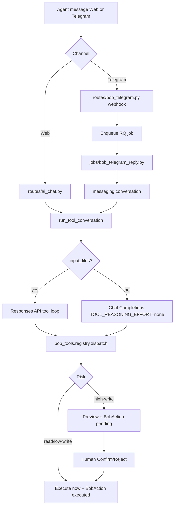
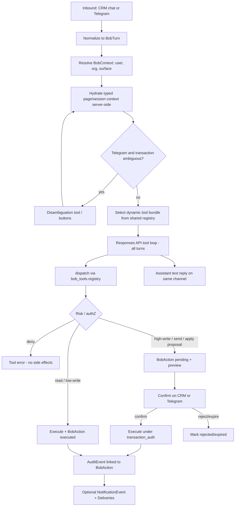
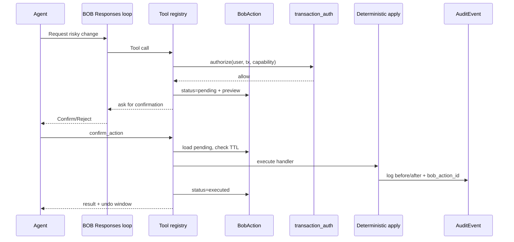
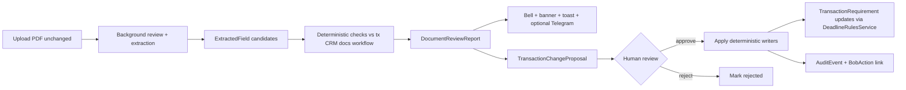
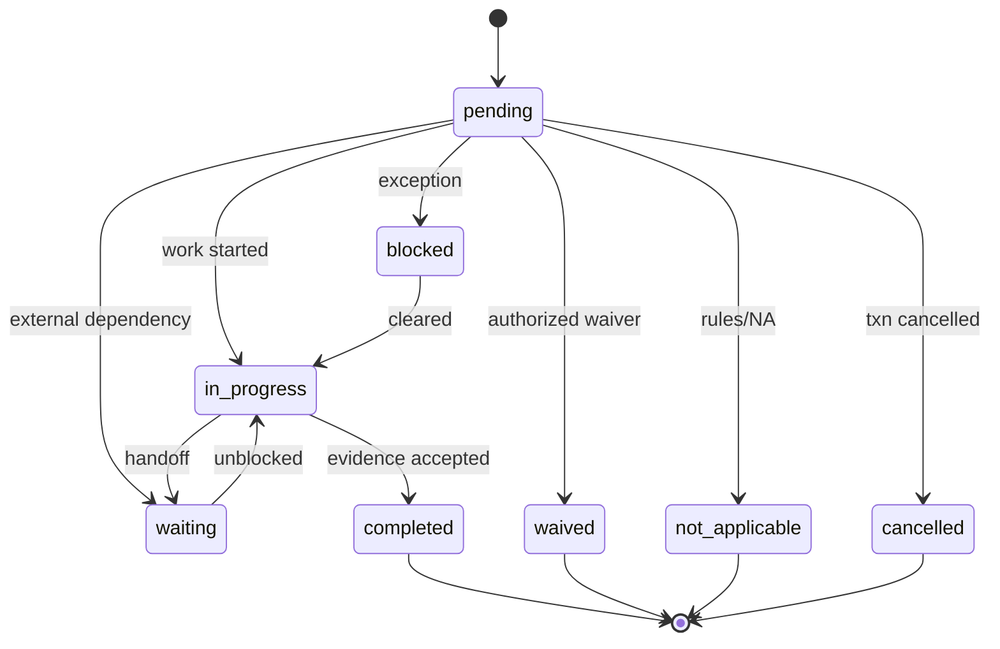
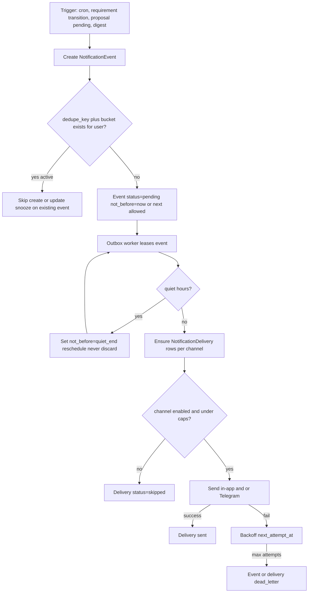

# BOB Virtual Transaction Coordinator — Complete Planning Document

**Status:** Planning only — no application code changes in this artifact  
**Product:** Origen CRM (Origen TechnolOG)  
**Vision:** Evidence-backed transaction control tower — not a chatty autopilot, not microservices, not a vector DB, not a multi-agent framework  
**Evidence legend:** `Confirmed from code` · `Confirmed from PDF` · `Recommended`

---

## 1. Executive Summary

Origen already has substantial transaction, document, portal, Gmail, calendar, BOB tool, and Telegram surfaces. What it does **not** have is a single evidence-backed control tower that turns Fast Track–style TC work into tracked requirements with human-approved writes.

The critical finding: document extraction currently **auto-writes** contract terms and **deletes/recreates** non-manual `SellerContractMilestone` rows (`Confirmed from code`: `services/document_extractor.py` → `sync_contract_from_document` → `create_contract_milestones(..., replace=True)`). DocuSeal/`DOCUMENT_GENERATION` is also **not** fully paused for pro/enterprise (`Confirmed from code`: `feature_flags.py`). Ordinary BOB tool loops still use Chat Completions with `TOOL_REASONING_EFFORT = "none"` while file turns use Responses API (`Confirmed from code`: `services/ai_service.py`).

**Recommended path:**

| Phase | Intent |
|---|---|
| **0A** | Safety freeze: stop extraction auto-writes; hard-freeze DocuSeal/generation |
| **0B** | BOB platform: Responses API unify; typed page context; dynamic tool bundles; audit expansion |
| **1A** | Read-only control tower on `TransactionRequirement` + Telegram status |
| **1B** | Contract-to-Transaction Bootstrap + Review and Apply + immediate document-review notifications + supporting-doc proposals |
| **1C** | Outbox + **core date/closing-readiness reminders** + approved drafts + task/comms coordination |
| **2** | Advanced portfolio/SLA/stale monitoring; buyer portal; listing/offers; Telegram PDF |
| **3** | Lease/tenant after privacy controls; learned templates; narrow autonomy |
| **Future/Blocked** | TXR generation, DocuSeal send/sign, MLS write, CDA generation |

**Agent experience (locked):** upload documents → review BOB proposals → approve. BOB + deterministic services perform setup, deadlines, requirements, review, and proactive monitoring.

First vertical slice after 0A/0B: **1A read-only control tower on one seller under-contract transaction + Telegram status**.

Model routing (`Recommended`): **Sol** for hard contract/exception work; **Terra** for routine TC chat; **Luna/Terra** for high-volume extraction only if evals pass. No multi-agent beta.

---

## 2. Investigation Method

1. Read Fast Track PDF (5 pages) via PyMuPDF — `Confirmed from PDF`.
2. Trace extraction → sync → milestone replace path in `document_extractor.py` / `seller_workflow.py` — `Confirmed from code`.
3. Inspect feature flags, DocuSeal registration (`routes/transactions/__init__.py`), portal signing (`routes/portal.py`) — `Confirmed from code`.
4. Inspect BOB tool registry, AI tool loop, Telegram webhook/job path — `Confirmed from code`.
5. Inventory models: `Transaction`, `SellerContractMilestone`, `Task`, `BobAction`, `AuditEvent`, portal, partners, Gmail — `Confirmed from code`.
6. Map each atomic PDF service to CRM/BOB capability with honest status (MLS/compliance/funds = attestation, not claimed external completion).
7. Propose unified requirement + proposal + outbox architecture without new deployable services.

---

## 3. Current Application Architecture

Flask 3.1 monolith, Jinja2 + progressive Stimulus/Tailwind, SQLAlchemy, Supabase Postgres with RLS (`SET LOCAL app.current_org_id`), SQLite local fallback, Gunicorn/Railway.

| Layer | Location | Notes |
|---|---|---|
| Models | `models.py` | Single file; `organization_id` on tenant models |
| Routes | `routes/` | Transactions split package; AI chat; Telegram; portal |
| Services | `services/` | Business logic; BOB tools; seller workflow; messaging |
| Jobs | `jobs/` | RQ/background; document extraction; Telegram reply |
| Documents | `documents/*.yml` + DocuSeal client | Generation/signing present |
| Features | `feature_flags.py` | Tier + org override + `GLOBAL_FEATURE_OVERRIDES` |
| Org roles | `User.org_role` | `owner` \| `admin` \| `agent` — **not** Broker (`Confirmed from code`) |

Multi-tenancy is RLS-first. Background jobs must call `set_job_org_context()`. AI access centralized in `services/ai_service.py`.

**Architecture constraint (`Recommended`):** remain a single Python service. Add tables/services modules, not microservices, vector DBs, or multi-agent orchestration frameworks.

---

## 4. Current BOB Architecture

BOB is an in-product agent with a shared tool registry and confirmation workflow:

- **Web chat:** `routes/ai_chat.py` streams via `run_tool_conversation`.
- **Tools:** `services/bob_tools/registry.py` — contacts, tasks, todos, interactions, attachments. Risk classes: read / low-write / high-write (pending `BobAction`).
- **Context:** `BobContext` carries org/user/surface; forbidden arg keys block identity spoofing.
- **Actions:** `BobAction` stores pending/executed/rejected/expired/undone/failed with preview/result/undo payload.
- **Telegram:** webhook → enqueue → `jobs/bob_telegram_reply.py` → `services/messaging/conversation.py`.

**Confirmed gaps:**

- No transaction tools (status, requirements, documents, parties).
- Task tools are contact-centric; `Task.contact_id` is non-null (`Confirmed from code`).
- No typed page context `{entity_type, entity_id}` hydration — page text would be untrusted if pasted.
- Tool bundle is largely static full registry, not dynamic by surface/entity.
- Ordinary tool loop on Chat Completions with `TOOL_REASONING_EFFORT = "none"` (`Confirmed from code`).

---

### Proposed unified CRM / Telegram BOB flow

## 5. Current Telegram Architecture

| Piece | Evidence |
|---|---|
| Feature flag | `BOB_TELEGRAM` default False all tiers; per-org override |
| Webhook | `POST /webhooks/telegram/<secret_path>` path+secret check; idempotent `MessagingInboundUpdate` |
| Connect UX | `/integrations/telegram` deep-link token |
| Async | Webhook returns 200; RQ processes reply |
| Proactive | `services/messaging/outbound.py` — quiet hours **SKIP** (not reschedule); daily cap 20 |
| Safety | Confirm/Cancel callbacks for pending `BobAction` |

**Gaps for TC:** no transaction disambiguation session; PDF handling for transaction docs not gated on selected transaction; quiet-hours skip drops deadlines; no durable notification outbox/dedupe/snooze.

---

## 6. Current Transaction Workflow

`Transaction` supports seller/buyer/landlord/tenant/referral via `transaction_types`. Seller path is deepest:

- Intake → documents (often `placeholder_upload_only`)
- `SellerListingProfile`, showings, price changes
- `SellerOffer` + versions + activities
- `SellerAcceptedContract` + amendments/terminations
- **`SellerContractMilestone`** currently calculated from frozen terms via legacy `build_contract_milestones` (`Confirmed from code`). Treat that function as **legacy behavior and regression/test input only**, not as an authoritative Texas deadline rules pack.

Buyer path exists but lacks an equivalent milestone/control-tower depth. Tasks can optionally link `transaction_id` but still require `contact_id`.

**Canonical target (`Recommended`):** ONE model `TransactionRequirement` — not parallel buyer milestones + checklist + `SellerContractMilestone`. Tasks remain human work/calendar. Bridge/migrate milestones. Requirements may link tasks one-directionally. Authoritative deadlines come only from versioned **Deadline Policy Packs** approved by qualified brokerage/legal review (see §21).

---

## 7. Current Uploaded-Document Workflow

1. Upload / attach `TransactionDocument` (storage via Supabase).
2. Background `jobs/document_extraction.py` → `extract_document_data`.
3. AI extraction → `field_data` stored.
4. **Immediate sync:** `sync_offer_version_from_document` + `sync_contract_from_document`.
5. `sync_contract_from_document` calls `create_contract_milestones(contract, replace=True)` which **deletes** non-manual milestones and recreates them (`Confirmed from code`, ~896–1231 in `seller_workflow.py`).
6. Optional package split into child docs.

There is **no** first-class proposal/approval layer between extraction and CRM mutation. That is the Phase 0A defect.

Intake schemas use `placeholder_upload_only` (external sign/upload), but generation/sign routes remain registered and callable for tiers with `DOCUMENT_GENERATION=True`.

---

## 8. PDF Service Inventory

Source: *Fast Track Transactions Services & Pricing* (5 pages) — `Confirmed from PDF`.

| Package | Fee | Boundary |
|---|---|---|
| Buyer Pre-Contract to Close | $500 | Includes pre-contract representation/offers |
| Buyer Contract to Close | $400 | Agent handles until under contract; **testimonials not listed** in CTC buyer closing section |
| Seller Pre-Contract to Close | $500 | Listing through post-close |
| Seller Contract to Close | $400 | Agent until under contract |
| Lease Listing | $300 | Listing + lease + MLS close |
| Tenant | $200 | Applications/docs collection |
| Footnotes | — | No termination fee; intermediary may need two packages; 30-day price notice; buyer +$25/offer after five |

Atomic services are enumerated exhaustively in §9 (one matrix row each). Honest rule: MLS, compliance uploads, funds, inspections, appraisals, walkthroughs, settlement, CDA, testimonials → **track human-confirmed evidence**; do not claim external system completion without attestation/connector.

---

## 9. Full Capability Traceability Matrix

> One row per atomic service. Status vocabulary: Fully supported · Supported but disconnected · Partially supported · Technically present but unusable · Missing · Blocked by document approval · Requires external integration · Should remain human-only · Not recommended.

| PDF service | Package | What human TC does | Agent responsibility | Required inputs | Expected output | Existing CRM capability | Existing BOB capability | Status | Missing pieces | Deterministic backend | AI responsibility | Human approval | Evidence to mark complete | Channels (CRM/Portal/Email/Telegram) | Privacy/legal limits | Phase | Evidence/files | PDF page |
| --- | --- | --- | --- | --- | --- | --- | --- | --- | --- | --- | --- | --- | --- | --- | --- | --- | --- | --- |
| B1 Prepare buyer representation documents | Buyer Pre-Contract to Close ($500) | Draft/assemble buyer representation package (BRA and related) for client signature | Provide client facts, brokerage forms policy, approve package contents | Buyer contact(s), representation terms, brokerage form set | Unsigned package ready for e-sign or upload | Transaction intake + document placeholders (`placeholder_upload_only`); TXR generation exists but should freeze | None for transaction docs | Blocked by document approval | Approved document templates; generation freeze; reviewed upload path | Document package checklist from intake schema | Classify uploaded BRA; propose field candidates only | Required before any CRM field write | Signed BRA uploaded + reviewed extraction approved | CRM; Portal later; Email for send (blocked until DocuSeal freeze policy clear) | Brokerage form versions; no unauthorized generation | 2 (track in 1A as requirement) | Confirmed from PDF p1; `routes/transactions/intake.py`; `feature_flags.py` DOCUMENT_GENERATION | 1 |
| B2 Prepare offers and send to client for e-signature | Buyer Pre-Contract to Close ($500) | Prepare offer docs and send to buyer for e-sign | Price/terms decisions; approve send | Offer terms, property, buyer signers | Offer package signed by client | DocuSeal send/sign routes present; seller offer upload/workflow stronger than buyer offer gen | None | Blocked by document approval | Hard DocuSeal freeze; buyer offer authoring UX; approval gate | Offer version records after human upload | Extract offer terms from uploaded PDF as proposals | Always for send/sign; always for applying extracted terms | Client-signed offer PDF stored on transaction | CRM; Email/DocuSeal blocked Phase 0A; Telegram PDF only after tx select (Phase 2) | No auto-send of unsigned offers | Future/Blocked for generation/send; 1B for upload intelligence | Confirmed from PDF p1; `routes/transactions/signing.py`; `routes/portal.py` sign_document | 1 |
| B3 Send offer to listing agent | Buyer Pre-Contract to Close ($500) | Deliver signed offer to listing agent | Approve recipient and timing | Signed offer PDF; listing agent contact | Delivery evidence (email/ledger entry) | Gmail send + ContactEmail; PartnerContact; no transaction communication ledger | None for outbound offer delivery | Partially supported | TransactionCommunication ledger; idempotent Gmail outbox; recipient resolution | Outbox send with audit | Draft message body only | Required before send | Ledger entry with message-id + attachment hash | Email primary; CRM ledger; Telegram status | Do not CC unnecessary parties; no blind blast | 1C | Confirmed from PDF p1; `services/gmail_service.py`; `ContactEmail` | 1 |
| B4 Send accepted contract to all parties | Buyer Pre-Contract to Close ($500) | Distribute executed contract package to parties | Confirm party list | Executed contract; party emails | Delivery evidence per party | Participants; document storage; no multi-party distribution ledger | None | Partially supported | Distribution checklist requirement; communication ledger | Requirement + outbox fanout | Suggest missing recipients from participants | Required | All required parties marked delivered with evidence | Email/CRM; Portal copy later | Need-to-know distribution | 1C | Confirmed from PDF p1; TransactionParticipant roles | 1 |
| B5 Ensure buyer submits contract funds on time | Buyer Pre-Contract to Close ($500) | Track earnest/option money deadlines; chase buyer/title | Client push; wire instructions verification (human) | Effective date; fund amounts; title wire info | Human-confirmed receipt evidence | SellerContractMilestone earnest_money_due (seller path); auto-recreated from extraction | None | Partially supported | Canonical TransactionRequirement; stop auto-write milestones; evidence status | DeadlineRulesService; requirement status machine | Extract due dates as candidates | Confirm funds received; never invent wire confirmation | Title/escrow confirmation uploaded or agent-attested | CRM/Telegram nudges; Email to title | Never store full wire secrets in chat; no auto-claim of funds received | 1A track; 1B extract; 1C coordinate | Confirmed from PDF p1; `create_contract_milestones` earnest_money_due | 1 |
| B6 Ensure inspection scheduled timely | Buyer Pre-Contract to Close ($500) | Chase inspection scheduling within option period | Select inspector; client coordination | Option deadline; inspector contact | Scheduled datetime evidence | Tasks + calendar_service; milestones weak on inspection | create_task/list_tasks (contact-scoped) | Partially supported | Inspection requirement type; transaction-linked tasks; evidence upload | Requirement due from option period rules | Detect inspection mentions in emails/PDFs | Confirm scheduled/completed | Appointment evidence or inspector confirmation | CRM/Telegram/Email | Do not book third parties without agent approval | 1A/1C | Confirmed from PDF p1; Task + calendar_service | 1 |
| B7 Write necessary amendments | Buyer Pre-Contract to Close ($500) | Draft/track amendments during option/repairs | Negotiate terms; approve language | Amendment terms; contract context | Signed amendment on file | SellerContractAmendment models (seller); buyer path thinner; generation blocked | None | Partially supported | Buyer amendment parity; upload+review pipeline; no auto-apply | Amendment version records | Summarize amendment diffs as proposals | Always | Signed amendment document linked | CRM; Telegram summary | No autonomous drafting sent externally | 1B/2 | Confirmed from PDF p1; SellerContractAmendment* | 1 |
| B8 Ensure buyer selects home warranty | Buyer Pre-Contract to Close ($500) | Prompt selection after option; track confirmation | Recommend product; client decision | Contract warranty terms; provider options | Selected warranty evidence | None dedicated | None | Missing | Requirement template; evidence field | Post-option requirement unlock | Detect warranty language in contract extract | Confirm selection | Order confirmation or NA attestation | CRM/Telegram/Portal | None special | 1A/1C | Confirmed from PDF p1 | 1 |
| B9 Ensure appraisal ordered timely | Buyer Pre-Contract to Close ($500) | Chase lender for appraisal order | Lender relationship | Lender contact; financing contingency dates | Order confirmation evidence | Partner lender participant; financing_approval_due milestone (seller) | None | Partially supported | Buyer requirement; lender comms ledger; evidence | Deadline from financing addendum via DeadlineRulesService | Extract appraisal-related dates | Confirm ordered | Lender confirmation logged | Email/CRM/Telegram | Do not claim ordered without evidence | 1A/1C | Confirmed from PDF p1; financing milestone code | 1 |
| B10 Keep close communication with title company | Buyer Pre-Contract to Close ($500) | Ongoing title chase; track open items | Escalations | Title participant; open items list | Communication ledger + open-item statuses | title_company participant; PartnerOrganization; no ledger | None | Partially supported | TransactionCommunication; open-item requirements | Comms ledger + requirement links | Draft updates; classify inbound | Outbound sends | Recent title touch within SLA + open items current | Email/CRM/Telegram | Limit PII in Telegram | 1C | Confirmed from PDF p1; PartnerOrganization | 1 |
| B11 Keep close communication with lender | Buyer Pre-Contract to Close ($500) | Ongoing lender chase | Escalations | Lender participant; CTC path items | Communication ledger | lender participant; PartnerContact | None | Partially supported | Same as B10 for lender | Comms ledger | Draft/classify | Outbound | Lender touch SLA met | Email/CRM/Telegram | Financial PII minimization | 1C | Confirmed from PDF p1 | 1 |
| B12 Complete outstanding title/lender items | Buyer Pre-Contract to Close ($500) | Work punch-list to CTC | Client document collection | Open conditions list | Items closed with evidence | Ad-hoc tasks only | Tasks (contact-scoped) | Partially supported | Requirement checklist from title/lender conditions; evidence links | TransactionRequirement children | Extract conditions from emails/PDFs as proposals | Accept condition list; close items | All blocking items complete or waived with evidence | CRM/Portal/Email/Telegram | Sensitive docs (SSN) careful handling | 1B/1C | Confirmed from PDF p1 | 1 |
| B13 Provide regular updates to clients | Buyer Pre-Contract to Close ($500) | Client status cadence | Tone/approval of client-facing content | Transaction status snapshot | Client update sent + logged | PortalMessage/seller portal; buyer portal parity missing | None | Partially supported | Buyer portal; scheduled update templates; notification outbox | NotificationEvent schedule | Draft update from control tower state | Default approve-before-send in MVP | Update delivered via portal/email with ledger | Portal/Email; Telegram to agent | Client-appropriate facts only | 1C drafts; 2 buyer portal | Confirmed from PDF p1; ClientPortalAccess/PortalMessage | 1 |
| B14 Provide regular updates to agents | Buyer Pre-Contract to Close ($500) | Agent/coordinator status cadence | Consume and act | Control tower snapshot | Agent-facing update | In-app notifications; Telegram proactive (skip on quiet hours) | Telegram chat status (contacts/tasks today) | Partially supported | Transaction status tools; outbox reschedule not skip | NotificationEvent | Summarize deadlines/risks | Not for read-only status | Agent received status within cadence | CRM/Telegram/Email | Org RBAC | 1A | Confirmed from PDF p1; `services/messaging/outbound.py` quiet-hours SKIP | 1 |
| B15 Ensure appraisal report received | Buyer Pre-Contract to Close ($500) | Confirm appraisal delivery | Respond to value issues | Appraisal order status | Report on file or confirmed received | Document upload | None | Missing | Requirement + evidence type; extraction of value/date | Requirement completion rules | Classify appraisal PDF; extract value as proposal | Confirm received/apply value | Appraisal PDF or lender attestation | CRM/Email/Telegram | Do not auto-share appraisal broadly | 1B/1C | Confirmed from PDF p1 | 1 |
| B16 Communicate necessary appraisal actions | Buyer Pre-Contract to Close ($500) | Coordinate reconsideration/repairs/gap coverage | Strategy decisions | Appraisal findings | Action plan + tracked requirements | Tasks/notes | create_task | Partially supported | Exception journey; linked requirements | Exception requirement types | Summarize issues; propose tasks | Strategy + outbound | Actions assigned and communicated | CRM/Email/Telegram | Sensitive negotiation | 1C/2 | Confirmed from PDF p1 | 1 |
| B17 Ensure clear-to-close received on time | Buyer Pre-Contract to Close ($500) | Chase CTC from lender | Escalation | Closing date; lender conditions | CTC evidence | None dedicated | None | Missing | CTC requirement; evidence | Deadline relative to closing | Detect CTC language in email | Confirm CTC | CTC email/PDF logged | Email/CRM/Telegram | Do not fabricate CTC | 1A/1C | Confirmed from PDF p1 | 1 |
| B18 Confirm/coordinate buyer closing appointment | Buyer Pre-Contract to Close ($500) | Schedule/confirm closing with title/buyer | Client availability | Title closing slots; buyer calendar | Confirmed appointment | Tasks + Google Calendar sync | create_task/get_agenda | Partially supported | Closing appointment requirement; transaction_id on tasks | Requirement + optional Task link | Propose times from emails | Confirm appointment | Confirmed time with title evidence | CRM/Email/Telegram/Calendar | None special | 1C | Confirmed from PDF p1; calendar_service | 1 |
| B19 Create the CDA | Buyer Pre-Contract to Close ($500) | Prepare Commission Disbursement Authorization | Commission splits accuracy | Commission terms; payees | CDA document | None for CDA generation | None | Not recommended | Blocked capability; track as human artifact upload | Requirement to upload CDA | None for drafting CDA in MVP-3 | Always human-created | Uploaded CDA PDF | CRM upload | Financial; brokerage-controlled form | Future/Blocked | Confirmed from PDF p1; product decision Future/Blocked | 1 |
| B20 Review settlement statement | Buyer Pre-Contract to Close ($500) | Review CD/ALTA for errors | Final approval of issues raised | Settlement statement PDF | Reviewed checklist + issues list | Document upload | None | Missing | Review checklist; extraction of key figures as proposals | Requirement + issue list | Extract figures; flag anomalies vs contract — proposal only | Required before marking reviewed | Human review attestation + statement on file | CRM | High sensitivity financial data | 1B/2 | Confirmed from PDF p1 | 1 |
| B21 Ensure final walkthrough scheduled | Buyer Pre-Contract to Close ($500) | Schedule walkthrough near closing | Attend/delegate | Closing date | Scheduled walkthrough | Seller milestone final_walkthrough (closing-2d); tasks | create_task | Partially supported | Buyer-side requirement; evidence | DeadlineRulesService closing-2d default (configurable) | None beyond scheduling drafts | Confirm schedule | Calendar/task confirmed | CRM/Calendar/Telegram | None special | 1A/1C | Confirmed from PDF p1; build_contract_milestones final_walkthrough | 1 |
| B22 MLS closeout accuracy | Buyer Pre-Contract to Close ($500) | Verify MLS closed correctly | MLS access / brokerage process | Closing confirmation; MLS ID | Human-confirmed MLS closeout | None (no MLS write/read API) | None | Requires external integration | External MLS; attestation-only requirement | Requirement with attestation evidence | None | Agent/TC attests | Attestation + optional screenshot upload | CRM | No MLS write automation | 1A track; Future for automation | Confirmed from PDF p1; no MLS integration in repo | 1 |
| B23 Upload docs to agent compliance system | Buyer Pre-Contract to Close ($500) | Upload file to brokerage compliance | Provide compliance system / credentials process | Final document set | Human-confirmed compliance upload | Local document store only | None | Requires external integration | Per-brokerage connectors; attestation model | Compliance checklist requirement | Propose checklist completeness from on-file docs | Attest external upload done | Attestation (+ receipt if available) | CRM | External system auth secrets not in BOB chat | 1A track; Future connectors | Confirmed from PDF p1 | 1 |
| B24 Send request for client testimonials/reviews | Buyer Pre-Contract to Close ($500) | Request reviews post-close | Approve ask timing/channel | Closed transaction; client contact | Review request sent | Email send primitives | None | Missing | Post-close automation template; outbox | NotificationEvent on closed | Draft request copy | MVP approve-before-send | Outbound ledger entry | Email/SMS later; CRM | TCPA/email consent | 2 | Confirmed from PDF p1 (testimonials in full package) | 1 |
| B25 Track additional offers beyond five ($25 fee) | Buyer Pre-Contract to Close ($500) | Count offers; bill overage | Approve billing | Offer count | Billing note / invoice line | Seller offers countable; buyer offers less structured | None | Partially supported | Buyer offer counter; billing flag | Offer count rule | None | Billing | Count >=6 flagged with fee note | CRM | None | 2 | Confirmed from PDF p1 footnote $25 | 1 |
| BC0 Agent handles pre-contract (exclusion/boundary) | Buyer Contract to Close ($400) | TC does NOT handle pre-contract; agent owns until under contract | Representation docs, offers, send to listing agent | N/A for TC package | Boundary documented on transaction package type | Transaction type/status can encode under_contract start | None | Should remain human-only | Package-type field on transaction; requirement templates differ by package | Package template selector | None | N/A | Package type = buyer_ctc; pre-contract requirements absent | CRM | None | 1A | Confirmed from PDF p2 Pre-Contact exclusion | 2 |
| BC1 Send accepted contract to all parties | Buyer Contract to Close ($400) | Distribute executed contract package to parties (CTC package; agent owned pre-contract) | Confirm party list | Executed contract; party emails | Delivery evidence per party | Participants; document storage; no multi-party distribution ledger | None | Partially supported | Distribution checklist requirement; communication ledger | Requirement + outbox fanout | Suggest missing recipients from participants | Required | All required parties marked delivered with evidence | Email/CRM; Portal copy later | Need-to-know distribution | 1C | Confirmed from PDF p2; mirrors B4; Confirmed from PDF p1; TransactionParticipant roles | 2 |
| BC2 Ensure buyer submits contract funds on time | Buyer Contract to Close ($400) | Track earnest/option money deadlines; chase buyer/title (CTC package; agent owned pre-contract) | Client push; wire instructions verification (human) | Effective date; fund amounts; title wire info | Human-confirmed receipt evidence | SellerContractMilestone earnest_money_due (seller path); auto-recreated from extraction | None | Partially supported | Canonical TransactionRequirement; stop auto-write milestones; evidence status | DeadlineRulesService; requirement status machine | Extract due dates as candidates | Confirm funds received; never invent wire confirmation | Title/escrow confirmation uploaded or agent-attested | CRM/Telegram nudges; Email to title | Never store full wire secrets in chat; no auto-claim of funds received | 1A track; 1B extract; 1C coordinate | Confirmed from PDF p2; mirrors B5; Confirmed from PDF p1; `create_contract_milestones` earnest_money_due | 2 |
| BC3 Ensure inspection scheduled timely | Buyer Contract to Close ($400) | Chase inspection scheduling within option period (CTC package; agent owned pre-contract) | Select inspector; client coordination | Option deadline; inspector contact | Scheduled datetime evidence | Tasks + calendar_service; milestones weak on inspection | create_task/list_tasks (contact-scoped) | Partially supported | Inspection requirement type; transaction-linked tasks; evidence upload | Requirement due from option period rules | Detect inspection mentions in emails/PDFs | Confirm scheduled/completed | Appointment evidence or inspector confirmation | CRM/Telegram/Email | Do not book third parties without agent approval | 1A/1C | Confirmed from PDF p2; mirrors B6; Confirmed from PDF p1; Task + calendar_service | 2 |
| BC4 Write necessary amendments | Buyer Contract to Close ($400) | Draft/track amendments during option/repairs (CTC package; agent owned pre-contract) | Negotiate terms; approve language | Amendment terms; contract context | Signed amendment on file | SellerContractAmendment models (seller); buyer path thinner; generation blocked | None | Partially supported | Buyer amendment parity; upload+review pipeline; no auto-apply | Amendment version records | Summarize amendment diffs as proposals | Always | Signed amendment document linked | CRM; Telegram summary | No autonomous drafting sent externally | 1B/2 | Confirmed from PDF p2; mirrors B7; Confirmed from PDF p1; SellerContractAmendment* | 2 |
| BC5 Ensure buyer selects home warranty | Buyer Contract to Close ($400) | Prompt selection after option; track confirmation (CTC package; agent owned pre-contract) | Recommend product; client decision | Contract warranty terms; provider options | Selected warranty evidence | None dedicated | None | Missing | Requirement template; evidence field | Post-option requirement unlock | Detect warranty language in contract extract | Confirm selection | Order confirmation or NA attestation | CRM/Telegram/Portal | None special | 1A/1C | Confirmed from PDF p2; mirrors B8; Confirmed from PDF p1 | 2 |
| BC6 Ensure appraisal ordered timely | Buyer Contract to Close ($400) | Chase lender for appraisal order (CTC package; agent owned pre-contract) | Lender relationship | Lender contact; financing contingency dates | Order confirmation evidence | Partner lender participant; financing_approval_due milestone (seller) | None | Partially supported | Buyer requirement; lender comms ledger; evidence | Deadline from financing addendum via DeadlineRulesService | Extract appraisal-related dates | Confirm ordered | Lender confirmation logged | Email/CRM/Telegram | Do not claim ordered without evidence | 1A/1C | Confirmed from PDF p2; mirrors B9; Confirmed from PDF p1; financing milestone code | 2 |
| BC7 Keep close communication with title company | Buyer Contract to Close ($400) | Ongoing title chase; track open items (CTC package; agent owned pre-contract) | Escalations | Title participant; open items list | Communication ledger + open-item statuses | title_company participant; PartnerOrganization; no ledger | None | Partially supported | TransactionCommunication; open-item requirements | Comms ledger + requirement links | Draft updates; classify inbound | Outbound sends | Recent title touch within SLA + open items current | Email/CRM/Telegram | Limit PII in Telegram | 1C | Confirmed from PDF p2; mirrors B10; Confirmed from PDF p1; PartnerOrganization | 2 |
| BC8 Keep close communication with lender | Buyer Contract to Close ($400) | Ongoing lender chase (CTC package; agent owned pre-contract) | Escalations | Lender participant; CTC path items | Communication ledger | lender participant; PartnerContact | None | Partially supported | Same as B10 for lender | Comms ledger | Draft/classify | Outbound | Lender touch SLA met | Email/CRM/Telegram | Financial PII minimization | 1C | Confirmed from PDF p2; mirrors B11; Confirmed from PDF p1 | 2 |
| BC9 Complete outstanding title/lender items | Buyer Contract to Close ($400) | Work punch-list to CTC (CTC package; agent owned pre-contract) | Client document collection | Open conditions list | Items closed with evidence | Ad-hoc tasks only | Tasks (contact-scoped) | Partially supported | Requirement checklist from title/lender conditions; evidence links | TransactionRequirement children | Extract conditions from emails/PDFs as proposals | Accept condition list; close items | All blocking items complete or waived with evidence | CRM/Portal/Email/Telegram | Sensitive docs (SSN) careful handling | 1B/1C | Confirmed from PDF p2; mirrors B12; Confirmed from PDF p1 | 2 |
| BC10 Provide regular updates to clients | Buyer Contract to Close ($400) | Client status cadence (CTC package; agent owned pre-contract) | Tone/approval of client-facing content | Transaction status snapshot | Client update sent + logged | PortalMessage/seller portal; buyer portal parity missing | None | Partially supported | Buyer portal; scheduled update templates; notification outbox | NotificationEvent schedule | Draft update from control tower state | Default approve-before-send in MVP | Update delivered via portal/email with ledger | Portal/Email; Telegram to agent | Client-appropriate facts only | 1C drafts; 2 buyer portal | Confirmed from PDF p2; mirrors B13; Confirmed from PDF p1; ClientPortalAccess/PortalMessage | 2 |
| BC11 Provide regular updates to agents | Buyer Contract to Close ($400) | Agent/coordinator status cadence (CTC package; agent owned pre-contract) | Consume and act | Control tower snapshot | Agent-facing update | In-app notifications; Telegram proactive (skip on quiet hours) | Telegram chat status (contacts/tasks today) | Partially supported | Transaction status tools; outbox reschedule not skip | NotificationEvent | Summarize deadlines/risks | Not for read-only status | Agent received status within cadence | CRM/Telegram/Email | Org RBAC | 1A | Confirmed from PDF p2; mirrors B14; Confirmed from PDF p1; `services/messaging/outbound.py` quiet-hours SKIP | 2 |
| BC12 Ensure appraisal report received | Buyer Contract to Close ($400) | Confirm appraisal delivery (CTC package; agent owned pre-contract) | Respond to value issues | Appraisal order status | Report on file or confirmed received | Document upload | None | Missing | Requirement + evidence type; extraction of value/date | Requirement completion rules | Classify appraisal PDF; extract value as proposal | Confirm received/apply value | Appraisal PDF or lender attestation | CRM/Email/Telegram | Do not auto-share appraisal broadly | 1B/1C | Confirmed from PDF p2; mirrors B15; Confirmed from PDF p1 | 2 |
| BC13 Communicate necessary appraisal actions | Buyer Contract to Close ($400) | Coordinate reconsideration/repairs/gap coverage (CTC package; agent owned pre-contract) | Strategy decisions | Appraisal findings | Action plan + tracked requirements | Tasks/notes | create_task | Partially supported | Exception journey; linked requirements | Exception requirement types | Summarize issues; propose tasks | Strategy + outbound | Actions assigned and communicated | CRM/Email/Telegram | Sensitive negotiation | 1C/2 | Confirmed from PDF p2; mirrors B16; Confirmed from PDF p1 | 2 |
| BC14 Ensure clear-to-close received on time | Buyer Contract to Close ($400) | Chase CTC from lender (CTC package; agent owned pre-contract) | Escalation | Closing date; lender conditions | CTC evidence | None dedicated | None | Missing | CTC requirement; evidence | Deadline relative to closing | Detect CTC language in email | Confirm CTC | CTC email/PDF logged | Email/CRM/Telegram | Do not fabricate CTC | 1A/1C | Confirmed from PDF p2; mirrors B17; Confirmed from PDF p1 | 2 |
| BC15 Confirm/coordinate buyer closing appointment | Buyer Contract to Close ($400) | Schedule/confirm closing with title/buyer (CTC package; agent owned pre-contract) | Client availability | Title closing slots; buyer calendar | Confirmed appointment | Tasks + Google Calendar sync | create_task/get_agenda | Partially supported | Closing appointment requirement; transaction_id on tasks | Requirement + optional Task link | Propose times from emails | Confirm appointment | Confirmed time with title evidence | CRM/Email/Telegram/Calendar | None special | 1C | Confirmed from PDF p2; mirrors B18; Confirmed from PDF p1; calendar_service | 2 |
| BC16 Create the CDA | Buyer Contract to Close ($400) | Prepare Commission Disbursement Authorization (CTC package; agent owned pre-contract) | Commission splits accuracy | Commission terms; payees | CDA document | None for CDA generation | None | Not recommended | Blocked capability; track as human artifact upload | Requirement to upload CDA | None for drafting CDA in MVP-3 | Always human-created | Uploaded CDA PDF | CRM upload | Financial; brokerage-controlled form | Future/Blocked | Confirmed from PDF p2; mirrors B19; Confirmed from PDF p1; product decision Future/Blocked | 2 |
| BC17 Review settlement statement | Buyer Contract to Close ($400) | Review CD/ALTA for errors (CTC package; agent owned pre-contract) | Final approval of issues raised | Settlement statement PDF | Reviewed checklist + issues list | Document upload | None | Missing | Review checklist; extraction of key figures as proposals | Requirement + issue list | Extract figures; flag anomalies vs contract — proposal only | Required before marking reviewed | Human review attestation + statement on file | CRM | High sensitivity financial data | 1B/2 | Confirmed from PDF p2; mirrors B20; Confirmed from PDF p1 | 2 |
| BC18 Ensure final walkthrough scheduled | Buyer Contract to Close ($400) | Schedule walkthrough near closing (CTC package; agent owned pre-contract) | Attend/delegate | Closing date | Scheduled walkthrough | Seller milestone final_walkthrough (closing-2d); tasks | create_task | Partially supported | Buyer-side requirement; evidence | DeadlineRulesService closing-2d default (configurable) | None beyond scheduling drafts | Confirm schedule | Calendar/task confirmed | CRM/Calendar/Telegram | None special | 1A/1C | Confirmed from PDF p2; mirrors B21; Confirmed from PDF p1; build_contract_milestones final_walkthrough | 2 |
| BC19 MLS closeout accuracy | Buyer Contract to Close ($400) | Verify MLS closed correctly (CTC package; agent owned pre-contract) | MLS access / brokerage process | Closing confirmation; MLS ID | Human-confirmed MLS closeout | None (no MLS write/read API) | None | Requires external integration | External MLS; attestation-only requirement | Requirement with attestation evidence | None | Agent/TC attests | Attestation + optional screenshot upload | CRM | No MLS write automation | 1A track; Future for automation | Confirmed from PDF p2; mirrors B22; Confirmed from PDF p1; no MLS integration in repo | 2 |
| BC20 Upload docs to agent compliance system | Buyer Contract to Close ($400) | Upload file to brokerage compliance (CTC package; agent owned pre-contract) | Provide compliance system / credentials process | Final document set | Human-confirmed compliance upload | Local document store only | None | Requires external integration | Per-brokerage connectors; attestation model | Compliance checklist requirement | Propose checklist completeness from on-file docs | Attest external upload done | Attestation (+ receipt if available) | CRM | External system auth secrets not in BOB chat | 1A track; Future connectors | Confirmed from PDF p2; mirrors B23; Confirmed from PDF p1 | 2 |
| S1 Prepare required listing documents | Seller Pre-Contract to Close ($500) | Assemble listing package | Approve forms/terms | Seller intake | Package ready | Intake + listing docs placeholders; generation freeze needed | None | Blocked by document approval | Freeze DocuSeal; reviewed uploads | Package checklist | Classify uploads | Before CRM writes | Signed listing docs on file | CRM/Portal | Form version control | 1B/2 | Confirmed from PDF p3; intake/documents | 3 |
| S2 Send listing docs to client for e-signature | Seller Pre-Contract to Close ($500) | Send for e-sign | Approve send | Unsigned package | Signed listing docs | DocuSeal routes callable | None | Blocked by document approval | Hard freeze + later re-enable policy | Send only after unfreeze | None until unfreeze | Always | Signed docs | Email/DocuSeal blocked 0A | No auto-send | Future/Blocked | Confirmed from PDF p3; signing.py/portal | 3 |
| S3 Provide client copies of listing paperwork | Seller Pre-Contract to Close ($500) | Deliver copies | Confirm delivery | Signed docs | Client has copies | Portal seller path; email | None | Partially supported | Auto-deliver via portal | Portal distribute | Draft note | If email send | Portal access or email evidence | Portal/Email | None | 1C/2 | Confirmed from PDF p3; ClientPortalAccess | 3 |
| S4 Input listing information into MLS | Seller Pre-Contract to Close ($500) | Enter MLS data | Provide MLS content / approve | Listing facts | MLS live draft/attestation | SellerListingProfile fields; no MLS API | None | Requires external integration | MLS integration or attestation | Attestation requirement | Suggest field completeness | Agent attests MLS entry | Attestation (+ screenshot) | CRM | No MLS write | 1A track; Future | Confirmed from PDF p3; SellerListingProfile | 3 |
| S5 Upload property photos into MLS | Seller Pre-Contract to Close ($500) | Upload photos | Provide photos | Photo set | Photos in MLS | Storage for docs; not MLS photos pipeline | None | Requires external integration | MLS photo upload / attestation | Attestation | None | Agent/TC attests | Attestation | CRM | Image rights | Future | Confirmed from PDF p3; — | 3 |
| S6 Upload documents into MLS | Seller Pre-Contract to Close ($500) | Upload docs to MLS | Approve which docs | Listing docs | Docs in MLS | Local doc store | None | Requires external integration | MLS connector/attestation | Attestation | Checklist completeness | Attest | Attestation | CRM | Public MLS exposure care | Future | Confirmed from PDF p3; — | 3 |
| S7 Set client up on showing services | Seller Pre-Contract to Close ($500) | Configure showing service | Provide vendor prefs | Listing; vendor | Showing service active | SellerShowing models exist | None | Partially supported | Vendor integration/attestation | Requirement | None | Confirm setup | Confirmation evidence | CRM/Email | Vendor credentials | 2 | Confirmed from PDF p3; SellerShowing | 3 |
| S8 Make property live once approved | Seller Pre-Contract to Close ($500) | Go-live checklist | Approve go-live | MLS ready state | Status active | Transaction status active | None | Partially supported | Go-live requirement gate | Status transition rules | None | Required | Status=active with attestation | CRM | Advertising compliance | 1A/2 | Confirmed from PDF p3; Transaction.status | 3 |
| S9 Input open houses as needed | Seller Pre-Contract to Close ($500) | Enter open houses | Decide schedule | Dates | Open house records | Tasks/calendar; no OH entity | create_task | Partially supported | Open house entity or task subtype | Task/calendar | None | Agent | Calendar events | CRM/Calendar/Telegram | None | 2 | Confirmed from PDF p3; calendar_service | 3 |
| S10 Review and summarize offers received | Seller Pre-Contract to Close ($500) | Summarize offers | Decide response | Offer PDFs | Offer summary for agent | SellerOffer + versions + extraction sync (auto-writes today) | None | Supported but disconnected | Stop auto-write; proposal review UI | Offer records | Summarize terms as proposals | Accept extract/summary | Reviewed offer summary | CRM/Telegram | Do not leak competing offer details improperly | 0A/1B | Confirmed from PDF p3; seller_workflow sync_offer* | 3 |
| S11 Maintain amendments (offer/listing phase) | Seller Pre-Contract to Close ($500) | Track listing/offer amendments | Approve | Amendment docs | Current terms accurate | Amendments on seller contract; listing amendments thinner | None | Partially supported | Listing-phase amendment model | Versions | Diff summaries | Always | Accepted amendment on file | CRM | None | 1B/2 | Confirmed from PDF p3; SellerContractAmendment | 3 |
| S12 Send chosen offer to client for e-signatures | Seller Pre-Contract to Close ($500) | Send selected offer to seller for sign | Choose winning offer | Chosen offer | Seller-signed acceptance path | Offer workflow + DocuSeal (freeze) | None | Blocked by document approval | Freeze e-sign; allow upload of wet/external signed | Offer status machine | None for send while frozen | Always | Acceptance evidence on file | CRM | No auto-sign | 0A; 1B upload | Confirmed from PDF p3; offers.py | 3 |
| S13 Send contract to all parties | Seller Pre-Contract to Close ($500) | Distribute executed contract | Confirm parties | Executed contract | Deliveries logged | Participants; no ledger | None | Partially supported | Communication ledger | Outbox fanout | Recipient suggestions | Required | All parties delivered | Email/CRM | Need-to-know | 1C | Confirmed from PDF p3; participants | 3 |
| S14 Ensure buyer submits funds on time | Seller Pre-Contract to Close ($500) | Track EM/option money | Escalate | Contract dates | Funds confirmed | SellerContractMilestone earnest_money_due; auto-recreate risk | None | Supported but disconnected | Phase 0A stop auto milestone wipe; TransactionRequirement | DeadlineRulesService | Extract dates | Confirm receipt | Evidence of funds | CRM/Telegram/Email | No false confirmation | 0A/1A/1C | Confirmed from PDF p3; create_contract_milestones | 3 |
| S15 Ensure inspection scheduled | Seller Pre-Contract to Close ($500) | Chase inspection | Coordinate access | Option period | Inspection scheduled | Milestones/tasks partial | create_task | Partially supported | Requirement + evidence | DeadlineRules | Detect schedule mentions | Confirm | Evidence | CRM/Telegram | Access codes careful | 1A/1C | Confirmed from PDF p3; seller milestones | 3 |
| S16 Ensure appraisal ordered timely | Seller Pre-Contract to Close ($500) | Chase appraisal order | Lender/buyer side | Financing dates | Order confirmed | financing_approval_due milestone | None | Partially supported | Canonical requirement | DeadlineRules | Extract | Confirm | Lender confirmation | CRM/Email/Telegram | No fabricate | 1A/1C | Confirmed from PDF p3; seller_workflow | 3 |
| S17 Communicate with title company | Seller Pre-Contract to Close ($500) | Title chase | Escalate | Title participant | Comms + open items | Participants/partners | None | Partially supported | Ledger | Comms ledger | Drafts | Outbound approve | SLA met | Email/CRM/Telegram | PII | 1C | Confirmed from PDF p3; PartnerOrganization | 3 |
| S18 Communicate with lender | Seller Pre-Contract to Close ($500) | Lender chase | Escalate | Lender participant | Comms ledger | Participants | None | Partially supported | Ledger | Comms ledger | Drafts | Outbound approve | SLA met | Email/CRM/Telegram | Financial PII | 1C | Confirmed from PDF p3; — | 3 |
| S19 Monitor/complete time-sensitive deadlines (under contract) | Seller Pre-Contract to Close ($500) | Deadline control tower | Act on risks | Contract terms | All requirements current | SellerContractMilestone auto sync (dangerous) | None | Supported but disconnected | TransactionRequirement + DeadlineRules; stop wipe | Requirement engine | Propose only | Status changes with evidence | No overdue unmanaged | CRM/Telegram | None | 0A/1A | Confirmed from PDF p3; sync_contract_from_document | 3 |
| S20 Regular updates clients/agents (under contract) | Seller Pre-Contract to Close ($500) | Cadence updates | Approve client copy | Snapshot | Updates sent | Portal seller; Telegram skip quiet hours | Telegram chat | Partially supported | Outbox reschedule; templates | NotificationEvent | Drafts | Client-facing yes | Cadence met | Portal/Email/Telegram | RBAC | 1A/1C | Confirmed from PDF p3; outbound.py | 3 |
| S21 Monitor deadlines (out of option / clear to close — PDF repeats) | Seller Pre-Contract to Close ($500) | Continue deadline monitoring in later phases | Act | Same + CTC inputs | Requirements by phase | Same milestone system | None | Supported but disconnected | Phase gates on requirements | Phase transition rules | Propose unlocks | Confirm phase facts | Phase requirements green/amber known | CRM/Telegram | None | 1A | Confirmed from PDF p3; PDF repeats language p3 | 3 |
| S22 Regular updates (out of option / clear to close) | Seller Pre-Contract to Close ($500) | Continue cadence | Approve | Snapshot | Updates | Portal/Telegram | Telegram | Partially supported | Cadence by phase | NotificationEvent | Drafts | Client-facing | Cadence met | Portal/Email/Telegram | RBAC | 1C/2 | Confirmed from PDF p3; PDF p3 | 3 |
| S23 Ensure appraisal received + communicate actions | Seller Pre-Contract to Close ($500) | Receive appraisal; coordinate actions | Strategy | Appraisal | Report + actions tracked | Upload only | None | Missing | Requirement + exception flow | Requirements | Extract value/issues | Confirm | Evidence + actions | CRM/Email/Telegram | Sensitive | 1B/1C | Confirmed from PDF p3; PDF p3 | 3 |
| S24 Upload docs to compliance | Seller Pre-Contract to Close ($500) | External compliance upload | Brokerage process | Doc set | Attestation | Local store | None | Requires external integration | Attestation/connectors | Checklist | Completeness suggest | Attest | Attestation | CRM | Secrets | 1A/Future | Confirmed from PDF p3; PDF p3 | 3 |
| S25 Request client testimonials | Seller Pre-Contract to Close ($500) | Ask for reviews | Approve timing | Closed file | Request sent | Email primitives | None | Missing | Template + outbox | NotificationEvent | Draft | Approve | Ledger | Email | Consent | 2 | Confirmed from PDF p3; PDF p3 | 3 |
| S26 Closing/post-close deadline monitoring and updates | Seller Pre-Contract to Close ($500) | Post-close wrap | Confirm closeout | Close date | Post-close requirements done | actual_close_date; weak post-close checklist | None | Partially supported | Post-close requirement template | Status=closed triggers | None | Attest MLS/compliance | All post-close reqs done | CRM/Telegram | None | 1A/2 | Confirmed from PDF p3; PDF p3 | 3 |
| SC0 Agent handles until under contract | Seller Contract to Close ($400) | TC starts at under contract | Listing, MLS, offers until acceptance | Package type | Boundary encoded | status under_contract | None | Should remain human-only | Package-type templates | Template selector | None | N/A | Package=seller_ctc | CRM | None | 1A | Confirmed from PDF p4 | 4 |
| SC1 Send contract to all parties | Seller Contract to Close ($400) | Distribute executed contract (CTC seller) | Confirm parties | Executed contract | Deliveries logged | Participants; no ledger | None | Partially supported | Communication ledger | Outbox fanout | Recipient suggestions | Required | All parties delivered | Email/CRM | Need-to-know | 1C | Confirmed from PDF p4; mirrors S13; Confirmed from PDF p3; participants | 4 |
| SC2 Ensure buyer funds on time | Seller Contract to Close ($400) | Track EM/option money (CTC seller) | Escalate | Contract dates | Funds confirmed | SellerContractMilestone earnest_money_due; auto-recreate risk | None | Supported but disconnected | Phase 0A stop auto milestone wipe; TransactionRequirement | DeadlineRulesService | Extract dates | Confirm receipt | Evidence of funds | CRM/Telegram/Email | No false confirmation | 0A/1A/1C | Confirmed from PDF p4; mirrors S14; Confirmed from PDF p3; create_contract_milestones | 4 |
| SC3 Ensure inspection scheduled | Seller Contract to Close ($400) | Chase inspection (CTC seller) | Coordinate access | Option period | Inspection scheduled | Milestones/tasks partial | create_task | Partially supported | Requirement + evidence | DeadlineRules | Detect schedule mentions | Confirm | Evidence | CRM/Telegram | Access codes careful | 1A/1C | Confirmed from PDF p4; mirrors S15; Confirmed from PDF p3; seller milestones | 4 |
| SC4 Write and send necessary amendments | Seller Contract to Close ($400) | Track listing/offer amendments (CTC seller) | Approve | Amendment docs | Current terms accurate | Amendments on seller contract; listing amendments thinner | None | Partially supported | Listing-phase amendment model | Versions | Diff summaries | Always | Accepted amendment on file | CRM | None | 1B/2 | Confirmed from PDF p4; mirrors S11; Confirmed from PDF p3; SellerContractAmendment | 4 |
| SC5 Appraisal ordered | Seller Contract to Close ($400) | Chase appraisal order (CTC seller) | Lender/buyer side | Financing dates | Order confirmed | financing_approval_due milestone | None | Partially supported | Canonical requirement | DeadlineRules | Extract | Confirm | Lender confirmation | CRM/Email/Telegram | No fabricate | 1A/1C | Confirmed from PDF p4; mirrors S16; Confirmed from PDF p3; seller_workflow | 4 |
| SC6 Title communication | Seller Contract to Close ($400) | Title chase (CTC seller) | Escalate | Title participant | Comms + open items | Participants/partners | None | Partially supported | Ledger | Comms ledger | Drafts | Outbound approve | SLA met | Email/CRM/Telegram | PII | 1C | Confirmed from PDF p4; mirrors S17; Confirmed from PDF p3; PartnerOrganization | 4 |
| SC7 Lender communication | Seller Contract to Close ($400) | Lender chase (CTC seller) | Escalate | Lender participant | Comms ledger | Participants | None | Partially supported | Ledger | Comms ledger | Drafts | Outbound approve | SLA met | Email/CRM/Telegram | Financial PII | 1C | Confirmed from PDF p4; mirrors S18; Confirmed from PDF p3; — | 4 |
| SC8 Monitor/complete deadlines | Seller Contract to Close ($400) | Deadline control tower (CTC seller) | Act on risks | Contract terms | All requirements current | SellerContractMilestone auto sync (dangerous) | None | Supported but disconnected | TransactionRequirement + DeadlineRules; stop wipe | Requirement engine | Propose only | Status changes with evidence | No overdue unmanaged | CRM/Telegram | None | 0A/1A | Confirmed from PDF p4; mirrors S19; Confirmed from PDF p3; sync_contract_from_document | 4 |
| SC9 Regular updates | Seller Contract to Close ($400) | Cadence updates (CTC seller) | Approve client copy | Snapshot | Updates sent | Portal seller; Telegram skip quiet hours | Telegram chat | Partially supported | Outbox reschedule; templates | NotificationEvent | Drafts | Client-facing yes | Cadence met | Portal/Email/Telegram | RBAC | 1A/1C | Confirmed from PDF p4; mirrors S20; Confirmed from PDF p3; outbound.py | 4 |
| SC10 Appraisal received + actions | Seller Contract to Close ($400) | Receive appraisal; coordinate actions (CTC seller) | Strategy | Appraisal | Report + actions tracked | Upload only | None | Missing | Requirement + exception flow | Requirements | Extract value/issues | Confirm | Evidence + actions | CRM/Email/Telegram | Sensitive | 1B/1C | Confirmed from PDF p4; mirrors S23; Confirmed from PDF p3; PDF p3 | 4 |
| SC11 Compliance upload | Seller Contract to Close ($400) | External compliance upload (CTC seller) | Brokerage process | Doc set | Attestation | Local store | None | Requires external integration | Attestation/connectors | Checklist | Completeness suggest | Attest | Attestation | CRM | Secrets | 1A/Future | Confirmed from PDF p4; mirrors S24; Confirmed from PDF p3; PDF p3 | 4 |
| SC12 Testimonials | Seller Contract to Close ($400) | Ask for reviews (CTC seller) | Approve timing | Closed file | Request sent | Email primitives | None | Missing | Template + outbox | NotificationEvent | Draft | Approve | Ledger | Email | Consent | 2 | Confirmed from PDF p4; mirrors S25; Confirmed from PDF p3; PDF p3 | 4 |
| SC13 Closing/post-close monitoring and updates | Seller Contract to Close ($400) | Post-close wrap (CTC seller) | Confirm closeout | Close date | Post-close requirements done | actual_close_date; weak post-close checklist | None | Partially supported | Post-close requirement template | Status=closed triggers | None | Attest MLS/compliance | All post-close reqs done | CRM/Telegram | None | 1A/2 | Confirmed from PDF p4; mirrors S26; Confirmed from PDF p3; PDF p3 | 4 |
| L1 Prepare listing documentation | Lease Listing ($300) | Prepare listing documentation | Landlord decisions / MLS access | Landlord, property, lease terms as applicable | Evidence-backed completion or attestation | Landlord transaction type exists; lease-specific workflow thin | None | Blocked by document approval | Lease listing package; generation freeze; Phase 3 privacy for tenant-adjacent data | Lease requirement templates | Classify uploads only after privacy controls | Required for external actions | Requirement evidence/attestation | CRM; limited Telegram | Tenant PII heightened — Phase 3 | 2 | Confirmed from PDF p5 | 5 |
| L2 Send landlord listing paperwork copies | Lease Listing ($300) | Send landlord listing paperwork copies | Landlord decisions / MLS access | Landlord, property, lease terms as applicable | Evidence-backed completion or attestation | Landlord transaction type exists; lease-specific workflow thin | None | Partially supported | Portal/email copies; Phase 3 privacy for tenant-adjacent data | Lease requirement templates | Classify uploads only after privacy controls | Required for external actions | Requirement evidence/attestation | CRM; limited Telegram | Tenant PII heightened — Phase 3 | 2 | Confirmed from PDF p5 | 5 |
| L3 Schedule photos | Lease Listing ($300) | Schedule photos | Landlord decisions / MLS access | Landlord, property, lease terms as applicable | Evidence-backed completion or attestation | Landlord transaction type exists; lease-specific workflow thin | None | Partially supported | Task/calendar; Phase 3 privacy for tenant-adjacent data | Lease requirement templates | Classify uploads only after privacy controls | Required for external actions | Requirement evidence/attestation | CRM; limited Telegram | Tenant PII heightened — Phase 3 | 2 | Confirmed from PDF p5 | 5 |
| L4 Schedule lockbox and sign | Lease Listing ($300) | Schedule lockbox and sign | Landlord decisions / MLS access | Landlord, property, lease terms as applicable | Evidence-backed completion or attestation | Landlord transaction type exists; lease-specific workflow thin | None | Partially supported | Task + vendor attestation; Phase 3 privacy for tenant-adjacent data | Lease requirement templates | Classify uploads only after privacy controls | Required for external actions | Requirement evidence/attestation | CRM; limited Telegram | Tenant PII heightened — Phase 3 | 2 | Confirmed from PDF p5 | 5 |
| L5 Input listing data into MLS | Lease Listing ($300) | Input listing data into MLS | Landlord decisions / MLS access | Landlord, property, lease terms as applicable | Evidence-backed completion or attestation | Landlord transaction type exists; lease-specific workflow thin | None | Requires external integration | MLS attestation only; Phase 3 privacy for tenant-adjacent data | Lease requirement templates | Classify uploads only after privacy controls | Required for external actions | Requirement evidence/attestation | CRM; limited Telegram | Tenant PII heightened — Phase 3 | Future | Confirmed from PDF p5 | 5 |
| L6 Upload docs/photos into MLS | Lease Listing ($300) | Upload docs/photos into MLS | Landlord decisions / MLS access | Landlord, property, lease terms as applicable | Evidence-backed completion or attestation | Landlord transaction type exists; lease-specific workflow thin | None | Requires external integration | MLS attestation; Phase 3 privacy for tenant-adjacent data | Lease requirement templates | Classify uploads only after privacy controls | Required for external actions | Requirement evidence/attestation | CRM; limited Telegram | Tenant PII heightened — Phase 3 | Future | Confirmed from PDF p5 | 5 |
| L7 Upload docs into compliance | Lease Listing ($300) | Upload docs into compliance | Landlord decisions / MLS access | Landlord, property, lease terms as applicable | Evidence-backed completion or attestation | Landlord transaction type exists; lease-specific workflow thin | None | Requires external integration | Compliance attestation; Phase 3 privacy for tenant-adjacent data | Lease requirement templates | Classify uploads only after privacy controls | Required for external actions | Requirement evidence/attestation | CRM; limited Telegram | Tenant PII heightened — Phase 3 | 1A/Future | Confirmed from PDF p5 | 5 |
| L8 Prepare the lease | Lease Listing ($300) | Prepare the lease | Landlord decisions / MLS access | Landlord, property, lease terms as applicable | Evidence-backed completion or attestation | Landlord transaction type exists; lease-specific workflow thin | None | Blocked by document approval | Lease prep human/upload; privacy Phase 3; Phase 3 privacy for tenant-adjacent data | Lease requirement templates | Classify uploads only after privacy controls | Required for external actions | Requirement evidence/attestation | CRM; limited Telegram | Tenant PII heightened — Phase 3 | 3 | Confirmed from PDF p5 | 5 |
| L9 Close property in MLS | Lease Listing ($300) | Close property in MLS | Landlord decisions / MLS access | Landlord, property, lease terms as applicable | Evidence-backed completion or attestation | Landlord transaction type exists; lease-specific workflow thin | None | Requires external integration | MLS close attestation; Phase 3 privacy for tenant-adjacent data | Lease requirement templates | Classify uploads only after privacy controls | Required for external actions | Requirement evidence/attestation | CRM; limited Telegram | Tenant PII heightened — Phase 3 | Future | Confirmed from PDF p5 | 5 |
| T1 Send lease applications and necessary documents | Tenant ($200) | Send lease applications and necessary documents | Applicant screening decisions remain human | Applicant set; listing agent | Collected package with chain of custody | Tenant transaction type; no sensitive vault workflow | None | Missing | Application packet send; privacy controls first | Tenant requirement + secure document classes | Minimal; prefer deterministic checklists; no unconstrained LLM over IDs/paystubs until evals+controls | Always for sharing externally | Checklist complete with secure storage refs | CRM secure portal; NOT Telegram for ID/paystubs | HIGH — FCRA/privacy; Telegram forbidden for sensitive docs | 3 | Confirmed from PDF p5; Phase 3 after controls | 5 |
| T2 Collect pay stubs | Tenant ($200) | Collect pay stubs | Applicant screening decisions remain human | Applicant set; listing agent | Collected package with chain of custody | Tenant transaction type; no sensitive vault workflow | None | Missing | Secure upload + retention policy | Tenant requirement + secure document classes | Minimal; prefer deterministic checklists; no unconstrained LLM over IDs/paystubs until evals+controls | Always for sharing externally | Checklist complete with secure storage refs | CRM secure portal; NOT Telegram for ID/paystubs | HIGH — FCRA/privacy; Telegram forbidden for sensitive docs | 3 | Confirmed from PDF p5; Phase 3 after controls | 5 |
| T3 Collect IDs | Tenant ($200) | Collect IDs | Applicant screening decisions remain human | Applicant set; listing agent | Collected package with chain of custody | Tenant transaction type; no sensitive vault workflow | None | Missing | Secure ID handling; retention/redaction | Tenant requirement + secure document classes | Minimal; prefer deterministic checklists; no unconstrained LLM over IDs/paystubs until evals+controls | Always for sharing externally | Checklist complete with secure storage refs | CRM secure portal; NOT Telegram for ID/paystubs | HIGH — FCRA/privacy; Telegram forbidden for sensitive docs | 3 | Confirmed from PDF p5; Phase 3 after controls | 5 |
| T4 Collect completed applications | Tenant ($200) | Collect completed applications | Applicant screening decisions remain human | Applicant set; listing agent | Collected package with chain of custody | Tenant transaction type; no sensitive vault workflow | None | Missing | Application intake vault | Tenant requirement + secure document classes | Minimal; prefer deterministic checklists; no unconstrained LLM over IDs/paystubs until evals+controls | Always for sharing externally | Checklist complete with secure storage refs | CRM secure portal; NOT Telegram for ID/paystubs | HIGH — FCRA/privacy; Telegram forbidden for sensitive docs | 3 | Confirmed from PDF p5; Phase 3 after controls | 5 |
| T5 Send package to listing agent | Tenant ($200) | Send package to listing agent | Applicant screening decisions remain human | Applicant set; listing agent | Collected package with chain of custody | Tenant transaction type; no sensitive vault workflow | None | Missing | Package transfer with audit | Tenant requirement + secure document classes | Minimal; prefer deterministic checklists; no unconstrained LLM over IDs/paystubs until evals+controls | Always for sharing externally | Checklist complete with secure storage refs | CRM secure portal; NOT Telegram for ID/paystubs | HIGH — FCRA/privacy; Telegram forbidden for sensitive docs | 3 | Confirmed from PDF p5; Phase 3 after controls | 5 |
| T6 Upload documentation into compliance | Tenant ($200) | Upload documentation into compliance | Applicant screening decisions remain human | Applicant set; listing agent | Collected package with chain of custody | Tenant transaction type; no sensitive vault workflow | None | Requires external integration | Compliance attestation | Tenant requirement + secure document classes | Minimal; prefer deterministic checklists; no unconstrained LLM over IDs/paystubs until evals+controls | Always for sharing externally | Checklist complete with secure storage refs | CRM secure portal; NOT Telegram for ID/paystubs | HIGH — FCRA/privacy; Telegram forbidden for sensitive docs | 3 | Confirmed from PDF p5; Phase 3 after controls | 5 |
| C1 No termination fee if file does not close | Commercial/Footnotes | N/A unless Origen sells managed TC packages | Aware of commercial terms | Package commercial terms | Billing/package note only | None | None | Should remain human-only / product decision | Do not encode as TransactionRequirement | Optional package metadata | None | Product/billing | Commercial note if Origen bills TC packages | CRM admin | Not a workflow obligation | Future/product | Confirmed from PDF footnotes | 1/2/5 |
| C2 Intermediary may require two packages | Commercial/Footnotes | N/A unless Origen sells managed TC packages | Aware of intermediary billing | Intermediary flag | Dual-package billing note | None | None | Should remain human-only / product decision | Optional dual-package billing flag only if selling TC packages | Optional package metadata | None | Product/billing | Billing metadata if applicable | CRM admin | Not a workflow obligation | Future/product | Confirmed from PDF footnotes | 1/2/5 |
| C3 Price change with 30-day notice | Commercial/Footnotes | N/A — vendor commercial notice | Aware | Price schedule | Commercial notice only | None | None | Should remain human-only / product decision | Outside TC workflow engine | None | None | Product ops | N/A | N/A | Not a workflow obligation | Future/product | Confirmed from PDF footnotes | 1/2/5 |
| C4 Buyer $25 per additional offer beyond five | Commercial/Footnotes | N/A unless Origen sells managed TC packages | Aware of overage fee | Offer count | Billing note | Offer counts exist on seller path | None | Should remain human-only / product decision | Optional metering only if selling TC packages; do not block workflow | Optional billing counter | None | Product/billing | Billing note if applicable | CRM admin | Not a workflow obligation | Future/product | Confirmed from PDF footnotes; related B25 metering may still track offer count for ops | 1/2/5 |

**Matrix row count:** 105 (B1–B25, BC0–BC20, S1–S26, SC0–SC13, L1–L9, T1–T6, C1–C4).

**BC21 removed:** The CTC buyer PDF Closing & Post Closing section only restates MLS closeout + compliance upload (BC19/BC20). It is not a separate atomic obligation. Testimonials are intentionally absent from CTC buyer post-close (unlike B24).

**Commercial rows C1–C4:** These are **optional commercial/billing metadata**, not workflow-template requirements. Keep them out of `TransactionRequirement` templates unless Origen later sells managed TC packages. Until that product decision, track only as package/billing notes if needed — not as coordinator outcomes.

---

## 10. Existing Capabilities We Should Reuse

| Capability | Where | Reuse for |
|---|---|---|
| `calendar_service` | `services/calendar_service.py` | Closing/walkthrough/inspection tasks |
| `PartnerOrganization` / `PartnerContact` | `models.py` | Title/lender/inspector directory |
| Seller offer workflow | `routes/transactions/offers.py`, `seller_workflow.py` | Offer review (after stopping auto-write) |
| `listing_checkin_service` | listing check-ins on tasks | Listing cadence patterns |
| `ClientPortalAccess`, `PortalMessage`, `portal_service`, seller portal | portal stack | Client updates; buyer parity in Phase 2 |
| `ContactEmail` + Gmail | gmail integration | Transaction communication ledger foundation |
| BOB tool registry + `BobAction` confirm/undo | `bob_tools/` | Extend, don’t rewrite |
| Telegram binding + RQ webhook pattern | messaging/* | Same channel for TC status |
| `AuditEvent` + `audit_service` | transactions history | Expand linkage with BobAction |
| Document extraction rendering/AI | `document_extractor.py` | Keep observe path; sever auto-write |
| RLS + `set_job_org_context` | app/jobs | All new jobs |

---

## 11. Broken or Disconnected Existing Capabilities

| Issue | Evidence | Impact |
|---|---|---|
| Extraction auto-writes + milestone wipe | `extract_document_data` → `sync_*` → `create_contract_milestones(replace=True)` | Silent data loss / overwrite of TC progress |
| DocuSeal not fully paused | `DOCUMENT_GENERATION` True pro/enterprise; modules registered; portal `sign_document` embeds DocuSeal | Agents can still hit generation/sign paths |
| Intake says upload-only but routes live | `placeholder_upload_only` vs signing/generation routes | Policy/UI mismatch |
| AI loop split-brain | Chat Completions `reasoning_effort=none` vs Responses for files | Weaker tools; harder evals |
| Quiet hours skip | `outbound.py` returns False | Missed deadline nudges |
| Milestones seller-only | `SellerContractMilestone` | Buyer/lease lack control tower |
| Tasks require contact | `Task.contact_id` nullable=False | Transaction-only work awkward |
| No transaction BOB tools | registry tool list | BOB cannot be a TC |
| No comms ledger | scattered Gmail/ContactEmail | Cannot prove “sent to all parties” |
| No proposal layer | field_data applied directly | Unsafe AI writes |

---

## 12. Missing Product Capabilities

1. `TransactionRequirement` as canonical workflow object  
2. `DeadlineRulesService` (deterministic deadline math)  
3. `DocumentExtractionRun` / `ExtractedField` / `TransactionChangeProposal`  
4. `TransactionAssignment` (lead_agent, TC, collaborator) + capability grants  
5. Centralized transaction authZ  
6. Transaction communication ledger + Gmail outbox/idempotency  
7. `NotificationEvent` outbox with dedupe/snooze/reschedule  
8. Typed page context + dynamic tool bundles  
9. Buyer portal parity  
10. Package-type templates (buyer/seller pre vs CTC, lease, tenant)  
11. Evidence/attestation model for MLS/compliance/funds  
12. Telegram transaction disambiguation + PDF-after-selection  
13. Eval program for extraction and tool use  
14. Lease/tenant privacy vault (Phase 3)

---

## 13. Proposed User Experience

**Control tower first.** The transaction page becomes an operational board:

- Phase banner (pre-contract / under contract / out of option / CTC / closing / post-close)
- Requirement list: due, owner, status, evidence, risk
- Document inbox: extractions awaiting review
- Communications timeline
- Exceptions queue

BOB is the **copilot over that board**, available in CRM chat and Telegram, with the same tools and the same approval rules. BOB narrates evidence; it does not invent completion.

Design language: existing CRM shell (dark slate, light surfaces, orange accent). No second “AI SaaS” visual system.

---

## 14. Proposed Buyer Transaction Journey

1. **Package select:** Pre-contract ($500) vs CTC ($400) — sets requirement template (`Confirmed from PDF` boundary).  
2. **Pre-contract (full package only):** Track B1–B3 as requirements; uploads over generation while DocuSeal frozen.  
3. **Under contract:** Instantiate funds, inspection, amendments, title/lender comms requirements.  
4. **Out of option:** Warranty, appraisal order/receive, outstanding items, updates.  
5. **CTC/closing:** CTC evidence, closing appt, settlement review, walkthrough; CDA = human upload (blocked generation).  
6. **Post-close:** MLS/compliance attestation; testimonials only for full pre-contract package per PDF.  
7. **Metering:** offer count >5 → $25 flag (C4/B25).

Buyer portal parity lands Phase 2; until then agent/TC mediate client updates.

---

## 15. Proposed Seller Transaction Journey

1. Package select pre vs CTC.  
2. **Listing (pre only):** docs, copies, MLS/photos/docs attestation, showing services, go-live, open houses, offer review.  
3. **Offer acceptance:** chosen offer evidence; stop auto-apply of extracts.  
4. **Under contract → post-close:** same control-tower pattern as buyer, on seller-side parties/access.  
5. Reuse seller portal for client updates; expand evidence types.

Primary 1A slice: **one seller under-contract** file with migrated milestones → requirements + Telegram status.

---

## 16. Proposed Listing Journey

Listing is a requirement template subset (S1–S12 / L1–L7), mostly attestation + document evidence while MLS write remains Future/Blocked. Open houses and photo scheduling reuse tasks/calendar. Go-live is a gated status transition requiring checklist green or explicit waiver.

---

## 17. Proposed Exception and Escalation Journey

Triggers: overdue requirement, failed delivery, appraisal gap, amendment stalemate, missing CTC inside threshold, extraction low-confidence on critical fields.

Flow:

1. System opens/flags `TransactionRequirement` with `status=blocked` or `risk=high`.  
2. BOB summarizes with Sol (hard cases).  
3. Proposed actions become `BobAction` / `TransactionChangeProposal` — never silent.  
4. Assignment notifies `lead_agent` + `transaction_coordinator`.  
5. Escalation SLA via `NotificationEvent` (reschedule through quiet hours).  
6. Resolution requires evidence or explicit waiver with actor + reason (audit).

---

## 18. Proposed BOB Tool Catalog

Dynamic bundles from a **shared registry**, filtered by surface, entity context, org features, and assignment capabilities. Identity always from `BobContext` (never model-supplied `organization_id` / `user_id`).

Summary table (full contracts in **Appendix A** at end of this section):

| Tool | Risk | Confirm | CRM | TG | Exists? | Module |
|---|---|---|---|---|---|---|
| `search_contacts` / `get_contact` / contact writes | as today | as today | y | y | yes | `bob_tools/contacts.py` |
| `list_tasks` / `get_agenda` / `create_task` / `update_task` / `complete_task` / `delete_task` | as today + txn | per risk | y | y | partial — add `transaction_id`, nullable contact | `bob_tools/tasks.py` |
| `list_todos` / `add_todo` / `complete_todo` | as today | as today | y | y | yes | `bob_tools/todos.py` |
| `log_interaction` / `append_contact_note` | low | no | y | y | yes | interactions/contacts |
| `inspect_attachment` / `import_contacts` | read/high | import yes | y | y | yes | attachments.py |
| `list_transactions` | read | no | y | y | **new** | `bob_tools/transactions.py` |
| `get_transaction` | read | no | y | y | **new** | transactions.py |
| `list_parties` | read | no | y | y | **new** | transactions.py |
| `list_requirements` / `get_requirement` | read | no | y | y | **new** | `bob_tools/requirements.py` |
| `propose_requirement_update` | high | yes | y | y | **new** | requirements.py |
| `attach_requirement_evidence` | low/high | policy | y | y | **new** | requirements.py |
| `list_change_proposals` | read | no | y | y | **new** | `bob_tools/proposals.py` |
| `approve_change_proposal` / `reject_change_proposal` | high | yes | y | limited | **new** | proposals.py |
| `list_transaction_documents` / `inspect_transaction_document` | read | no | y | y | **new** | `bob_tools/tx_documents.py` |
| `identify_missing_documents` | read | no | y | y | **new** | tx_documents.py |
| `draft_transaction_message` | read | n/a | y | y | **new** | `bob_tools/comms.py` |
| `queue_transaction_send` | high | yes | y | y | **new** | comms.py |
| `select_transaction_context` | low | no | n | **y** | **new** | messaging + tools |
| `add_transaction_note` | low | no | y | y | **new** | transactions.py |
| `escalate_transaction_risk` | low | no | y | y | **new** | requirements.py |
| `closing_readiness_summary` | read | no | y | y | **new** | transactions.py |

### Appendix A — BOB tool contracts (proposed TC tools)

Common failure codes: `unauthorized`, `not_found`, `wrong_tenant`, `validation_error`, `stale_version`, `confirmation_required`, `expired_confirmation`, `feature_disabled`, `ambiguous_context`.

#### `list_transactions`
- **Intent:** Find transactions the agent can access.
- **Input:** `{ "query": "string?", "status": "string?", "transaction_type": "string?", "limit": "1-50" }`
- **Output:** `{ "transactions": [ { "id", "address", "status", "type", "expected_close_date", "role" } ], "count" }`
- **Permission:** `transaction_auth.can_view` for each row.
- **Tenant checks:** `organization_id` from context only.
- **Validation:** limit bounds; status enum if present.
- **Risk/confirm:** read / none.
- **Audit:** optional read metric; no AuditEvent required.
- **Idempotency:** n/a.
- **Stale-record:** n/a.
- **Failures:** empty result vs unauthorized.
- **CRM/TG:** both.
- **Module:** `services/bob_tools/transactions.py`

#### `get_transaction`
- **Intent:** Control-tower snapshot for one transaction.
- **Input:** `{ "transaction_id": "integer" }`
- **Output:** `{ "transaction", "parties_summary", "requirements_summary": { "overdue", "due_soon", "blocked" }, "pending_proposals_count", "documents_count", "sources_note" }`
- **Permission:** `can_view(transaction_id)`.
- **Tenant checks:** org match.
- **Validation:** id required.
- **Risk/confirm:** read / none.
- **Audit:** none required.
- **Idempotency:** n/a.
- **Stale-record:** n/a.
- **Failures:** `not_found`, `unauthorized`.
- **CRM/TG:** both.
- **Module:** `transactions.py`

#### `list_parties`
- **Intent:** List participants/partners.
- **Input:** `{ "transaction_id": "integer" }`
- **Output:** `{ "parties": [ { "participant_id", "role", "name", "email?", "company?" } ] }`
- **Permission:** `can_view`.
- **Risk/confirm:** read / none.
- **CRM/TG:** both.
- **Module:** `transactions.py`

#### `list_requirements`
- **Intent:** List requirements with work/timing/risk.
- **Input:** `{ "transaction_id": "integer", "work_status": "string?", "timing_state": "string?", "risk_level": "string?", "limit": "1-100" }`
- **Output:** `{ "requirements": [ { "id", "requirement_key", "title", "work_status", "timing_state", "risk_level", "due_at", "assignee_user_id", "version", "deadline_rule_version" } ] }`
- **Permission:** `can_view`.
- **Risk/confirm:** read / none.
- **CRM/TG:** both.
- **Module:** `requirements.py`

#### `get_requirement`
- **Intent:** Detail + evidence + dependencies.
- **Input:** `{ "requirement_id": "integer" }`
- **Output:** `{ "requirement", "evidence": [], "dependencies": [], "events_recent": [] }`
- **Permission:** `can_view` on parent tx.
- **Risk/confirm:** read / none.
- **CRM/TG:** both.
- **Module:** `requirements.py`

#### `propose_requirement_update`
- **Intent:** Propose work_status/due/assignment/risk changes without applying.
- **Input:** `{ "requirement_id": "integer", "expected_version": "integer", "patch": { "work_status?", "risk_level?", "assignee_user_id?", "responsibility_type?", "due_at_manual_override?", "waiver_reason?" } }`
- **Output:** `{ "status": "awaiting_confirmation", "bob_action_id", "preview": { "diff", "preview_digest" } }`
- **Permission:** `can_coordinate` (lead/TC/collaborator per policy); waivers may need elevated capability.
- **Validation:** enum checks; version required; due override requires reason.
- **Risk/confirm:** high / yes (`BobAction` pending).
- **Audit:** BobAction + on confirm AuditEvent (`bob_action_id`).
- **Idempotency:** `idempotency_key` on confirm.
- **Stale-record:** reject if `expected_version` ≠ current.
- **Failures:** `stale_version`, `unauthorized`, `validation_error`.
- **CRM/TG:** both (confirm UX differs).
- **Module:** `requirements.py`

#### `attach_requirement_evidence`
- **Intent:** Attach document/comms/attestation evidence.
- **Input:** `{ "requirement_id": "integer", "evidence_type": "document|comms|attestation|note", "document_id?", "communication_id?", "attestation_json?", "notes?" }`
- **Output:** `{ "evidence_id", "requirement_id" }`
- **Permission:** `can_coordinate`.
- **Validation:** exactly one evidence payload shape; doc/comms must belong to same tx/org.
- **Risk/confirm:** low for note/doc link; high if attestation marks complete — if completion implied, require confirm.
- **Audit:** RequirementEvent + AuditEvent when completion-impacting.
- **Idempotency:** hash(requirement_id, evidence payload) for retries.
- **CRM/TG:** CRM full; TG limited (no sensitive uploads).
- **Module:** `requirements.py`

#### `list_change_proposals` / `approve_change_proposal` / `reject_change_proposal`
- **Intent:** Review extraction/CRM diffs.
- **Input (approve):** `{ "proposal_id": "integer", "expected_record_versions": {}, "field_decisions": [ { "field_key", "decision": "approve|reject" } ], "idempotency_key": "string" }`
- **Output:** `{ "proposal_status", "applied_fields", "skipped_fields", "audit_event_ids" }`
- **Permission:** `can_coordinate` or stronger for critical financial fields.
- **Risk/confirm:** approve/reject are high; may themselves be the confirmation step (or nested BobAction).
- **Audit:** AuditEvent + proposal status; link extraction_run_id.
- **Idempotency:** `idempotency_key`; second apply no-ops.
- **Stale-record:** reject if record versions changed.
- **CRM/TG:** CRM primary; TG can approve simple sets with digest.
- **Module:** `proposals.py`

#### `list_transaction_documents` / `inspect_transaction_document` / `identify_missing_documents`
- **Intent:** Document inventory, extracted candidates (read), missing checklist.
- **Input:** `{ "transaction_id": "integer" }` / `{ "document_id": "integer" }`
- **Output:** docs list / fields+run status / missing requirement keys.
- **Permission:** `can_view`.
- **Risk/confirm:** read / none.
- **Note:** inspect returns candidates + confidence_evidence; never implies applied CRM values.
- **CRM/TG:** both (TG summaries truncated).
- **Module:** `tx_documents.py`

#### `draft_transaction_message`
- **Intent:** Draft client/title/lender update from control-tower state.
- **Input:** `{ "transaction_id": "integer", "audience": "client|title|lender|other", "purpose": "string", "channel": "email|portal" }`
- **Output:** `{ "draft_id", "subject", "body", "suggested_recipients", "warnings" }`
- **Permission:** `can_coordinate`.
- **Risk/confirm:** read/low — **does not send**.
- **Audit:** draft stored on TransactionCommunication as draft or side table.
- **CRM/TG:** both.
- **Module:** `comms.py`

#### `queue_transaction_send`
- **Intent:** Queue approved outbound email/portal update.
- **Input:** `{ "transaction_id": "integer", "draft_id?", "channel": "email|portal", "subject", "body", "recipients": [], "cc": [], "attachment_document_ids": [], "client_idempotency_key": "string", "approved_payload_hash": "string" }`
- **Output:** `{ "communication_id", "status": "queued" }`
- **Permission:** `can_coordinate` + Gmail connected for email.
- **Validation:** recipients validated against parties unless explicit override flag + reason; hash must match server-computed payload hash.
- **Risk/confirm:** high / yes.
- **Audit:** BobAction + AuditEvent; DeliveryAttempt history later.
- **Idempotency:** `client_idempotency_key` unique per org; retries return same communication_id.
- **Ambiguous:** worker may mark `ambiguous` — reconcile required; not claimed sent.
- **CRM/TG:** CRM + TG confirm; sending executes server-side.
- **Module:** `comms.py`

#### `select_transaction_context`
- **Intent:** Bind Telegram session to a transaction.
- **Input:** `{ "transaction_id": "integer" }`
- **Output:** `{ "selected_transaction_id", "address", "expires_at" }`
- **Permission:** `can_view`.
- **Risk/confirm:** low / none.
- **CRM/TG:** Telegram only.
- **Module:** messaging conversation + tools

#### `add_transaction_note` / `escalate_transaction_risk` / `closing_readiness_summary`
- **Intent:** Notes; raise risk_level; readiness read model.
- **Inputs:** note text / `{requirement_id?, risk_level, reason}` / `{transaction_id}`.
- **Permission:** `can_coordinate` / `can_view` for summary.
- **Risk:** low for note/escalate; read for summary. Escalate writes RequirementEvent.
- **CRM/TG:** both.
- **Module:** `transactions.py` / `requirements.py`

#### Task tools (delta)
- Add optional `transaction_id` to create/list/update/complete.
- Allow null `contact_id` when `transaction_id` present (DB CHECK).
- Enforce `transaction_auth` on linked tx.
- Stale: update_task uses expected fields preview as today + version if added.

### Action approval and audit flow

### Action approval and audit flow

### Action approval and audit flow

## 19. Proposed Telegram Experience

1. Link channel (existing).  
2. Agent: “status on Lakeside” → BOB lists candidate transactions → **must select** before document tools.  
3. After selection, session holds `transaction_id` (TTL).  
4. PDF/photo for TC docs accepted **only after selection** (Phase 2).  
5. Status: top overdue/due-soon requirements, blockers, pending proposals.  
6. Confirm/Reject inline for high-risk (existing BobAction pattern).  
7. Sensitive tenant IDs/paystubs: **never** via Telegram (Phase 3 vault uses CRM portal only).  
8. Proactive: `NotificationEvent` outbox; quiet hours **reschedule**, not skip.

---

## 20. Proposed Document-Intelligence Pipeline

Applies to **any** transaction document upload (not only contracts).

### After every upload

1. Original PDF stored unchanged.  
2. Background review begins.  
3. BOB extracts candidate dates, parties, amounts, obligations.  
4. Deterministic checks compare against: selected transaction, existing CRM data, required fields, other uploaded versions, workflow/placeholders.  
5. When processing finishes, BOB **proactively alerts** the agent.  
6. **Nothing is written** to canonical CRM terms/deadlines until human approval.

### Alert surfaces (required)

| Surface | Behavior |
|---|---|
| CRM notification bell | `document_review` category; title like “Document review needs attention for 123 Main.” |
| Transaction warning banner | Persistent red/amber banner while open attention/critical reports exist |
| Document-review inbox | Section on transaction detail with findings list |
| Dismissible attention toast | **Persisted modal** when severity ≠ ok; cannot click-away/Escape; must dismiss explicitly (“I understand — dismiss”) |
| Optional Telegram | To assigned lead/TC (and creator) via existing proactive notify path |

### What BOB flags (operational, not legal)

Wrong/possibly-wrong property; missing/inconsistent parties; conflicting close/effective dates; missing amounts; CRM value conflicts; unreadable/poor scans; possible missing pages; duplicates; possible superseding newer docs; amendment vs workflow conflicts; deadlines needing confirmation; low-confidence critical fields; processing/storage failures; wrong document type; still-missing required placeholders.

Signature/initial/checkbox absence must use careful wording:  
“I could not confirm a buyer signature on page 10.” — **never** “This contract is invalid.”

### If nothing obvious is wrong

Still report completion:  
“I reviewed the contract for 123 Main. I found no obvious CRM conflicts, but 14 extracted fields still require your approval before I update the transaction or calculate deadlines.”

Never claim the document is “correct” or “legally sufficient.”

Rules:

- AI extracts **candidates only**.  
- No direct writes to contract terms/milestones/requirements from extraction job.  
- Phase 0A removes `sync_offer_version_from_document` / `sync_contract_from_document` auto-apply from `extract_document_data` (or gates behind explicit approval service).  
- Package split may remain if it only creates child docs without mutating terms — verify before keep.  
- Model: **`DocumentReviewReport`** (`services/document_review.py`) owns findings + toast dismissal state.

---

## 21. Proposed Workflow and Deadline Model

**Canonical object:** `TransactionRequirement`.

### Status dimensions (separated)

Do **not** overload a single status enum with both work progress and lateness.

| Dimension | Values | Notes |
|---|---|---|
| **work_status** | `pending`, `in_progress`, `waiting`, `blocked`, `completed`, `waived`, `not_applicable`, `cancelled` | Human/process state; mutated only by authorized actors or approved applies |
| **timing_state** | `no_deadline`, `upcoming`, `due_soon`, `overdue` | **Derived** from `due_at` + clock + thresholds (not stored as authoritative write path; may be cached/computed) |
| **risk_level** | `low`, `medium`, `high`, `critical` | Explicit risk; may be raised by rules or human; not equated with overdue |

### Deadline authority

- `due_at` is produced only by **`DeadlineRulesService`** using a versioned **Deadline Policy Pack**.
- Legacy `build_contract_milestones` / current seller milestone math is **legacy behavior and test input only** — not the production rules pack.
- Each Deadline Policy Pack must document: applicability (transaction type/package/jurisdiction), calendar vs business-day behavior, holiday calendar, timezone, cutoff time, contract paragraph/addendum source references, pack `effective_date`, and **qualified brokerage/legal approval** record (approver, approved_at, notes).
- AI may propose candidate *inputs* (effective_date, option_days, etc.) via `TransactionChangeProposal`. AI does **not** compute authoritative deadlines.
- BOB language must distinguish: (a) what the **contract states**, (b) what the **CRM currently records**, (c) what is **calculated after agent confirmation** under pack version X.

### Requirement mechanics

- Stable `requirement_key` + `template_version` + `deadline_rule_version`.
- Optimistic concurrency: `version` integer; stale updates rejected.
- Structured responsibility: `assignee_user_id` and optional `responsibility_type` / `participant_id` — not free-text alone (`responsible_party_label` may remain display-only).
- Optional one-way `task_id` link to human/calendar Task.
- Evidence via `TransactionRequirementEvidence` rows (not opaque JSON-only).
- History via `TransactionRequirementEvent` (append-only).
- Dependencies via `TransactionRequirementDependency`.
- Amendment recalculation: supersede prior `due_at` with history; **never** delete completed work or blindly recreate.

`timing_state` overlays independently from `due_at` (e.g. `work_status=waiting` + `timing_state=overdue`).

Migrate `SellerContractMilestone` → requirements once; after cutover milestones are **read-only** (see Migration). No dual-write.

---

## 22. Data Model Changes

### DocumentExtractionRun
| Column | Type | Notes |
|---|---|---|
| id | PK | |
| organization_id | FK | RLS |
| transaction_id | FK | |
| document_id | FK | |
| status | enum | queued/processing/succeeded/failed |
| schema_version | str | extraction schema version |
| model | str | |
| prompt_version | str | |
| renderer_ocr_version | str | PyMuPDF/renderer/OCR stack id |
| file_sha256 | str | content hash |
| page_count | int | |
| document_classification | str | classified type |
| duplicate_of_document_id | FK null | duplicate detection |
| supersedes_document_id | FK null | version lineage |
| usage_json | JSON | tokens/cost/latency |
| raw_response | JSON | subject to retention/redaction policy |
| raw_response_retained_until | datetime null | |
| error | text | |
| created_at / completed_at | datetime | |

### ExtractedField
| Column | Type | Notes |
|---|---|---|
| id | PK | |
| organization_id | FK | RLS denormalized **or** enforced via join to run; prefer denormalized org_id for RLS simplicity |
| extraction_run_id | FK | |
| field_key | str | |
| raw_value | JSON/text | as returned by model |
| normalized_value | JSON | typed/normalized; separate from raw |
| validation_flags | JSON | deterministic validators |
| confidence_evidence | JSON | page, snippet, bbox, heuristic scores — **not** a calibrated LLM self-score |
| self_reported_model_confidence | float null | optional; **never** treat as calibrated confidence |
| page | int null | |
| supporting_snippet | text | |
| bounding_box | JSON null | |
| status | enum | candidate/accepted/rejected/stale |

### TransactionChangeProposal
| Column | Type | Notes |
|---|---|---|
| id | PK | |
| organization_id / transaction_id | FK | |
| source_type | str | extraction/bob/email/manual |
| source_id | int | |
| extraction_run_id | FK null | |
| proposal_type | str | set_fields/create_requirements/update_requirement… |
| payload | JSON | CRM diff / field-level ops |
| record_version_basis | JSON | versions of records used to build preview |
| status | enum | pending/approved/rejected/expired/applied/partially_applied |
| proposed_by_user_id | FK null | |
| reviewed_by_user_id / reviewed_at | | |
| apply_result | JSON | |
| bob_action_id | FK null | when proposed via BOB |

### TransactionRequirement
| Column | Type | Notes |
|---|---|---|
| id | PK | |
| organization_id / transaction_id | FK | |
| package_key / phase_key / requirement_key | str | stable keys |
| template_version | str | |
| deadline_rule_version | str | pack version that produced due_at |
| title | str | |
| work_status | str | see §21 |
| timing_state | str | derived/cached from due_at |
| risk_level | str | low/medium/high/critical |
| due_at | datetime null | from DeadlineRulesService |
| due_at_superseded_at | datetime null | when amended |
| prior_due_at | datetime null | last superseded value shortcut |
| assignee_user_id | FK null | structured responsibility |
| responsibility_type | str null | e.g. lead_agent, title, lender, buyer_client |
| participant_id | FK null | optional party link |
| responsible_party_label | str null | display-only legacy label |
| task_id | FK null | one-way link |
| source | str | template/migrated/manual/proposal |
| source_milestone_id | FK null | bridge from SellerContractMilestone |
| version | int | optimistic concurrency |
| created_at / updated_at | | |

### TransactionRequirementEvidence
| Column | Type | Notes |
|---|---|---|
| id | PK | |
| organization_id / transaction_id / requirement_id | FK | |
| evidence_type | str | document/comms/attestation/note |
| document_id / communication_id | FK null | |
| attestation_json | JSON null | |
| created_by_user_id | FK | |
| created_at | | |
| notes | text | |

### TransactionRequirementEvent
| Column | Type | Notes |
|---|---|---|
| id | PK | |
| organization_id / requirement_id | FK | |
| event_type | str | created/status_changed/due_changed/assigned/evidence_added/waived… |
| actor_user_id | FK null | |
| before_json / after_json | JSON | |
| proposal_id / bob_action_id | FK null | |
| created_at | | |

Append-only revision history. (Name locked: **`TransactionRequirementEvent`**.)

### TransactionRequirementDependency
| Column | Type | Notes |
|---|---|---|
| id | PK | |
| organization_id | FK | |
| requirement_id | FK | dependent |
| depends_on_requirement_id | FK | prerequisite |
| dependency_type | str | blocks/informs |
| created_at | | |

### TransactionAssignment
| Column | Type | Notes |
|---|---|---|
| id | PK | |
| organization_id / transaction_id / user_id | FK | |
| role | enum | `lead_agent`, `transaction_coordinator`, `collaborator` |
| capabilities | JSON | e.g. `compliance_reviewer` |
| created_at | | |

Owner/admin org_role retain break-glass access via **`services/transaction_auth.py`** — org_role is not Broker.

### TransactionCommunication (ledger + outbox)
| Column | Type | Notes |
|---|---|---|
| id | PK | |
| organization_id / transaction_id | FK | |
| channel | email/portal/telegram_agent/note | |
| direction | inbound/outbound | |
| purpose | str | |
| subject/body | text | snapshot fields |
| recipients / cc | JSON | |
| attachment_refs | JSON | |
| approved_payload_hash | str | immutable hash of approved payload |
| client_idempotency_key | str | **client-generated**; distinct from provider ids |
| provider_message_id | str null | Gmail message id when known |
| provider_thread_id | str null | |
| requirement_id | FK null | |
| status | enum | `queued`, `sending`, `sent`, `ambiguous`, `failed`, `cancelled` |
| next_attempt_at | datetime null | |
| locked_at / locked_by | datetime/str null | worker lease |
| last_error | text null | |
| created_by_user_id | FK | |
| approved_by_user_id / approved_at | | |
| created_at | | |

**DeliveryAttempt** (child rows): attempt_no, started_at, finished_at, outcome (`sent`/`failed`/`ambiguous`), provider_response_json, error.

**Gmail semantics (`Recommended`):** at-least-once with reconciliation — **not** exactly-once. Ambiguous outcomes (timeout after send accepted unknown) → `ambiguous` → reconcile job / manual review. Retries must use `client_idempotency_key` + provider search; never promise exactly-once without that mechanism.

### NotificationEvent vs NotificationDelivery

**NotificationEvent** (logical):
| Column | Type | Notes |
|---|---|---|
| id | PK | |
| organization_id / user_id | FK | |
| category | str | |
| dedupe_key | str | logical uniqueness with user + time bucket |
| dedupe_bucket | str | e.g. calendar day / hour window |
| payload | JSON | |
| status | pending/processing/completed/cancelled/dead_letter | |
| not_before | datetime | quiet-hours reschedule |
| snoozed_until | datetime null | |
| related_transaction_id / requirement_id | null | |
| escalation_level | int | |
| created_at | | |

Unique constraint: `(user_id, dedupe_key, dedupe_bucket)` — **channel is not part of this key**.

**NotificationDelivery** (per channel):
| Column | Type | Notes |
|---|---|---|
| id | PK | |
| notification_event_id | FK | |
| channel | in_app/telegram/email | |
| status | pending/sending/sent/failed/skipped | |
| attempts | int | |
| next_attempt_at | datetime | |
| locked_at / locked_by | | |
| last_error | text | |
| provider_message_id | str null | |
| sent_at | datetime null | |

Worker: lease/lock row, exponential backoff, dead-letter after N failures. Quiet hours set `not_before` — **reschedule, never discard**.

### BobAction expansions (must match E0B-4)
| Column | Type | Notes |
|---|---|---|
| organization_id | already present | |
| transaction_id | FK null | |
| conversation_id / surface | already present | |
| model | str | model used |
| response_trace_id | str | provider response/trace id |
| preview_digest | str | immutable hash of preview |
| source_document_id | FK null | |
| extraction_run_id | FK null | |
| record_version | JSON/str | versions used for preview |
| requester_user_id | = user_id | |
| approving_user_id / approved_at | | |
| rejecting_user_id / rejected_at | | |
| provider_event_id | str null | Telegram update id / etc. |
| idempotency_key | str | |
| requirement_id / proposal_id | FK null | |
| resulting_audit_event_ids | JSON | correlation |
| tool_bundle / risk / confirmation_surface | | |
| page_context | JSON | typed entity context used |

### AuditEvent expansions
| Column | Type | Notes |
|---|---|---|
| organization_id | FK **add** | currently missing; required for RLS/filter |
| bob_action_id | FK null **add** | direct correlation |
| (existing) transaction_id, document_id, actor_id, event_type, event_data, source, ip, ua, created_at | | |

Every applied proposal / TC write logs before/after, source (`bob`/`web`/`job`), and BobAction correlation.

### Task constraint
`contact_id` nullable with CHECK (`contact_id IS NOT NULL OR transaction_id IS NOT NULL`); BOB task tools accept `transaction_id`.

### DeadlineRulesService + Deadline Policy Pack (not ad-hoc code)
- Pure deterministic functions over versioned packs.
- Pack metadata: id/version, applicability, calendar rules, holidays, timezone, cutoff, paragraph/addendum sources, effective_date, legal/brokerage approval.
- Store `deadline_rule_version` on each requirement when `due_at` is set.
- Unit tests use boundary dates; legacy `build_contract_milestones` outputs may appear as **fixtures** to compare migration diffs, not as production authority.

---

## 23. Backend and Service-Layer Changes

| Module | Change |
|---|---|
| `feature_flags.py` | `GLOBAL_FEATURE_OVERRIDES['DOCUMENT_GENERATION']=False`; optional `DOCUSEAL_SIGNING=False` |
| Route guards | Hard 403 on **new** generate/fill/preview/template/upload-for-signature/ad-hoc send/resend/void/portal sign while frozen |
| DocuSeal webhooks (legacy) | **Decision for 0A:** keep authenticated webhook endpoint available **only** to finish already-sent submissions (status sync + signed PDF download). Block creating new submissions. Inventory outstanding submissions at freeze; any that cannot complete safely are **explicitly voided/retired with agent notification** so signers are not stranded without a path. Do not silently leave signers in limbo. |
| `document_extractor.py` | Stop auto sync; create ExtractionRun + ExtractedField + proposals |
| `seller_workflow.py` | Apply helpers only from approved proposals; stop extraction-driven milestone replace |
| `services/deadline_rules.py` | **new** DeadlineRulesService + versioned packs |
| `services/requirements_service.py` | **new** CRUD/status/evidence/events/dependencies |
| `services/proposal_service.py` | **new** approve/reject/apply |
| `services/transaction_auth.py` | **new** centralized assignment/capability checks (**chosen name**; do not also create `transaction_access.py`) |
| `services/transaction_comms.py` | **new** ledger + outbox + DeliveryAttempt + reconcile |
| `services/notification_outbox.py` | **new** NotificationEvent + NotificationDelivery workers |
| `services/ai_service.py` | Unify tool loop on Responses API (0B) |
| `services/bob_tools/*` | Transaction tool modules; dynamic bundles |
| `services/messaging/outbound.py` | Create NotificationEvent/Delivery; quiet hours reschedule |
| Portal | Buyer parity Phase 2; freeze new portal DocuSeal embeds |

No new microservices. Authorization module name is locked: **`transaction_auth.py`**.

---

## 24. Frontend Changes

1. Transaction **Control Tower** panel (requirements, risk, evidence).  
2. **Proposal review** UI on documents.  
3. Assignments UI (lead, TC, collaborators).  
4. Communications timeline.  
5. BOB chat: pass server-hydrated page context; show pending TC actions.  
6. Package-type selector at intake.  
7. Attestation components for MLS/compliance/funds.  
8. Preserve CRM design system (`crm-*`, styleguide) — no AI-slop chrome.

---

## 25. Background Jobs and Notifications

| Job | Purpose |
|---|---|
| document extraction (modified) | observe → proposals only |
| requirements freshness | recompute due_soon/overdue from clocks |
| notification outbox worker | send/reschedule/dedupe |
| gmail outbox worker | idempotent sends |
| telegram reply (existing) | interactive TC |
| daily TC digest | Phase 2 proactive |
| milestone→requirement backfill | migration |

Quiet hours: set NotificationEvent.`not_before` to end of quiet window — **do not drop**. Deliveries are per-channel via `NotificationDelivery`.

---

### Proactive notification outbox flow

**Confirmed from code today:** `services/messaging/outbound.py` skips during quiet hours (returns False) rather than rescheduling — this outbox replaces that behavior.

## 26. Permissions, Security, and Auditability

- Centralize in `transaction_auth`: creator, assignments, org owner/admin, capability flags (`compliance_reviewer`).  
- RLS on all new tables.  
- BOB tools check auth in handlers; never trust tool args for identity.  
- Portal tokens unchanged pattern; buyer portal least privilege.  
- Full audit for requirement status, evidence, proposal apply, outbound send.  
- Telegram: no sensitive tenant docs; link-only for deep CRM views when needed.

---

## 27. AI Safety and Human Approval Rules

| Action | AI | Human |
|---|---|---|
| Extract fields | yes | review before apply |
| Deadline math | **no** — DeadlineRulesService | configure rules |
| Mark funds received | no | required |
| Send email to parties | draft only | confirm |
| MLS/compliance complete | no | attestation |
| CDA/TXR/DocuSeal send | blocked | N/A until unblocked |
| Waive requirement | no | required + reason |
| Create task from requirement | yes low-risk | undo available |
| Approve own high-risk on Telegram | yes with BobAction TTL | confirm buttons |

Page text untrusted; entity ids from server context only.

---

## 28. Observability and Operational Support

- Structured logs: extraction_run_id, proposal_id, requirement_id, bob_action_id, notification_event_id.  
- Metrics: proposal accept rate, extraction failure, overdue count, outbox lag, quiet-hour delay, tool error rate.  
- Admin: freeze flags visible; kill switches via `GLOBAL_FEATURE_OVERRIDES`.  
- Support playbook: how to re-run extraction without apply; how to waive; how to reassign TC.  
- New Relic spans around apply/outbox.

---

## 29. Intended Agent Experience (explicit)

The agent’s primary job is:

1. **Upload** the executed contract and supporting documents.  
2. **Review** BOB’s proposed information (consolidated Review and Apply).  
3. **Approve** (one-click selected fields) — or reject/correct.

BOB + deterministic backend services own: transaction setup, deadline preparation, requirement creation, document review, and proactive monitoring. The agent does **not** manually populate the entire transaction before upload.

---

## 29A. MVP Scope

**0A + 0B + 1A + 1B bootstrap/review path (+ 1C core reminders once outbox exists).**

- Freeze generation/DocuSeal.  
- Stop extraction auto-write.  
- Responses API tool loop.  
- Typed context + dynamic bundles (read transaction tools).  
- `TransactionRequirement` for seller under-contract template.  
- Migrate milestones for pilot files.  
- CRM control tower read-only.  
- Telegram status after disambiguation (no PDF yet).  
- Assignments minimal (lead + TC).  
- **Contract-to-Transaction Bootstrap** + consolidated Review and Apply.  
- Immediate document-review notifications (completed / needs_attention / failed).

Out of MVP: advanced portfolio risk, third-party SLA monitoring, buyer portal parity, listing MLS write, lease/tenant, autonomy, CDA/TXR/DocuSeal send, auto client outbound.

---

## 29A. Canonical document ingestion model (implemented)

Documents are not treated as “executed contracts” by default. Filing decisions combine four human-visible facts:

1. **Identity** — form kind, canonical slug, form number, confidence band (High confidence / Needs confirmation).
2. **Human representation side** — seller or buyer, confirmed by the agent (never inferred from the PDF alone).
3. **Execution state** — draft / party-signed / executed / unknown; drives offer vs controlling-contract when ambiguous.
4. **Scope destination** — listing, offer (existing or new), controlling contract, amendment, or other/unfiled.

**Routing actions (deterministic):** create/match listing · inbound seller offer · buyer offer · attach controlling contract · amendment · supporting · needs confirmation · invalid.

**UI surfaces implemented (code complete; visual QA pending parent review):**

| Surface | Behavior |
|---|---|
| Transactions list | Primary CTA `Start from a document`; Create manually secondary; pilot-gated |
| Bootstrap inbox | PDF upload → explicit seller/buyer representation; first-doc guidance (TXR-1101 / purchase) |
| Bootstrap review | Identity summary, filing plan, destination radios, route-aware approve CTA |
| Post-approve | Route-specific `next_url` (listing / offers / contract), not forced intake |
| Transaction detail | Side-aware packages via `build_document_packages`; seller Listing/Offers/Contract always discoverable |
| Upload hub | Stimulus `<dialog>`; scoped FormData to `upload-completed`; stay on detail after upload |
| Review workspace | File-this-document panel separate from Apply selected fields |
| Amendments | Upload CTA only when controlling baseline exists; review links under Contract |

**Not claimed yet:** full browser visual verification, full pytest suite green outside focused intake/package tests.

---

## 30. Phase Placement (locked)

### Phase 1B

- **Document-to-Transaction Bootstrap** (upload → identify form → human side → route/destination → match/create proposal → Review and Apply → approved deterministic writers). Not contract-only.  
- Consolidated Review and Apply screen (one-click approve selected fields). Classification filing is separate from term approval.  
- Immediate extraction-complete / needs-attention / failed notifications (`document_review_*`).  
- Supporting-document proposals (amendment, EM receipt, inspection, appraisal, title, CTC, settlement, CDA track-only, termination).  
- Side-aware document packages + scoped upload hub on transaction detail.  
- Observe → propose only before approval (no canonical writes).

### Phase 1C

- Durable `NotificationEvent` / `NotificationDelivery` outbox.  
- **Core date reminders** (T-7/T-3/T-1/due-today/overdue/escalation) for approved deadlines.  
- Closing-readiness alerts.  
- CRM bell + control-tower alerts + optional Telegram.  
- Snooze, dedupe, quiet-hour reschedule, preferences, escalation, stop conditions.  
- Approved communication drafts (never auto client/third-party send).  
- Task links / transaction-native tasks / comms ledger as previously scoped.

### Phase 2

- Advanced stale-transaction detection.  
- Third-party response SLA monitoring.  
- Predictive / portfolio risk analysis.  
- Brokerage-wide compliance escalation.  
- Weekly portfolio reporting.  
- More personalized reminder cadence.  
- Buyer portal parity, listing templates, Telegram PDF intake (as previously scoped), offer compare assist.

### Phase 3

- Lease/tenant workflows **after** privacy controls (secure classes, retention, Telegram bans for sensitive).  
- Learned requirement templates from approved history (still deterministic apply).  
- Narrow autonomy: auto-approve low-risk proposals below threshold with audit + easy undo.  
- Deeper exception playbooks.

---

## 32. Future/Blocked Capabilities

| Capability | Why blocked |
|---|---|
| TXR / form generation | Document approval + freeze |
| DocuSeal send/sign | Hard freeze until product re-enable |
| MLS write | No integration; legal/broker constraints |
| CDA generation | Brokerage-controlled; human artifact |
| Unconstrained tenant-doc LLM | Privacy until Phase 3 controls + evals |

Track as requirements with upload/attestation substitutes where the PDF expects TC completion.

---

## 33. Detailed Implementation Backlog

Stories use: Problem · User value · Scope · Likely files · New models/fields · API/tool changes · Dependencies · Acceptance (Given/When/Then) · Risk · Effort · Phase.

### Epic E0A — Safety Freeze

**E0A-1 Stop extraction auto-write**  
- **Problem:** `extract_document_data` auto-applies via `sync_offer_version_from_document` / `sync_contract_from_document`, and `create_contract_milestones(..., replace=True)` deletes non-manual milestones.  
- **User value:** Canonical dates/terms only change with human approval.  
- **Scope:** Remove or hard-gate sync calls; keep `field_data` + `extraction_status`; temporary `EXTRACTION_AUTO_APPLY=False`.  
- **Likely files:** `services/document_extractor.py`, `services/seller_workflow.py`, `jobs/document_extraction.py`, `tests/`.  
- **New models:** none yet.  
- **API/tool:** none.  
- **Dependencies:** none.  
- **Acceptance:** Given an uploaded accepted-contract PDF linked to a seller contract with existing milestones including a completed manual item, When extraction finishes, Then `field_data` is stored, contract `frozen_terms` unchanged, milestone rows unchanged (including completed), and no new wipe/recreate occurs.  
- **Risk:** High. **Effort:** M. **Phase:** 0A.

**E0A-2 Hard freeze DocuSeal / document generation**  
- **Problem:** `DOCUMENT_GENERATION` is True for pro/enterprise; signing/generate/portal embed still callable.  
- **User value:** Zero accidental generation or e-sign sends while TXR approval is pending; no stranded signers.  
- **Scope:** `GLOBAL_FEATURE_OVERRIDES['DOCUMENT_GENERATION']=False`; server guards on **new** generate, fill, preview, template ops, upload-for-signature, ad-hoc send, resend, void, portal `/sign`; hide paused UI; upload/fulfill/download of external PDFs remain. **Legacy submissions:** inventory in-flight DocuSeal submissions at freeze; keep authenticated webhook **only** to complete already-sent submissions (status + signed PDF pull); explicitly void/retire any that cannot complete and notify the agent — do not strand signers.  
- **Likely files:** `feature_flags.py`, `routes/transactions/{signing,documents,intake,docuseal_admin}.py`, `routes/portal.py`, templates, tests, ops runbook.  
- **New models:** none.  
- **API/tool changes:** guarded routes; webhook narrow allowlist.  
- **Dependencies:** ops inventory of open submissions.  
- **Acceptance:** Given a pro-tier org with `DOCUSEAL_API_KEY` set, When any new generate/send/sign/portal-sign route is called, Then the request is rejected server-side and no new DocuSeal submission API call is made; Given an already-sent submission, When DocuSeal sends a signed webhook, Then status sync may complete; Given an open submission that will be retired, When freeze runbook executes, Then it is voided and the agent is notified; Given placeholder fulfill upload, When agent uploads external signed PDF, Then storage succeeds.  
- **Risk:** Med. **Effort:** M. **Phase:** 0A.

**E0A-3 Centralize transaction authorization (skeleton)**  
- **Problem:** Mixed `current_user.role` vs `org_role` checks.  
- **User value:** Consistent access before TC tools expand.  
- **Scope:** Introduce **`services/transaction_auth.py`** (locked name) with capability checks; wrap existing transaction routes gradually; no Broker org role; no `transaction_access.py`.  
- **Likely files:** `services/transaction_auth.py` (new), `routes/transactions/*`, `services/tenant_service.py`.  
- **New models:** none yet (assignments land in 1A).  
- **API/tool changes:** internal auth helpers used by routes.  
- **Dependencies:** none.  
- **Acceptance:** Given an agent not assigned to a transaction and without view-all org data, When accessing that transaction API, Then 403; Given owner/admin, When accessing any org transaction, Then allowed.  
- **Risk:** Med. **Effort:** M. **Phase:** 0A.

**E0A-4 AI helper route gates + rate-limit copy**  
- **Problem:** Some AI helper routes are login-only; free-tier limit copy says 10 while `tier_limits.py` configures 25.  
- **User value:** Correct gating and honest quota messaging.  
- **Scope:** Add `@feature_required('AI_CHAT')` to history/clear/search-contacts; fix rate-limit message to match `tier_config/tier_limits.py`.  
- **Likely files:** `routes/ai_chat.py`, `tier_config/tier_limits.py` (read).  
- **New models:** none.  
- **API/tool changes:** same routes, stricter guards.  
- **Dependencies:** none.  
- **Acceptance:** Given a logged-in user whose org has `AI_CHAT` disabled, When calling `/api/ai-chat/history` or `/api/ai-chat/clear` or `/api/ai-chat/search-contacts`, Then the request is rejected by the feature gate; Given a free-tier user who exceeds the configured daily AI chat limit, When the limit message is returned, Then it cites the same numeric limit as `tier_limits.py` (currently 25), not 10.  
- **Risk:** Low. **Effort:** S. **Phase:** 0A.

### Epic E0B — BOB Platform

**E0B-1 Unify Responses API tool loop**  
- **Problem:** Ordinary turns Chat Completions + `reasoning_effort=none`; file turns Responses.  
- **Scope:** One `run_tool_conversation` on Responses for CRM+Telegram; preserve function call IDs/output items; `previous_response_id` or equivalent safe multi-turn; streaming; privacy-preserving `safety_identifier`; prompt caching + token/cost telemetry; explicit reasoning effort by workload; Sol/Terra/(optional Luna) routing behind evals. No multi-agent beta.  
- **Likely files:** `services/ai_service.py`, `routes/ai_chat.py`, `services/messaging/conversation.py`, tests.  
- **Acceptance:** Given a non-file tool turn, When BOB runs, Then Responses API is used, tools execute, and confirm/undo still work; Given model primary failure, When fallback triggers, Then Terra path completes with telemetry recorded.  
- **Risk:** High. **Effort:** L. **Phase:** 0B.

**E0B-2 Typed page/entity context**  
- **Problem:** Client `pageContent` is not authoritative.  
- **Scope:** Client sends `{entity_type, entity_id}`; backend authorizes and hydrates compact DB context; treat page text/notes/docs as untrusted.  
- **Likely files:** `routes/ai_chat.py`, `static/js/ai_chat.js`, `services/bob_tools/context.py`.  
- **Acceptance:** Given spoofed entity_id outside org, When chat streams, Then hydration fails closed and tools cannot see foreign tx; Given valid transaction page, When chat opens, Then system context includes authorized summary fields only.  
- **Risk:** Med. **Effort:** M. **Phase:** 0B.

**E0B-3 Dynamic tool bundles**  
- **Problem:** All tools exposed every turn.  
- **Scope:** Shared registry + policy selecting bundles by surface, entity, attachment state, access, intent class.  
- **Likely files:** `services/bob_tools/registry.py`, ai_chat, conversation.  
- **Acceptance:** Given Telegram without selected transaction, When schemas built, Then transaction write tools absent; Given transaction page, When schemas built, Then transaction read tools present.  
- **Risk:** Med. **Effort:** M. **Phase:** 0B.

**E0B-4 Expand BobAction + AuditEvent linkage**  
- **Problem:** Audit fields incomplete for TC claims; `AuditEvent` lacks `organization_id` and `bob_action_id`.  
- **User value:** Reconstruct who proposed/approved what, from which model/trace/document, under which record versions.  
- **Scope:** Expand `BobAction` with model, response_trace_id, preview_digest, source_document_id, extraction_run_id, record_version, approving/rejecting actor+timestamps, provider_event_id, idempotency_key, transaction_id, resulting_audit_event_ids; add `AuditEvent.organization_id` and `AuditEvent.bob_action_id`; stale approval rejection; atomic change-set confirmations. Schema must match §22.  
- **Likely files:** `models.py`, migrations, `services/bob_tools/registry.py`, `services/audit_service.py`.  
- **New models/fields:** BobAction columns above; AuditEvent org + bob_action_id.  
- **API/tool changes:** confirm/reject payloads include digest + versions.  
- **Dependencies:** 0B-1 recommended first.  
- **Acceptance:** Given pending high-write with record_version V1, When underlying record becomes V2 before confirm, Then confirm rejected as stale; Given approved apply, When complete, Then BobAction stores model/trace/preview_digest and AuditEvent rows include `organization_id` and `bob_action_id` correlating to that action.  
- **Risk:** Med. **Effort:** L. **Phase:** 0B.

**E0B-5 Baseline eval suite**  
- **Problem:** No regression harness for TC AI quality/safety.  
- **Scope:** De-identified gold set scaffold; tool-selection tests; injection tests; IDOR tests.  
- **Likely files:** `tests/evals/` (new), CI optional.  
- **Acceptance:** Given gold fixture pack, When suite runs in CI/nightly, Then pass/fail thresholds reported.  
- **Risk:** Med. **Effort:** L. **Phase:** 0B.

### Epic E1A — Read-only Control Tower

**E1A-1 TransactionRequirement model + SellerContractMilestone bridge**  
- **Problem:** Parallel milestone/checklist risk.  
- **User value:** One control-tower source of truth.  
- **Scope:** New requirement tables per §22 (`work_status`/`timing_state`/`risk_level`, evidence/events/dependencies, version, template_version, deadline_rule_version, structured assignee); migrate/bridge seller milestones; Task link later; preserve history (no wipe).  
- **Likely files:** `models.py`, migration, `services/requirements_service.py`, seller_workflow bridge.  
- **New models:** TransactionRequirement(+Evidence/Event/Dependency).  
- **API/tool changes:** read APIs for tower.  
- **Dependencies:** RO-1 for pilot cutover.  
- **Acceptance:** Given seller under-contract with milestones, When backfill runs, Then each milestone maps to a requirement with stable key, completed work_status preserved, and SellerContractMilestone remains readable until cutover makes it read-only.  
- **Risk:** High. **Effort:** L. **Phase:** 1A.

**E1A-2 DeadlineRulesService + versioned policy packs**  
- **Problem:** AI/extraction currently influences deadlines via sync; legacy milestone builder is not an approved rules pack.  
- **User value:** Deterministic, approvable deadline math.  
- **Scope:** DeadlineRulesService consuming versioned packs (applicability, calendar/business-day, holidays, TZ, cutoff, paragraph/addendum sources, effective_date, brokerage/legal approval). Legacy `build_contract_milestones` = fixtures only. Missing inputs → work_status waiting + blocker; timing_state derived from due_at.  
- **Likely files:** `services/deadline_rules.py`, pack YAML/JSON, tests.  
- **New models:** pack metadata store or versioned files.  
- **API/tool changes:** internal compute API.  
- **Dependencies:** legal/brokerage pack approval process (product).  
- **Acceptance:** Given pack v1 approved and effective_date+option_days inputs, When compute option expiry, Then due_at matches pack v1 tests; Given missing effective_date, When compute, Then work_status=waiting with blocker `missing_effective_date` and timing_state=no_deadline.  
- **Risk:** Med. **Effort:** M. **Phase:** 1A.

**E1A-3 Control tower UI (read-only)**  
- **Scope:** Transaction detail panel: parties, approved dates, requirements, docs, risks, evidence links.  
- **Likely files:** `templates/transactions/detail.html`, FE controllers/CSS.  
- **Acceptance:** Given under-contract seller tx, When agent opens detail, Then overdue/upcoming requirements render from TransactionRequirement, not live DocuSeal state.  
- **Risk:** Med. **Effort:** L. **Phase:** 1A.

**E1A-4 BOB read tools for transactions**  
- **Scope:** `search_transactions`, `get_transaction_summary`, `list_parties`, `list_documents`, `get_upcoming_deadlines`, `get_overdue_work`, `closing_readiness_summary` (read).  
- **Likely files:** `services/bob_tools/transactions.py` (new), registry.  
- **Acceptance:** Given authorized agent, When asking “what’s due this week on 123 Main?”, Then BOB answers from requirements with sources labeled contract vs CRM vs calculated-pending-confirm.  
- **Risk:** Med. **Effort:** M. **Phase:** 1A.

**E1A-5 Telegram status + disambiguation**  
- **Scope:** Select-transaction buttons; stable selected context; minimal PII in messages.  
- **Likely files:** `services/messaging/conversation.py`, telegram transport.  
- **Acceptance:** Given two matching addresses, When agent asks status, Then BOB presents authorized choices and does not answer until selection.  
- **Risk:** Med. **Effort:** M. **Phase:** 1A.

**E1A-6 TransactionAssignment**  
- **Scope:** lead_agent, transaction_coordinator, collaborator; capability grants for owner/admin + compliance_reviewer.  
- **Likely files:** models, migration, `services/transaction_auth.py`, UI assign.  
- **Acceptance:** Given collaborator assignment, When collaborator lists deadlines, Then allowed; When collaborator attempts compliance mark-complete, Then denied pending capability.  
- **Risk:** Med. **Effort:** M. **Phase:** 1A.

**E1A-7 Client portal reuse (seller status surface)**  
- **Scope:** Ensure control-tower client-safe fields can feed existing portal view model; no new internal leakage.  
- **Likely files:** `services/portal_service.py`.  
- **Acceptance:** Given seller portal token, When viewing status, Then only client-safe requirement summaries show (no commission/internal notes).  
- **Risk:** Low. **Effort:** S. **Phase:** 1A.

### Epic E1B — Reviewed Document Intelligence + Contract Bootstrap

**E1B-0 Contract-to-Transaction Bootstrap**  
- **Problem:** Agents must manually create/populate a transaction before upload; slows under-contract intake.  
- **User value:** Upload executed contract → review proposals → approve; backend sets up the transaction.  
- **Scope:** Accept contract from existing tx upload, general contract inbox, later Telegram after selection; preserve SHA-256/filename/MIME/page_count/source/uploader/timestamp; classify type/side/address; extract candidates with evidence; deterministic org-scoped match; outcomes attach / disambiguate / create-new / reject-and-pick; never silent create/attach from AI guess; consolidated Review and Apply with accept/reject/correct; one-click Approve selected fields; pre-approval observations only; post-approval deterministic writers (Transaction, participants, accepted-contract, link doc, fields, requirements template, DeadlineRulesService, missing docs, reminder prep, BobAction+AuditEvent); supporting docs same proposal workflow with scoped field/requirement updates; never claim legal sufficiency or external events from text alone.  
- **Likely files:** `services/contract_bootstrap.py`, `services/document_review.py`, `services/proposal_service.py`, `routes/transactions/bootstrap.py`, templates review UI, migration for `ContractBootstrapSession`.  
- **New models:** `ContractBootstrapSession` (match state, classification, proposal_id, status).  
- **API/tool changes:** bootstrap upload/match/create APIs; Review and Apply endpoints; BOB tools for status.  
- **Dependencies:** E0A-1, E1B-1/2, E1A-1/2, transaction_auth.  
- **Acceptance:** See §34A Contract bootstrap suite.  
- **Risk:** High. **Effort:** XL. **Phase:** 1B.

**E1B-1 DocumentExtractionRun + ExtractedField models**  
- **Problem:** Extraction writes opaque `field_data` and can mutate CRM; no immutable observation layer.  
- **User value:** Auditable, re-runnable extraction without silent CRM mutation.  
- **Scope:** Implement §22 extraction tables including schema_version, file SHA-256, page_count, renderer/OCR version, usage/cost, classification, duplicate/supersedes, raw_response retention/redaction; ExtractedField with org_id (or RLS join), raw vs normalized values, validation_flags, confidence_evidence (not calibrated LLM float).  
- **Likely files:** `models.py`, migration, `document_extractor.py`, `jobs/document_extraction.py`.  
- **New models:** DocumentExtractionRun, ExtractedField.  
- **API/tool changes:** none yet (internal).  
- **Dependencies:** E0A-1.  
- **Acceptance:** Given extraction job, When complete, Then run row stores model/schema/prompt/renderer versions, file_sha256, page_count, usage/cost, classification; field rows store raw_value, normalized_value, page, snippet, validation_flags, confidence_evidence; original file unchanged; CRM contract terms unchanged.  
- **Risk:** Med. **Effort:** L. **Phase:** 1B.

**E1B-2 TransactionChangeProposal + field-level review**  
- **Problem:** No human review gate between extraction and CRM.  
- **User value:** Field-level approve/reject with evidence.  
- **Scope:** Proposal model + CRM review UI; BOB list/approve/reject tools; preview digest; record_version_basis.  
- **Likely files:** `models.py`, `services/proposal_service.py`, templates/transactions, `bob_tools/proposals.py`.  
- **New models:** TransactionChangeProposal.  
- **API/tool changes:** proposal APIs + BOB tools.  
- **Dependencies:** E1B-1, E0B-4.  
- **Acceptance:** Given extracted close_date differing from CRM, When proposal created, Then UI shows diff with source page/snippet; When agent rejects field, Then that field not applied; When agent approves set, Then deterministic writer applies once with AuditEvent.bob_action_id set when via BOB.  
- **Risk:** High. **Effort:** L. **Phase:** 1B.

**E1B-3 Deterministic apply writers + amendment history**  
- **Problem:** `replace=True` milestone recreate destroys history.  
- **User value:** Amendments update deadlines without deleting completed work.  
- **Scope:** Writers for approved fields/requirements; DeadlineRulesService recompute; RequirementEvent history; supersede due_at.  
- **Likely files:** `proposal_service.py`, `deadline_rules.py`, `requirements_service.py`, seller_workflow apply helpers.  
- **New models:** uses RequirementEvent.  
- **API/tool changes:** apply endpoint.  
- **Dependencies:** E1A-1/2, E1B-2.  
- **Acceptance:** Given amendment changing option days approved, When apply runs, Then new due_at supersedes prior with Event history retained and completed requirements not deleted.  
- **Risk:** High. **Effort:** L. **Phase:** 1B.

**E1B-4 Missing-document identification**  
- **Problem:** Placeholders exist but BOB/tools cannot list gaps.  
- **User value:** Know what docs are still missing.  
- **Scope:** `identify_missing_documents` from placeholders + required requirements.  
- **Likely files:** `bob_tools/tx_documents.py`, intake placeholders.  
- **New models:** none.  
- **API/tool changes:** new read tool.  
- **Dependencies:** E1A-1.  
- **Acceptance:** Given under-contract tx with unfilled required placeholders, When tool runs, Then missing requirement keys/docs returned.  
- **Risk:** Med. **Effort:** M. **Phase:** 1B.

**E1B-5 Extraction eval harness v1**  
- **Problem:** No measured extraction quality.  
- **User value:** Catch regressions before pilot widen.  
- **Scope:** De-identified gold set; per-field P/R; page/snippet correctness; duplicate/superseded detection; “must not auto-write” assertion.  
- **Likely files:** `tests/evals/`.  
- **New models:** none.  
- **API/tool changes:** none.  
- **Dependencies:** E1B-1.  
- **Acceptance:** Given gold PDFs, When eval runs, Then per-field precision/recall and page-snippet scores emit; auto-write guard tests pass.  
- **Risk:** Med. **Effort:** L. **Phase:** 1B.

**E1B-6 Immediate document-review notifications (event-driven)**  
- **Problem:** Agents miss extraction completion/conflicts without proactive notice.  
- **User value:** Know immediately when review needs attention or fields await approval.  
- **Scope:** Every completed/failed `DocumentExtractionRun` emits `document_review_completed` | `document_review_needs_attention` | `document_review_failed`; findings service classifies critical/warning/low-confidence/missing/wrong-tx/duplicate/supersede/fields-ready/failures; one deduped `NotificationEvent` per extraction run; bell + banner + inbox + optional Telegram to lead/TC; careful copy; deep link to Review and Apply; never auto-send findings to clients/third parties.  
- **Likely files:** `services/document_review.py`, `notification_outbox.py`, templates, Telegram outbound.  
- **Dependencies:** E1B-1, DocumentReviewReport.  
- **Acceptance:** See §34A Document-review notification suite.  
- **Risk:** Med. **Effort:** M. **Phase:** 1B (not deferred to Phase 2).

### Epic E1C — Controlled Coordination + Core Proactive Reminders

**E1C-1 Transaction-native Task (nullable contact_id)**  
- **Problem:** `Task.contact_id` NOT NULL; BOB create_task requires contact.  
- **User value:** Coordinator work can live on a transaction without a fake contact.  
- **Scope:** Nullable contact_id with CHECK (contact_id IS NOT NULL OR transaction_id IS NOT NULL); BOB schemas include transaction_id; `transaction_auth` enforced; assignable to team member.  
- **Likely files:** `models.py`, migration, `routes/tasks.py`, `services/bob_tools/tasks.py`, `calendar_service.py`.  
- **New models/fields:** Task.contact_id nullable + CHECK.  
- **API/tool changes:** task create/list/update/complete accept transaction_id.  
- **Dependencies:** E1A-6 auth.  
- **Acceptance:** Given transaction-only task with null contact_id, When created via BOB under policy, Then task persists, appears on control tower, and calendar sync works or explicitly skips with reason.  
- **Risk:** High. **Effort:** L. **Phase:** 1C.

**E1C-2 Requirement → Task one-way link**  
- **Problem:** Requirements and tasks can diverge if bidirectional sync is naive.  
- **User value:** Clear ownership: requirement = outcome; task = human work.  
- **Scope:** Optional task_id on requirement; create-task from requirement; completing task suggests—not auto-completes—requirement without evidence policy.  
- **Likely files:** `requirements_service.py`, bob tools, UI.  
- **New models/fields:** requirement.task_id.  
- **API/tool changes:** propose/create task from requirement.  
- **Dependencies:** E1C-1, E1A-1.  
- **Acceptance:** Given requirement needing human work, When agent accepts create task, Then task created and linked; When task completed, Then requirement does not auto-complete without evidence/waiver policy.  
- **Risk:** Med. **Effort:** M. **Phase:** 1C.

**E1C-3 Transaction communication ledger + Gmail outbox**  
- **Problem:** ContactEmail is contact-scoped; no transaction ledger; Gmail retries can double-send.  
- **User value:** Approved, auditable outbound with realistic delivery semantics.  
- **Scope:** TransactionCommunication + DeliveryAttempt; client_idempotency_key ≠ provider_message_id; approved_payload_hash; statuses queued/sending/sent/ambiguous/failed/cancelled; next_attempt_at, locked_at/by, last_error; recipient validation vs parties with explicit override; no auto-send; reconcile/manual-review for ambiguous — **not** exactly-once fantasy.  
- **Likely files:** models, `transaction_comms.py`, `gmail_service.py`, bob tools draft/send, jobs reconcile.  
- **New models:** TransactionCommunication, DeliveryAttempt.  
- **API/tool changes:** `draft_transaction_message`, `queue_transaction_send`.  
- **Dependencies:** E0B-4, Gmail connected.  
- **Acceptance:** Given approved send with client_idempotency_key K, When confirm is retried after success, Then one communication row and one provider message; Given timeout with unknown provider outcome, When worker finishes, Then status=ambiguous and reconcile/manual-review path is required before claiming sent.  
- **Risk:** High. **Effort:** L. **Phase:** 1C.

**E1C-4 PortalMessage updates alongside email**  
- **Problem:** Client updates should prefer portal-safe surfaces.  
- **User value:** Clients see status without internal notes/commission leakage.  
- **Scope:** Approved drafts can create PortalMessage; optional email link alert; client-safe field filter.  
- **Likely files:** `portal_service.py`, `transaction_comms.py`, bob tools.  
- **New models:** none (reuse PortalMessage).  
- **API/tool changes:** channel=portal on queue send.  
- **Dependencies:** E1C-3 patterns, existing portal.  
- **Acceptance:** Given approved client update, When agent chooses portal channel, Then PortalMessage created and optional email link sent without leaking internal notes/other-party PII.  
- **Risk:** Med. **Effort:** M. **Phase:** 1C.

**E1C-5 NotificationEvent + NotificationDelivery outbox**  
- **Problem:** Telegram quiet hours skip (discard); no durable snooze/dedupe; channel mixed into event uniqueness.  
- **User value:** One logical alert can fan out to in-app and Telegram safely.  
- **Scope:** Split NotificationEvent (logical; dedupe_key+bucket) from NotificationDelivery (per channel); leases/locking; retry backoff; dead-letter; prefs; quiet hours set not_before (reschedule, never discard); snooze / remind-tomorrow; per-category enable/disable; escalation cadence; stop on complete/waive/cancel/supersede.  
- **Likely files:** models, `notification_outbox.py`, `notification_service.py`, `messaging/outbound.py`, jobs.  
- **New models:** NotificationEvent, NotificationDelivery.  
- **API/tool changes:** prefs UI may expose snooze.  
- **Dependencies:** none.  
- **Acceptance:** Given deadline alert during quiet hours, When outbox processes, Then event not_before is set after quiet hours and not discarded; Given one event for in-app+Telegram, When processed, Then two delivery rows exist under one event; Given duplicate trigger same dedupe_key+bucket, When processed, Then a single event remains.  
- **Risk:** Med. **Effort:** L. **Phase:** 1C.

**E1C-6 Notes / escalate risk tools**  
- **Problem:** Agents need quick txn notes and risk flags from CRM/Telegram.  
- **User value:** Capture blockers without full CRM navigation.  
- **Scope:** `add_transaction_note`, `escalate_transaction_risk` tools; RequirementEvent on risk change.  
- **Likely files:** `bob_tools/transactions.py`, `requirements.py`, audit.  
- **New models:** none (uses events).  
- **API/tool changes:** new low-risk tools.  
- **Dependencies:** E1A tools + auth.  
- **Acceptance:** Given authorized agent on Telegram, When adding a transaction note, Then note stored with audit and appears in CRM; When escalating risk_level, Then RequirementEvent recorded.  
- **Risk:** Low. **Effort:** S. **Phase:** 1C.

**E1C-7 Core proactive date and closing-readiness reminders**  
- **Problem:** A virtual TC must watch approved dates; this cannot wait for Phase 2 portfolio features.  
- **User value:** Earnest/option/inspection/financing/title/CTC/walkthrough/closing reminders without spam.  
- **Scope:** Deterministic DeadlineRulesService owns due dates/triggers (BOB never invents dates). Monitor at minimum: earnest money, option fee, option-period end, inspection, amendment deadlines, financing, appraisal ordered/received, title commitment/objections, home warranty, clear-to-close, final walkthrough, closing appointment/date, compliance/MLS closeout attestation, post-closing. Windows: T-7/T-3/T-1/due-today/overdue/unresolved escalation (per requirement class). Deliver to lead + TC (+ other assignees only when responsibility applies) via bell, control-tower, optional Telegram, later email digest. Group routine into daily TC briefing; immediate for critical/due-today/overdue/closing blockers/new date conflicts/failed processing. Never auto-message clients/third parties (draft only). Amendment supersedes deadlines, cancels obsolete scheduled notifications, creates new ones, preserves history. Telegram safe buttons (Open/Review/Snooze/Create follow-up/Add evidence/Draft follow-up/Mark task complete/View closing readiness) cannot bypass evidence/approval.  
- **Likely files:** `jobs/transaction_reminders.py`, `services/reminder_scheduler.py`, `notification_outbox.py`, messaging outbound.  
- **Dependencies:** E1C-5, E1A-1/2, approved deadlines.  
- **Acceptance:** See §34A Date reminders suite.  
- **Risk:** High. **Effort:** L. **Phase:** 1C (moved from Phase 2).

### Epic E2 — Portal Parity, Listing, Offers, Advanced Monitoring, Telegram PDF

**E2-1 Advanced proactive / portfolio monitoring**  
- **Problem:** Broader stale-tx, third-party SLA, and portfolio risk need more signal than core date reminders.  
- **User value:** Brokerage-scale visibility after 1C core reminders are stable.  
- **Scope:** Stale-transaction detection; third-party response SLA; predictive/portfolio risk; brokerage compliance escalation; weekly portfolio reporting; personalized cadence. Core T-7…overdue reminders remain in E1C-7.  
- **Likely files:** `jobs/` portfolio monitor, analytics views.  
- **Dependencies:** E1C-5/7.  
- **Acceptance:** Given portfolio with stale files, When weekly job runs, Then brokerage digest emits once per bucket without double-sending core due-today events already handled by 1C.  
- **Risk:** Med. **Effort:** L. **Phase:** 2.

**E2-2 Buyer portal parity**  
- **Problem:** Portal is seller-oriented today.  
- **User value:** Buyers get client-safe status without email blasting internals.  
- **Scope:** ClientPortalAccess for buyer participants; portal_service client-safe view; no commission/internal notes/other-party PII.  
- **Likely files:** `portal_service.py`, `routes/portal.py`, templates/portal.  
- **New models:** none (reuse).  
- **API/tool changes:** portal admin issue link for buyers.  
- **Dependencies:** E1A tower fields.  
- **Acceptance:** Given buyer participant portal link, When opened, Then buyer sees own status/docs/messages only.  
- **Risk:** Med. **Effort:** L. **Phase:** 2.

**E2-3 Listing/pre-contract requirement templates**  
- **Problem:** Listing Fast Track items lack requirements without MLS APIs.  
- **User value:** Track MLS/showing work as human-attested outcomes.  
- **Scope:** Template keys for listing prep; attestation evidence types; no MLS write API.  
- **Likely files:** requirement templates, `requirements_service.py`, seller listing UI.  
- **New models:** template seed data.  
- **API/tool changes:** apply package template.  
- **Dependencies:** E1A-1.  
- **Acceptance:** Given seller preparing_to_list, When template applied, Then MLS input/photos/showing-service requirements appear pending awaiting evidence/attestation.  
- **Risk:** Med. **Effort:** L. **Phase:** 2.

**E2-4 Offer comparison assist**  
- **Problem:** Offer review is manual; extraction auto-write unsafe.  
- **User value:** Side-by-side term diffs with sources.  
- **Scope:** Reuse SellerOffer*; Sol-tier compare from ExtractedFields; proposals only.  
- **Likely files:** `bob_tools/`, seller offer UI, ai_service routing.  
- **New models:** none.  
- **API/tool changes:** compare tool or chat-only with tools.  
- **Dependencies:** E0A-1, E1B-1.  
- **Acceptance:** Given two offer versions, When agent asks compare, Then summary cites extracted fields with pages; no auto-accept.  
- **Risk:** Med. **Effort:** M. **Phase:** 2.

**E2-5 Telegram PDF intake**  
- **Problem:** Telegram rejects deal PDFs today.  
- **User value:** Capture docs from the field after tx selection.  
- **Scope:** After select_transaction_context; MIME/size/hash; malware scan hook; confirm; private storage; extraction observation-only.  
- **Likely files:** `routes/bob_telegram.py`, conversation, storage, extraction enqueue.  
- **New models:** none.  
- **API/tool changes:** telegram media path.  
- **Dependencies:** E1A-5, E1B-1, E0A-1.  
- **Acceptance:** Given selected tx + PDF, When agent confirms upload, Then document stored privately, duplicate hash detected if replayed, extraction run queued observation-only.  
- **Risk:** High. **Effort:** L. **Phase:** 2.

### Epic E3 — Lease/Tenant Privacy + Narrow Autonomy

**E3-1 Sensitive document classification + retention**  
- **Problem:** Tenant IDs/pay stubs must not enter unconstrained LLM prompts.  
- **User value:** Safer lease/tenant ops.  
- **Scope:** classification, least-privilege, retention/deletion, redaction, malware scan, audit access, explicit AI allowlist.  
- **Likely files:** storage, extraction allowlist, portal secure upload, models classification fields.  
- **New models/fields:** classification/retention on docs/runs.  
- **API/tool changes:** block AI tools on sensitive classes.  
- **Dependencies:** none beyond storage.  
- **Acceptance:** Given pay stub upload, When classified sensitive, Then AI provider send blocked unless allowlist policy; access audited.  
- **Risk:** High. **Effort:** L. **Phase:** 3.

**E3-2 Lease/tenant requirement templates**  
- **Problem:** L/T Fast Track services lack requirements.  
- **User value:** Track lease listing/tenant packet work after privacy gates.  
- **Scope:** Templates for L1–L9 / T1–T6 as attestation/secure-upload outcomes; Telegram forbidden for sensitive docs.  
- **Likely files:** templates seed, requirements_service, UI.  
- **New models:** template rows.  
- **API/tool changes:** package apply.  
- **Dependencies:** E3-1.  
- **Acceptance:** Given tenant package selected and privacy controls on, When template applied, Then application/ID/paystub requirements require secure evidence types and cannot complete via Telegram upload.  
- **Risk:** Med. **Effort:** L. **Phase:** 3.

**E3-3 Learned per-org templates + narrow auto reminders**  
- **Problem:** Orgs want customization and low-risk autonomy.  
- **User value:** Less repetitive setup without unsafe sends.  
- **Scope:** Per-org template overrides; auto personal reminders only where evals prove safe; never auto client outbound.  
- **Likely files:** template services, bob tools, eval gates.  
- **New models:** org template overrides.  
- **API/tool changes:** preference flags.  
- **Dependencies:** eval program.  
- **Acceptance:** Given org enables auto personal reminders, When low-risk reminder created, Then undo available and no client outbound occurs.  
- **Risk:** Med. **Effort:** L. **Phase:** 3.

### Technical foundation / Observability / Security / Rollout stories

**TF-1 RLS for all new tables**  
- **Problem:** New TC tables must not leak across orgs.  
- **User value:** Tenant isolation.  
- **Scope:** organization_id + RLS policies; job org context; ExtractedField org policy.  
- **Likely files:** migrations, `app.py` RLS patterns, jobs/base.  
- **New models:** policies on all §22 tables.  
- **API/tool changes:** none.  
- **Dependencies:** each model migration.  
- **Acceptance:** Given user in org A, When querying org B requirement by id, Then zero rows / 404.  
- **Risk:** High. **Effort:** M. **Phase:** with each model.

**OBS-1 Token/cost/trace telemetry**  
- **Problem:** Sol/Terra/Luna cost unknown.  
- **User value:** Control spend and debug traces.  
- **Scope:** Log model, tokens, cost, response_trace_id per BOB turn and extraction run.  
- **Likely files:** `ai_service.py`, extraction run usage_json, dashboards/docs.  
- **New models:** fields on runs/actions.  
- **API/tool changes:** none.  
- **Dependencies:** E0B-1.  
- **Acceptance:** Given a tool turn, When complete, Then telemetry record includes model, token usage, and trace id.  
- **Risk:** Low. **Effort:** M. **Phase:** 0B.

**SEC-1 Cross-tenant IDOR suite**  
- **Problem:** New tools increase IDOR surface.  
- **User value:** Prevent cross-org reads/writes.  
- **Scope:** Tests for every new tool/API with foreign ids.  
- **Likely files:** `tests/test_idor_protection.py` extensions, bob tool tests.  
- **New models:** none.  
- **API/tool changes:** none.  
- **Dependencies:** continuous.  
- **Acceptance:** Given foreign transaction_id, When each TC tool is invoked, Then unauthorized/not_found and no mutation.  
- **Risk:** High. **Effort:** M. **Phase:** continuous.

**RO-1 Pilot org flag `BOB_VTC_PILOT`**  
- **Problem:** Need controlled rollout.  
- **User value:** Safe pilot.  
- **Scope:** Org feature flag; gate 1A+ UI/tools; migration only for pilot orgs first.  
- **Likely files:** `feature_flags.py`, route/tool gates.  
- **New models:** none.  
- **API/tool changes:** flag checks.  
- **Dependencies:** 0A/0B.  
- **Acceptance:** Given non-pilot org, When opening control tower TC APIs, Then disabled; Given pilot org, When enabled, Then 1A available.  
- **Risk:** Low. **Effort:** S. **Phase:** 1A rollout.

**MIG-1 Milestone → Requirement cutover**  
- **Problem:** Ambiguous dual-write risk.  
- **User value:** Single source of truth.  
- **Scope:** See Migration/Backfill Plan — idempotent backfill, creators→lead_agent, milestones read-only after cutover, no dual-write, batched/RLS-aware, validation queries, rollback.  
- **Likely files:** migration scripts, `requirements_service.py`, seller_workflow write guards.  
- **New models:** bridge fields.  
- **API/tool changes:** read path switches to requirements for pilot.  
- **Dependencies:** E1A-1, RO-1.  
- **Acceptance:** Given pilot org cutover, When UI/BOB list deadlines, Then data comes from TransactionRequirement; SellerContractMilestone writes blocked; re-run backfill is idempotent.  
- **Risk:** High. **Effort:** L. **Phase:** 1A.

**TEST-1 Deadline policy pack golden tests**  
- **Problem:** Deadline math must not silently inherit legacy milestone quirks.  
- **User value:** Predictable dates.  
- **Scope:** Unit tests for holidays, business days, TZ, cutoffs, amendments; legacy `build_contract_milestones` used only as comparison fixtures.  
- **Likely files:** `tests/test_deadline_rules.py`.  
- **New models:** none.  
- **API/tool changes:** none.  
- **Dependencies:** E1A-2.  
- **Acceptance:** Given pack v1 fixtures, When compute runs, Then expected due_at match; missing inputs yield waiting + blocker codes.  
- **Risk:** Med. **Effort:** M. **Phase:** 1A.

---

## 34. Testing Strategy

| Layer | Coverage |
|---|---|
| Unit | DeadlineRulesService (holidays, business days, TZ, amendments, missing inputs, overrides) |
| Unit | Extraction no longer mutates contracts/milestones (0A regression) |
| Unit | DocuSeal/generation freeze guards; portal sign blocked; upload still works |
| Unit | Transaction access matrix (lead/TC/collaborator/owner/admin/compliance) |
| Unit | NotificationEvent dedupe, snooze, quiet-hour reschedule |
| Unit | Gmail outbox idempotency / partial failure reconcile |
| Unit | Stale BobAction approval rejection on record_version mismatch |
| Integration | BOB transaction tools + Telegram disambiguation with FakeTransport |
| Integration | Proposal approve applies once; second apply no-ops |
| Playwright | Control tower read; field review approve/reject; portal client-safe view |
| Evals | De-identified gold docs: per-field P/R; page/snippet correctness; duplicate/superseded detection |
| Evals | Tool selection/parameter correctness; confirmation-policy compliance |
| Evals | Prompt injection from documents/page content; model fallback equivalence |
| Evals | Sol/Terra/Luna quality-latency-cost comparison by workload |
| Security | Cross-tenant/IDOR; Telegram unbound silence; signed URL expiry |
| Ops | Duplicate webhook/update_id; duplicate job; rate limits |
| Pilot metrics | Time-to-first-status answer; proposal accept rate; false auto-complete rate (target 0); rollback thresholds |
| Safety | Red-team: spoof org_id; apply without approve; Telegram PDF before select |
| Full eval program | Golden PDFs (offers, contracts, amendments, settlement); score exact fields + “must not auto-write” |

Do not claim external MLS/compliance success in tests — assert attestation records only.

### 34A. Required Acceptance Suites (Given / When / Then)

#### Contract bootstrap (E1B-0)

| # | Given | When | Then |
|---|---|---|---|
| CB1 | Executed contract PDF for a new address; no matching org tx | Agent reviews and approves create-new + selected fields | Transaction created; participants/accepted-contract/requirements/deadlines applied; original file linked unchanged; AuditEvent+BobAction written |
| CB2 | Existing authorized tx matches normalized address confidently | Agent approves attach | Document linked to that tx; approved fields applied; no second tx created |
| CB3 | Two authorized txs match the same address | Bootstrap completes | Agent must select among matches; no silent attach/create |
| CB4 | Matching address exists only in another organization | Match search runs | Zero rows; wrong-org match rejected |
| CB5 | Classification uncertain on buyer vs seller side | Review screen opens | Side ambiguity shown; agent must choose before apply |
| CB6 | Same SHA-256 already on the target tx | Review runs | Duplicate finding; no second canonical apply of identical contract without agent override |
| CB7 | Amendment PDF for existing under-contract tx | Agent approves amendment fields | Terms/deadlines superseded with history; completed requirements not wiped |
| CB8 | Multiple validated fields on Review and Apply | Agent clicks Approve selected fields once | All selected fields apply in one deterministic change-set; no per-field confirmation popups |
| CB9 | Extracted close_date wrong | Agent rejects or corrects before approve | Canonical close date unchanged (reject) or set to corrected value (correct); rejected value not applied |
| CB10 | Extraction finished; agent has not approved | Any reader inspects CRM | No Transaction/participant/accepted-contract/requirement/task/deadline mutations from this run |

#### Document-review notification (E1B-6)

| # | Given | When | Then |
|---|---|---|---|
| DN1 | Extracted closing date ≠ CRM | Review finalizes | `document_review_needs_attention`; copy cites page + CRM value; deep link to Review and Apply |
| DN2 | Address strongly mismatches tx | Review finalizes | Wrong-property finding; critical severity; toast required |
| DN3 | Option-period unreadable | Review finalizes | “could not confirm” wording; fields still await approval |
| DN4 | Required placeholder still missing | Review finalizes | Missing-required-input finding listed |
| DN5 | Duplicate filename/hash on file | Review finalizes | Duplicate finding |
| DN6 | Newer amendment vs prior contract | Review finalizes | Potentially-superseded finding |
| DN7 | Extraction fails | Finalize with failed | `document_review_failed`; original file retained |
| DN8 | No CRM conflicts; N fields extracted | Finalize | `document_review_completed`; “no obvious CRM conflicts”; N fields await approval; never “valid/legally sufficient/error-free” |
| DN9 | Same extraction_run_id finalized twice | Second notify | One NotificationEvent (dedupe_key+bucket); no duplicate bell spam |
| DN10 | Any finding notification | Delivery attempted | Never sent to client/third party automatically |

#### Date reminders (E1C-7)

| # | Given | When | Then |
|---|---|---|---|
| DR1 | Approved option-period due_at | Scheduler at T-7/T-3/T-1/due-today/overdue | Matching NotificationEvents created once per window |
| DR2 | Reminder due during quiet hours | Outbox processes | `not_before` set after quiet hours; not discarded |
| DR3 | User snoozed until tomorrow 9am | Worker runs before then | No delivery |
| DR4 | Cron fires twice same bucket | Process | Single event remains |
| DR5 | Requirement completed with evidence | Future windows | No further reminders for that requirement |
| DR6 | Requirement waived/cancelled | Future windows | Reminders stop |
| DR7 | Amendment changes approved due_at | Apply | Old scheduled notifications cancelled; new windows created; history preserved |
| DR8 | User not assigned and not break-glass | Reminder fanout | Not notified |
| DR9 | Telegram “Mark complete” without evidence policy | Button pressed | Denied / routes to evidence flow; no bypass |
| DR10 | Any reminder path | Send | No automatic client/lender/title/inspector message |

---

## 35. Rollout and Migration Strategy

1. Deploy 0A flags first (no UI dependency).  
2. 0B behind org flag `BOB_TC_PLATFORM`.  
3. 1A for internal/pilot org on seller under-contract only.  
4. Backfill milestones → requirements (see Migration section).  
5. 1B Contract-to-Transaction Bootstrap + Review and Apply + immediate document-review notifications.  
6. 1C outbox + **core date/closing-readiness reminders** + approved drafts (pilot users).  
7. Phase 2 advanced portfolio/SLA/personalized cadence after 1C stable.  
8. Expand packages (buyer/listing) after seller path stable.

---

## 36. Risks and Mitigations

| Risk | Mitigation |
|---|---|
| Milestone wipe already happened historically | Backfill from contract terms; preserve manual; audit diffs |
| Agents depend on DocuSeal | Communicate freeze; upload-only path; later controlled unfreeze |
| AI over-claims completion | Evidence-required statuses; evals; copy rules |
| Quiet-hour misses | Outbox reschedule |
| Scope explosion into MLS/CDA | Keep Future/Blocked list sacred |
| Tenant privacy incident | Phase 3 gate; Telegram ban list |
| Task contact null breaks UI | Migrate forms/queries carefully; CHECK constraint |

---

## 37. Assumptions

1. Fast Track PDF is the capability north star, not a literal billing product in-app on day one.  
2. Legacy `build_contract_milestones` is **not** an authoritative Deadline Policy Pack — only legacy behavior/test input. Production packs require versioning + brokerage/legal approval.  
3. Single-org RLS model remains.  
4. Sol/Terra/Luna refer to Cursor/model routing labels for planning; wire to concrete OpenAI model IDs in implementation.  
5. Seller under-contract is the highest-ROI first slice.  
6. No MLS API will exist in MVP.  
7. Human TCs/agents remain accountable for legal filings and brokerage compliance.

---

## 38. Remaining Product Decisions

1. Exact package_key enum and fee display in CRM.  
2. Whether waivers require dual approval (agent + TC).  
3. Default quiet hours / cadence per requirement class.  
4. When (if ever) to re-enable DocuSeal and under what approval.  
5. Settlement review: which figures are in-scope for AI proposals.  
6. Intermediary dual-package UX (C2).  
7. Retention policy for tenant IDs/paystubs.  
8. Whether BOB may auto-create tasks for every overdue requirement.  
9. Timezone source of truth for deadline end-of-day.  
10. Compliance attestation vs future connectors priority.
11. Who approves Deadline Policy Packs (brokerage counsel / broker of record) and update cadence.
12. Whether Origen will sell managed TC packages (gates C1–C4 / B25 billing features).
13. In-flight DocuSeal void vs wait-to-complete thresholds at freeze.

---

## 39. Recommended First Implementation Slice

**After 0A + 0B minimum:**

Ship **1A read-only control tower** for **one seller under-contract** transaction:

1. Freeze + stop auto-write (0A).  
2. Responses unify + page context + bundle filtering (0B).  
3. `TransactionRequirement` backfill from that file’s milestones.  
4. CRM tower panel (read-only).  
5. BOB tools: `list_transactions`, `get_transaction`, `list_requirements`.  
6. Telegram: disambiguate → status summary.

**Exit criteria:** Agent can ask BOB on Telegram “what’s due on [address]?” and get requirement-accurate answer matching CRM, with zero extraction-driven milestone churn on new uploads.

---

## Explicit Architecture Decisions

1. **Monolith only** — no microservices, vector DB, or multi-agent framework.  
2. **One workflow model:** `TransactionRequirement` (migrate milestones).  
3. **Tasks ≠ requirements** — tasks are human/calendar; optional one-way link.  
4. **Deterministic deadlines** — versioned Deadline Policy Packs via `DeadlineRulesService`; AI supplies candidate inputs only; legacy milestone builder is not authority.  
5. **Observe → propose → approve → apply** for all document intelligence writes.  
6. **DocuSeal/TXR/CDA/MLS write blocked** until explicit product unfreeze; webhooks may finish already-sent submissions only; otherwise void/retire with notice.  
7. **Shared BOB registry** with dynamic bundles; CRM and Telegram parity; contracts in §18 Appendix A.  
8. **Typed server page context**; page DOM text untrusted.  
9. **Assignments:** lead_agent / transaction_coordinator / collaborator + capabilities; org_role owner|admin|agent; auth in `transaction_auth.py`.  
10. **NotificationEvent + NotificationDelivery**; durable dedupe/snooze; quiet hours reschedule.  
11. **Evidence/attestation** via TransactionRequirementEvidence for external systems.  
12. **Model routing:** Sol hard cases; Terra routine; Luna/Terra extraction if evals pass.  
13. **Phase 0A before any TC feature work.**  
14. **Requirement dimensions:** work_status ≠ timing_state ≠ risk_level.  
15. **Gmail:** at-least-once with reconciliation/ambiguous state — not exactly-once.  
16. **Commercial PDF fees (C1–C4)** are product/billing decisions, not workflow requirements, unless Origen sells managed TC packages.  
17. **Migration:** no dual-write; Requirements are pilot SoT; milestones read-only after cutover.

---

## Remaining Genuine Product Decisions

(Overlaps §38; these still need a human call.)

- Re-enable timeline for DocuSeal.  
- Dual-approval waivers.  
- Tenant data retention & destruction.  
- Whether fees/packages are billed in-app or tracked only.  
- Narrow autonomy thresholds for Phase 3.  
- Brokerage-specific compliance connector roadmap.

---

## Migration/Backfill Plan

**Source of truth after pilot cutover:** `TransactionRequirement` (not milestones, not dual-write).

1. **0A deploy** — stop extraction auto-writes and new DocuSeal submissions immediately; handle in-flight DocuSeal per E0A-2.  
2. **Schema migrate (batched, RLS-aware):** add §22 tables; expand BobAction; add AuditEvent.organization_id + bob_action_id; backfill AuditEvent.organization_id via transaction join where possible.  
3. **Assignment backfill:** for every transaction, upsert `TransactionAssignment(role=lead_agent)` for `created_by_id` (idempotent on org/tx/user/role).  
4. **Milestone backfill (idempotent):** for each `SellerContractMilestone`, upsert Requirement by `(transaction_id, requirement_key)` or `source_milestone_id`; map legacy status → `work_status`; set `due_at`; derive `timing_state`; set `source=migrated`; do **not** delete milestone rows. Re-run safe.  
5. **Cutover (pilot org):**  
   - Switch read APIs/UI/BOB to Requirements.  
   - Make `SellerContractMilestone` **read-only** (block creates/updates/deletes in app paths; extraction must not call `create_contract_milestones`).  
   - **No optional dual-write.**  
6. **Task CHECK migration:** nullable `contact_id` with CHECK(contact_id OR transaction_id); verify calendar paths.  
7. **Optional:** re-extract pilot docs into ExtractionRun/proposals without apply.  
8. **Validation queries:** counts milestones vs requirements per tx; orphan FKs; lead_agent coverage; overdue timing_state consistency; AuditEvent org_id null rate.  
9. **Rollback plan:** feature-flag revert reads to milestone bridge views; Requirements remain but unused; do **not** re-enable extraction auto-write; DocuSeal freeze stays unless explicitly unfrozen. Milestone table data preserved throughout.

Auth module name locked: **`services/transaction_auth.py`**.

---

## Exit-Criteria Reconciliation

| Claimed exit | Measured by |
|---|---|
| No silent term/milestone mutation from extraction | Integration test + pilot observation |
| DocuSeal/generation unreachable | Automated route tests + flag inspection |
| Control tower truth == Telegram status | Side-by-side pilot script |
| Deadlines deterministic | Unit golden cases vs DeadlineRulesService |
| Human approval on writes | Proposal/BobAction statuses before apply |
| Evidence for completion | Requirement cannot complete without evidence/waiver |
| No scope creep into blocked list | Checklist review each phase gate |

---

## Final Consistency Check (precision pass)

| Check | Result |
|---|---|
| Schemas (§22) match backlog stories (E0B-4, E1A-1/2, E1B-*, E1C-3/5, MIG-1) | Required fields for extraction runs/fields, proposals, requirements (+evidence/events/dependencies/version/template+rule versions), assignments, communications (+attempts), NotificationEvent/Delivery, BobAction, AuditEvent.org+bob_action_id are specified |
| Separated work_status / timing_state / risk_level | Specified in §21 and TransactionRequirement |
| Deadline packs vs legacy milestones | `build_contract_milestones` demoted to legacy/test input; packs require approval metadata |
| Every promised acceptance criterion present on E1B/E2/E3/TF/MIG/TEST/RO/SEC/OBS stories | Expanded with Problem/User value/Scope/Files/Models/APIs/Dependencies/Acceptance/Risk/Effort/Phase |
| Migration SoT + rollback | Requirements SoT after cutover; milestones read-only; no dual-write; lead_agent backfill; validation queries; rollback via flag without re-enabling auto-write |
| External send idempotency | client_idempotency_key + approved_payload_hash + ambiguous reconcile; no exactly-once claim |
| Notification fanout | Event≠Delivery; dedupe on event; per-channel delivery records |
| Tool contracts | §18 Appendix A covers proposed TC tools |
| PDF matrix BC21 | Removed as duplicate of BC19/BC20 |
| C1–C4 | Separated as commercial/product decisions, not workflow requirements |
| Auth module name | Locked to `transaction_auth.py` |
| DocuSeal freeze legacy | Webhook finish already-sent OR explicit void/retire with agent notice |
| Application code changed in this pass | **No** |

## Confirmation that no application code was changed

This document was written to:

`docs/BOB_VIRTUAL_TRANSACTION_COORDINATOR_PLAN.md`

**Planning artifact only.** No application code, migrations, templates, or feature-flag values in the running product were modified as part of producing or correcting this file. Untracked PDFs in the repo root (if present) were used as research inputs only.

---

*End of plan.*
